# 18. 常用软件

"工欲善其事，必先利其器"。

在这样的章节中，我想说说如何高效的利用好各个系统。

# 18.1 Windows 篇

通常来说，windows 应该是我们最先接触到的系统，也是除了 Mac 笔记本外最常见的预装系统。

# 18.1.1 硬件配置

好马配好鞍，操作系统也应该在一定性能的机器上才能发挥更大的作用。

一般来说，如果别人让我推荐电脑，我会按照对方的需求去推荐。

## 办公型

就是简单的处理文档，浏览网页，逛逛淘宝的。

这类的我比较推荐轻薄的，便携和续航较强的电脑。我觉得 chrome book 就挺好。。。

## 游戏型

Dota，魔兽这类的，内存和显卡有个保障就行。

大型游戏，最好还是显卡强劲一点。

## 工作型

比如程序员这种类型，这里还可以对前后端划分一下。

前端开发主要是以浏览器为主，偶尔开虚拟机测试。能够书写代码就行，脚本语言都不会设计到什么编译，性能不必太高。

后端开发设计语言的编译，数据库的运行，本地服务器环境的搭配。最好还是性能强劲一些。

## 什么叫性能强劲

建议大家去中关村之类能搜索电脑价位的网站，普通电脑价位倒叙搜索看一看。CPU 差不多就那几款，CPU 的性能提升个人感觉远不如内存和 SSD 带来的提升大。

所以有钱的话，建议投入内存和 SSD 之中，触屏的笔记本目前来看没有必要。

## 关于外设

我推荐投入：

- 显示器：最为重要，直接和效率挂钩，推荐24寸以上。戴尔不错。
- 鼠标： 最好有多功能，无线 Mini 接收器。罗技不错。
- 键盘： 只要手感舒适就行，机械键盘我用过茶轴（介于青轴与黑轴之间），准备尝试红轴。
- 音响： 耳机也行，能隔绝外界的环境，沉浸于属于你自己的世界。

# 18.1.2 系统安装

通常我不是很喜欢预装的系统，并且预装的机器 C 盘都比较大，浪费空间。所以还是有必要重新安装下系统(我安装的是盗版，我鄙视自己)。

## 系统下载

系统我比较喜欢下载纯净的版本，一般我会从这里:[MSDN 我告诉你](http://msdn.itellyou.cn/)中下载需要的版本。

我自己也有存储一些镜像文件到网盘之中：[windows 系统镜像](https://leohxj.gitbooks.io/a-programmer-prepares/content/software/windows/install-windows.html)。

## 如何安装

### 硬盘安装

此种方法适合能正常开机的机器，无需借助 U 盘就可以安装新系统。使用到的是 NT6 这个软件，异次元有一篇文章讲解的很清楚：[NT6 HDD Installer 使用教程 - 在没有光驱 U 盘情况下直接通过本机硬盘重装系统 (支持 Win8/Win7 等)](http://www.iplaysoft.com/nt6-hdd-installer.html)。

需要准备的东西就两样：

- 系统镜像文件
- NT6 安装文件

然后找一个非系统盘，格式化并将系统镜像文件和 NT6 安装到此盘符的根目录下。通过 NT6 重启进入安装。安装过程我一般会格式化C盘，待安装完成之后再格式化其他盘符。

### 引导盘启动

此方法适合无法进入系统的情况，一般需要一个 U 盘制作为启动盘。制作启动盘的方式有：

- [WinSetupFromUSB](http://www.iplaysoft.com/winsetupfromusb.html)
- [大白菜](http://www.dabaicai.com/)

由于我已经完了这种方式如何使用，特别是PE工具格式化等操作。请大家自行搜索。

## 硬盘分区

我也忘记了:D，等我用到了再说吧。

# 18.1.3 windows 软件

记录是给自己的回顾和总结，也是给别人的一种分享。所以我想说说使用 Windows 的经验。

为了方便自己系统安装，我会把一些安装文件定期更新到云盘中，而常用的一些软件以及配置文件放在可同步的网盘中。

## 常用软件

常用软件就是装机必备啦，说说我常用的软件：（待添加下载地址）

- **Chrome**: 主力浏览器，使用 google 账号登陆并且同步。
- **Office 系列**: 其实我用WPS多一些，或者 google 文档。
- **MSE**:微软官方的杀毒软件。
- **CCleaner**：小巧方便的清理软件。
- **腾讯电脑管家**: 有时候我就是用腾讯电脑管家替代杀毒软件加清理软件。
- **输入法**： 我就用原生的，不折腾，不弹框。
- **PotPlayer**： 影音播放器。
- **FastStone Image Viewer**： 图片查看工具。
- 有道词典： 方便取词，高端一点我就用欧陆词典。
- 欧陆词典: 无需插件取词，无广告，可自定义扩充词库，替换有道词典。
- 福昕阅读器：最好的 PDF 阅读器。
- **foxmail**：邮件客户端。
- 迅雷： 下载工具。
- **[BitTorrent Sync](http://www.appinn.com/bittorrent-sync/)**: p2p 同步服务，可实现多设备网盘同步功能。
- **7-zip**：压缩/解压缩工具。
- **[Flash](http://helpx.adobe.com/flash-player/kb/archived-flash-player-versions.html)**: Flash 播放器，最好下插件，以及独立播放器。
- [f.lux](https://justgetflux.com/): 根据日出日落去调节色温，保护视力。
- **[HexChat](https://hexchat.github.io/)**: IRC Client, 沟通工具，程序员用的多。

有了这些，差不多使用 windows 就没问题了。下面我们再谈一谈如何更好的使用 windows。

## 提高效率的工具

- **[launchy](http://launchy.net/)**: 快速开启工具。我还设置了快速 web 搜索。
- **[strokesplus](http://www.strokesplus.com/)**： 全局鼠标手势工具，占用内存小，且支持 LUA 编程。
- **[Wox](http://www.getwox.com/)**: 暂时未使用，和 launchy 类似。
- **[MasterSeeker](http://www.master-seeker.com/)**: 全盘文件搜索工具，搜索可选择项比 Everything 多。
- **[Everything](http://www.voidtools.com/)**: 全盘文件搜索工具。
- **[Listary](http://www.listary.com/)**: 目录搜索，操作工具。
- **[ditto](http://ditto-cp.sourceforge.net/)**: 历史剪切板工具，可设置快捷键为 alt+v。
- [VistaSwitcher](http://www.ntwind.com/software/vistaswitcher.html): 程序切换软件，特别方便的是提供了`alt+` 的切换，类似 mac 下的操作。使用方式就是按住 alt+tab 切换，也可按住 alt+tab 后，松开 tab 按数字键快速切换。
- **[PicPick](http://www.picpick.org/en/)**: 截图，标尺工具。
- **[Clover 3](http://cn.ejie.me/)**: 资源管理器扩展工具，使得类似 chrome，带书签功能。
- **[Q-Dir](http://www.softwareok.com/?seite=Freeware/Q-Dir)**: 由于 Clover 在 windows8 上经常崩溃，我又不喜欢 TotalCommander，发现这个也不错。
- **[NetSetMan](http://www.netsetman.com/)**: 方便切换 ip/dns, 适合经常切换 Home/Work 环境。
- **[AutoHotkey](http://ahkscript.org/download/)**: 可自定义操作的脚本，还未使用，据说功能强大。
- **[teracopy](http://codesector.com/teracopy)**: 据说复制大文件时候速度更快。
- **[chocolatey](http://chocolatey.org/)**: 类似 Unix 下的 apt-get 命令，安装软件。
- **[joytokey](http://joytokey.net/en/)**: 可以使用手柄模拟鼠标的软件。
- **[XMind](http://www.xmind.net/)**: 脑图工具。

## 开发者必备工具

这里可以单独开一章节了，但是我先试着在这列一下吧：

### 开发环境

开发环境下，我会配置好常用的语言，python, ruby, nodejs 等等。并且最好安装上 Virtual Studio，很多需要编译的环境依赖其中的 VC++。

- **[gow](https://github.com/bmatzelle/gow)**: 扩展一些常用的*unix 命令。
- **[ConEmu](https://code.google.com/p/conemu-maximus5/)**: 可代替 cmd 的工具，界面舒服，内置 Clink。
- **[Clink](http://mridgers.github.io/clink/)**: 支持命令行下粘贴复制。
- [tdm-gcc](http://tdm-gcc.tdragon.net/download): windows 下的 C/C++ 编译器。
- **[git](http://git-scm.com/)**: 版本管理工具，安装后可命令行使用。
- **[sourcetree](http://www.sourcetreeapp.com/)**: Git 的图形管理工具。
- **[svn](http://tortoisesvn.net/)**: 一般公司用的比较多，也是版本管理工具。
- **[Koala](http://koala-app.com/)**: 前端预处理语言编译器。

## 文件编辑工具

- [SublimeText 3](http://sublimetext.com/3): 最方便的编辑器，插件也多。
- [Beyond Compare](http://www.scootersoftware.com/index.php): 对比文件工具。

## 开发辅助工具

- [charles](http://www.charlesproxy.com/): 代理工具。
- [texturepacker](http://www.codeandweb.com/texturepacker): 处理动画图片工具。
- [FileZilla](https://filezilla-project.org/): FTP 传输工具。
- [Xshell 4](http://www.netsarang.com/download/free_license.html): 远程连接服务器工具。
- [TeamViewer](http://www.teamviewer.com/zhCN/index.aspx): 远程操作电脑工具。

## 设计

- [亿图](http://www.edrawsoft.cn/freemind.php): 除了制作思维导图，还提供流程图，UML 等。
- [licecap](http://www.cockos.com/licecap/): gif 录屏软件。
- **[camstudio](http://camstudio.org/)**: 录屏软件。

## Bat 文件

如果有一些命名是自己常用的，不妨整理到一个` bin `目录中，并添加到 PATH 中。将一个命名包装为 bat 文件的形式如下：

```
@echo off
%~dp0\nant-0.92\bin\NAnt.exe
```

`%~dp0` 可指代当前目录。

## 参考资料

- [Windows 下有什么软件能够极大地提高工作效率？](http://www.zhihu.com/question/22919326)
- [2014 年 Windows 平台软件推荐：这些工具都很有用](http://daily.zhihu.com/story/3705059)
- [我最喜欢的软件 windows 版](http://love.appinn.com/)

# 18.2 Mac 篇

终于换了 Mac了。

除了按键不习惯，其他都很好！貌似把键盘的 ctrl 修改为 command 会比较好。

# 18.2.1 通用设置

想要一个系统顺手，还是要做一些适合自己的设置。

## App Store

应用商店最大的问题有两个：

- 下载失败，提示"使用已购页面再试一次"。
- 下载速度慢。

这两个问题常见的解决方式就是设置DNS为114.114.114.114。但是貌似这个下载应该还和 apple 的服务器解析有关，有时候还是会抽风。

## 快捷键

- 屏幕切换，command+数字键。
- 截图: shift+command+4。
- aflred2: `alt+s`, 已换成 `CapsLock`.

## 显示器设置

设置显示器屏幕不出现菜单栏, 取消 `System Preferences -> Mission control -> Display have separate Spaces` 即可，需要重新登录。

## 触控板设置

添加按住 ctrl 加滚轮缩放屏幕：`System Preferences -> Accessibillity -> Zoom`。

增加触控板的灵敏度和双击拖拽功能： `System Preferences -> Accessibillity -> Mouse & Trackpad -> Trackpad Options`.

## 参考资料

- [mac-setup](http://www.sourabhbajaj.com/mac-setup/): 国外人写的，介绍 mac 的使用。
- [Mac 开发配置手册](http://aaaaaashu.gitbooks.io/mac-dev-setup/content/)： 上面的翻译版本
- [Mac 技巧索引](http://www.cnblogs.com/chijianqiang/archive/2013/02/23/macindex.html): 《TacTalk 人生元编程》作者整理。
- [Mac 攻略](https://www.zybuluo.com/rulerstorm/note/29343)
- [Hacker's Guide to Setting up Your Mac](http://lapwinglabs.com/blog/hacker-guide-to-setting-up-your-mac)
- [Mac 开发环境设置](https://github.com/sb2nov/mac-setup)
- [Mac OS X Setup Guide](https://github.com/Aaaaaashu/Mac-dev-setup)

# 18.2.2 权限问题

如果有过 linux 基础的人，就会明白这个权限问题。其实 *nix 的系统，都是一个 root 用户，然后自己创建其他用户使用。用户和用户之前通过权限互相独立。

对一般的用户而言，不需要太关注这个权限问题，但是对程序员来说，这一点应该是必知必会的。不然我们常常会被 npm install -g xx 出现的报错而不知所措。

## root：“超级用户”

在 Mac OS X 中，在安装系统时将会创建一个名为 root 的超级用户。 root 用户对计算机上的所有文件和文件夹都有完全的访问权限，并且还具有一般用户没有的其他管理访问权限。在计算机的正常使用中，您并不需要以 root 用户的身份登录。事实上，默认情况下， root 用户是被禁用的。

## 普通用户

mac 系统创建的用户，会和 root 在一个 group 中，一般叫做 `staff` 或者 `admin`。root 用户的权限高于其他用户。

## 定义的权限

- 读取 (r--)
- 写入 (-w-)
- 执行 (--x)

当您可以做到所有三种操作时，您就拥有了“rwx”权限。文件夹的权限与此类似。具有内含文档的文件夹的只读权限，您可以打开和读取其中的文档，但不能保存对该文件夹所做的更改，也不能为该文件夹添加新的文档。只读 (r--) 权限是常用于客户访问的文件共享。

## 所有者、组、其他

像“rwx”和“r-x”这样的简写描述了一个用户或一个实体的权限。每个文件或文件夹的权限设置都定义了三个实体的访问能力：所有者、组和其他。

- 所有者: 所有者通常是创建该文件的用户。在您的 root 目录下的几乎所有文件和文件夹都将您的用户名列作所有者。
- 组: Admin 用户就是一些被称为“staff”和“admin”的组的成员。超级用户“root”是这些及其他一些组的成员。通常情况下，所有文件和文件夹都被分配到“staff”、“admin”或“wheel”等组中。
- 其他: 其他是指某个文件或文件夹的所有者或组成员之外的其他所有用户。
因为每个实体都有其自己的权限，如一个完整的权限组可能为“-rwxrw-r--”。前面的连字符指定该项目是一个文件而不是文件夹。文件夹的权限以“d”开头，如“drwxrw-r--”。“d”代表 directory（目录），表示文件夹。

## 使用 Terminal 查看权限

在终端中输入 `list -l`，你会得到类似如下的信息:

```
total 0
drwx------   6 leohxj  staff   204B Jan 27 21:50 Applications
drwx------+  3 leohxj  staff   102B Mar 11 14:54 Desktop
drwx------+  7 leohxj  staff   238B Jan 18 22:11 Documents
drwx------+  5 leohxj  staff   170B Mar 10 23:39 Downloads
drwx------@ 16 leohxj  staff   544B Mar 11 14:54 Dropbox
drwx------@ 62 leohxj  staff   2.1K Jan 17 23:22 Library
drwx------+  4 leohxj  staff   136B Jan  3 21:37 Movies
drwx------+  7 leohxj  staff   238B Jan  6 09:45 Music
drwx------+  8 leohxj  staff   272B Feb  7 15:23 Pictures
drwxr-xr-x+  6 leohxj  staff   204B Jan  6 10:28 Public
```

- `drwx------`：这一段是对文件或者目录的用户权限描述，d 代表目录，后面九个字符，每三个为一组，代表所有者，组成员和其他用户。
- `leohxj`：这一栏表示所有者。
- `staff`: 这一栏表示所在组。

## 参考资料

- [Mac OS X 中权限问题的故障排除](https://support.apple.com/zh-cn/HT2963)

# 18.2.3 alias 设置

alias 是一个 shell 命令，可以理解为别名，就是可以让我们对一些命名重新命名，这样在终端中，我们就可以输入更少的字符完成同样的事情。

## 系统自带(或者是 oh-my-zsh 添加的)

在终端中输入 `alias`，会得到:

```
...=../..
....=../../..
.....=../../../..
......=../../../../..
1='cd -'
2='cd -2'
3='cd -3'
4='cd -4'
5='cd -5'
6='cd -6'
7='cd -7'
8='cd -8'
9='cd -9'
_=sudo
a='fasd -a'
afind='ack-grep -il'
d='fasd -d'
f='fasd -f'
g=git
ga='git add'
gaa='git add --all'
gap='git add --patch'
gb='git branch'
gba='git branch -a'
gbr='git branch --remote'
gc='git commit -v'
'gc!'='git commit -v --amend'
gca='git commit -v -a'
'gca!'='git commit -v -a --amend'
gcl='git config --list'
gclean='git reset --hard && git clean -dfx'
gcm='git checkout master'
gcmsg='git commit -m'
gco='git checkout'
gcount='git shortlog -sn'
gcp='git cherry-pick'
gcs='git commit -S'
gd='git diff'
gdc='git diff --cached'
gdt='git difftool'
gg='git gui citool'
gga='git gui citool --amend'
ggpnp='git pull origin $(current_branch) && git push origin $(current_branch)'
ggpull='git pull origin $(current_branch)'
ggpur='git pull --rebase origin $(current_branch)'
ggpush='git push origin $(current_branch)'
gignore='git update-index --assume-unchanged'
gignored='git ls-files -v | grep "^[[:lower:]]"'
git-svn-dcommit-push='git svn dcommit && git push github master:svntrunk'
gk='gitk --all --branches'
gl='git pull'
glg='git log --stat --max-count=10'
glgg='git log --graph --max-count=10'
glgga='git log --graph --decorate --all'
glo='git log --oneline --decorate --color'
globurl='noglob urlglobber '
glog='git log --oneline --decorate --color --graph'
glp=_git_log_prettily
gm='git merge'
gmt='git mergetool --no-prompt'
gp='git push'
gpoat='git push origin --all && git push origin --tags'
gr='git remote'
grba='git rebase --abort'
grbc='git rebase --continue'
grbi='git rebase -i'
grep='grep  --color=auto --exclude-dir={.bzr,.cvs,.git,.hg,.svn}'
grh='git reset HEAD'
grhh='git reset HEAD --hard'
grmv='git remote rename'
grrm='git remote remove'
grset='git remote set-url'
grt='cd $(git rev-parse --show-toplevel || echo ".")'
grup='git remote update'
grv='git remote -v'
gsd='git svn dcommit'
gsps='git show --pretty=short --show-signature'
gsr='git svn rebase'
gss='git status -s'
gst='git status'
gsta='git stash'
gstd='git stash drop'
gstp='git stash pop'
gsts='git stash show --text'
gts='git tag -s'
gunignore='git update-index --no-assume-unchanged'
gunwip='git log -n 1 | grep -q -c "\-\-wip\-\-" && git reset HEAD~1'
gup='git pull --rebase'
gvt='git verify-tag'
gwc='git whatchanged -p --abbrev-commit --pretty=medium'
gwip='git add -A; git ls-files --deleted -z | xargs -r0 git rm; git commit -m "--wip--"'
history='fc -l 1'
l='ls -lah'
la='ls -lAh'
ll='ls -lh'
ls='ls -G'
lsa='ls -lah'
md='mkdir -p'
o='a -e open'
please=sudo
po=popd
pu=pushd
rd=rmdir
run-help=man
s='fasd -si'
sd='fasd -sid'
sf='fasd -sif'
st='open -a "Sublime Text"'
v='f -e vim'
which-command=whence
z='fasd_cd -d'
zz='fasd_cd -d -i'
```

这表明 mac 的终端其实自带了一些 `alias`。当然，我们也可以手动添加。

## 手动添加

自定义的 alias 应该在终端的配置文件中添加，比如我使用的是 zsh，就在 `.zshrc `文件中添加。

常用的操作有:

- `alias st='open -a "Sublime Text"'`: 打开 sublimeText

# 18.2.4 Mac 软件

换了大 Mac 之后，我首先想到的还是装一些常用软件。

mac 的软件安装不同于 window，一般直接从 app store 里搜索下载。或者去软件的官网下载 dmg 格式安装，或者 app 直接拖到 application 再安装。

## 常用软件

- **Chrome**: 官网直接下载。
- 搜狗输入法: 联想能力比较出众。
- [欧陆词典](http://www.eudic.net/eudic/mac_dictionary.aspx): 不知道为什么，官方和 app store 里的版本居然不一致， 官网下载的也是新版本，只要能买到注册码，一样激活。
- 金山快盘: 国内的限制，被迫放弃 dropbox。
- **dropbox**: 为了同步 1password, 主要用于手机端内容同步。需要翻墙。
- **QQ**： 对 windows 的版本对比，真心简洁。
- 迅雷: 我发现到了 mac 下都变得简洁了。
- **MPlayerX**: 播放器，据说解码能力强。
- **SPlayerX**: 射手播放器，MAS 购入，6 RMB。可在线搜索字幕。
- **VOX**: MAS 购入，免费，音频播放器。
- **shadowsocks**: shadowsocks-ios 版本默认支持自动代理模式。
- **iStat Menus**：查看系统状态，磁盘，CPU，温度等状态的工具。
- **[BitTorrent Sync](http://www.appinn.com/bittorrent-sync/)**: p2p 同步服务，可实现多设备网盘同步功能。
- **[Homebrew](http://brew.sh/)**: mac 下用于安装命令行下工具的 apt-get。
- **[Homebrew cask](http://brew.sh/)**: mac 下用于安装应用的 apt-get。
- [为知笔记](https://leohxj.gitbooks.io/a-programmer-prepares/content/software/mac/software-list.html): 个人觉得最好的云笔记。
- [Mou](https://leohxj.gitbooks.io/a-programmer-prepares/content/software/mac/software-list.html): 最好的 markdown 编辑器，但是我更习惯 ST3 编辑。
- [CleanMyMac 2](https://leohxj.gitbooks.io/a-programmer-prepares/content/software/mac/software-list.html): 电脑垃圾清理软件。 用的盗版，对其他软件有误伤，初次用来除去系统多语言还是不错的，但是话又说回来，系统语言又不占多少大小,其他的缓存文件多少还是有点用的。
- **Keka**: MAS 正版购入，方便的压缩工具。
- **Spillo**: pinboard 书签服务客户端，MAS 购入，68 RMB。
- [ReadKit](http://readkitapp.com/): 一站式阅读工具, MAS 购入，68 RMB。
- [Day One]: 书写类工具，日记软件，支持 Markdown。
- [Fantastical](https://leohxj.gitbooks.io/a-programmer-prepares/content/software/mac/software-list.html): 日历软件。MAS 购入，68 RMB。

## 系统相关

- **[Startupizer 2](https://leohxj.gitbooks.io/a-programmer-prepares/content/software/mac/software-list.html)**: 管理自启动项工具，可根据日期或标签设置不同启动。MAS 购入，68 RMB。
- **[MacUpdate Desktop 6](http://www.macupdate.com/desktop/)**: app 安装更新工具。我觉得可以替换 brew cask 了吧，起码能看什么软件有更新。下载资源包括了 MAS 和直接下载。
- **[AppCleaner](http://www.freemacsoft.net/appcleaner/)**: app 卸载工具。
- [DaisyDisk](https://leohxj.gitbooks.io/a-programmer-prepares/content/software/mac/software-list.html): 显示磁盘状态的工具。
- [OptimApps](https://leohxj.gitbooks.io/a-programmer-prepares/content/software/mac/software-list.html): 系统优化工具，包含三个功能。
- **F.lux**: 根据日出日落调整屏幕色温，保护视力。个人喜欢设置4000-5500。
- **caffeine**: App Store 下载，免费。取消自动休眠的功能。
- **Yolink**: 临时存储文件或内容的工具，感觉不是很必要。
- **Timing**: 付费软件，统计 Mac 使用习惯，每天做了什么。
- [fliqlo](http://fliqlo.com/): 时钟屏保。
- [BOOM 2](https://leohxj.gitbooks.io/a-programmer-prepares/content/software/mac/software-list.html): 音效增强工具。 
- [CheatSheet](http://www.cheatsheetapp.com/CheatSheet/): 显示快捷键操作。

## 提高效率的工具

- [Hider 2](https://leohxj.gitbooks.io/a-programmer-prepares/content/software/mac/software-list.html): 隐藏系统文件的工具。
- **xtraFinder**：Finder 的插件。
- **[alfred 2](http://www.alfredapp.com/)**: 效率神器/快速启动。一定要购买 powerpack 配合使用哦！
- **[1Password](https://agilebits.com/onepassword)**: 最佳密码管理工具。
- **[TextExpander](http://www.smilesoftware.com/TextExpander/screencast/index.html)**: 最佳输入辅助工具。
- **Manico**: 付费软件，通过 option 快速切换应用程序。
- **[Karabiner](https://pqrs.org/osx/karabiner/index.html.en)**: 修改按键映射。
- **[Seil](https://pqrs.org/osx/karabiner/seil.html.en)**: 配合 karabiner,修改 CapsLock 映射。
- **AutoKeyboard**: MAS 免费购入。
- **[BetterTouchTool](http://www.boastr.net/)**: 自定义手势操作，以及鼠标，按键等。最明显的帮助是让我的鼠标中间左右切换起作用了。
- [ShortCat](https://shortcatapp.com/): 快速移动鼠标软件， 默认 `shift+command+space` 查找，按住 `control+ `对应字母进行快速切换。
- [Moom]: 付费软件,68元,其实 sizeup 也是付费的。但我更看好 moom 的拖放，和自定义窗口大小。
- **Bartender**: 官网下载，付费软件。管理右上角 menu bar 图标的软件。
- **SynergyKM**: 可以使多台设备共用一套键鼠。
- **[popClip](http://pilotmoon.com/popclip/)**:付费软件，30元，文本选择辅助工具，高效。
- **[ClipMenu](http://www.clipmenu.com/)**: 付费软件，6元，剪切板历史管理工具。不如 windows 下的 ditto 好用。
- **XMind**: 思维导图软件，先用这个免费版本，熟悉熟悉。
- **[jitouch2](http://www.jitouch.com/)**: 触控板辅助工具。删除的原因是全屏的手势比较容易误操作，且不一定所有程序都支持。
- **[sizeup](https://www.irradiatedsoftware.com/sizeup/)**: 窗口管理工具，类似的还有 moom, divvy。这软件开发的公司其他作品也都很高效。

## 设计相关

- **Skitch**： Evernote 出品，截屏、标注工具。
- [LilyView](https://leohxj.gitbooks.io/a-programmer-prepares/content/software/mac/software-list.html): 图片查看工具。
- [1000 Open Type Fonts](https://itunes.apple.com/us/app/1000-opentype-fonts-commercial/id664501556): 字体相关软件。
- [SnapRuler]: MAS 购入，68 RMB，标尺以及截图工具。

## 开发工具

- **xCode**: mac 下开发必备吧。
- **iTerm2**: 据说是最好的终端。
- **SublimeText3**: 最好的文本编辑器。
- **Dash**: 超全文档查看工具。
- **SourceTree**: git GUI 工具。
- **cotnerstone**: SVN 客户端。
- **Abode 系列**: 其实也就是用用 Photoshop。
- **MAMP**： 本地服务器。
- **CodeRunner 2**: 代码直接编辑预览工具。
- [FoobarPlus](http://www.foobaz.io/plus/): 运行代码的工具。
- [Genymotion](https://www.genymotion.com/): 安卓模拟器。
- **Textual 5**: MAS 购入，免费时获取。IRC 聊天工具。
- **OhMyStar**: MAS 购入，68 RMB，分类 github star 项目。
- [Robomongo](http://robomongo.org/): MongoDB GUI 工具。
- [WebStorm](https://www.jetbrains.com/webstorm/): web 开发 IDE.

## brew 安装的

- git
- fasd
- htop
- zsh
- brew-cask
- joe/gitignore
- nvm
- ruby
- htop-osx
- tree

## 想要购买的

- [iThoughtX](https://leohxj.gitbooks.io/a-programmer-prepares/content/software/mac/software-list.html): 脑图工具,
- [iStat Menus](https://leohxj.gitbooks.io/a-programmer-prepares/content/software/mac/software-list.html): 查看系统状态。
- [mac-app-blocker](https://leohxj.gitbooks.io/a-programmer-prepares/content/software/mac/software-list.html): 给软件加密。
- [Multimon](https://leohxj.gitbooks.io/a-programmer-prepares/content/software/mac/software-list.html): 多屏工作最佳伴侣.
- [Snagit](https://leohxj.gitbooks.io/a-programmer-prepares/content/software/mac/software-list.html): 截屏录屏编辑一条龙.
- [commandQ](http://clickontyler.com/commandq/): 防止误按 `command+Q`， 售价9.99$.

## 参考资料

- [Best-App](https://github.com/hzlzh/Best-App)
- [Mac 软件](http://soft.macx.cn/)

# 18.2.4.1 iTerm2

早就听说这个终端工具了，可以完全替代 terminal。

## 设置

## 配色

[Solarized](http://ethanschoonover.com/solarized), 是目前最完整的 Terminal/Editor/IDE 配色项目，几乎覆盖所有主流操作系统（Mac OS X, Linux, Windows）、编辑器和 IDE（Vim, Emacs, Xcode, TextMate, NetBeans, Visual Studio 等），终端（iTerm2, Terminal.app, Putty 等）。类似的项目还有 [Tomorrow Theme](https://github.com/chriskempson/tomorrow-theme)。

拿 tomorrow-theme 举例，下载 Tomorrow-Night-Eighties.itermcolors 文件，双击自动导入到 iTerm2 中，在 Perferences->Profiles->Colors->Load Presets 中可以看到对应的配色。修改即可。

## 中文乱码问题

确保 Preferences->Profiles->Terminal->Terminal Emulation 中的字符编码为 UTF-8。

中文乱码的问题需要设置一下 locale， 在对于的 shell 配置文件中，比如 bash 对应的就是`~/.bashrc`， zsh 对应的就是`~/.zshrc`, 这里以 zsh 为例，打开 .zshrc 文件，修改其中 `# You may need to manually set your language environment export LANG=en_US.UTF-8`：

```
# You may need to manually set your language environment
export LANG=en_US.UTF-8
```

接着重启一下终端，或者输入:` source ~/.zshrc`。

## 一些快捷操作

- `command+方向键`: 切换 tab。
- `command+enter`: 全屏模式。
- `command+f`: 搜索，支持正则表达式。
- `command+d`: 垂直分屏。
- `command+shift+d`: 水平分屏。
- `command+[ 或 command +]`: 在最近使用的分屏直接切换。
- `command+t`: 打开新标签。
- `command+w`: 关闭新标签。
- `command+;`: 自动补全历史命令。
- `command+r`: 清除屏幕，相当与 clear.
- `command+p/n`: 上一条/下一条命令，相当于方向键上和下。
- `ctrl+r`: 搜索命令历史。

### 编辑操作

基本的 Emacs 移动光标方式。还有一些很好的操作方式，我觉得都可以借鉴配置到 SublimeText 中。

- `ctrl+d`: 删除当前字符。
- `ctrl+h`: 删除之前的字符。
- `ctrl+u`: 删除整行。
- `ctrl+k`: 删除当前到文本末尾的字符。
- `ctrl+w`: 删除光标前的单词。
- `ctrl+t`: 交换当前光标和前一个位置，互换。

## 参考资料

- [官方文档](http://iterm2.com/documentation.html)
- [我在用的 mac 软件(1)--终端环境之 iTerm2](http://foocoder.com/blog/wo-zai-yong-de-macruan-jian.html/)

# 18.2.4.2 brew

## homebrew

[homebrew](https://github.com/Homebrew/homebrew)，是 mac 下类似 apt-get 的软件管理工具。

通常情况下 brew 安装的软件都会在 `brewprefix `返回的目录中，不会在额外创建文件。

### 安装

没啥说的，直接安装官方提供的方式，终端下运行：`ruby -e "$(curl -fsSL https://raw.githubusercontent.com/Homebrew/install/master/install)"`

### 使用

安装完 brew 之后，执行 `brew update `和 `brew doctor`，然后按照提示稍微设置下，需要我们将`/usr/local/bin `添加到 PATH 路径的最前面，保证系统优先调用到的是 brew 下载的。在命名行下输入: `echo export PATH='/usr/local/bin:$PATH' >> ~/.bash_profile`。

一般来说，我会用 brew 安装 git, nvm, zsh。V2EX 有人统计了下常用的安装软件:

```
wget=26
pkg-config=17
automake=17
autoconf=17
readline=15
git=14
gettext=14
libtool=14
xz=14
pcre=13
imagemagick=12
zsh=12
jpeg=12
gdbm=12
openssl=11
mongodb=11
cmake=11
coreutils=11
libevent=11
tree=11
freetype=11
sqlite=11
libpng=10
macvim=10
mtr=10
libyaml=10
mysql=9
node=9
mercurial=9
tig=9
nginx=9
gnutls=8
redis=8
libgpg-error=8
ack=8
gmp=8
tmux=8
libtiff=8
glib=7
go=7
libksba=7
nettle=7
p11-kit=7
unrar=7
phantomjs=7
python=7
libffi=7
gawk=7
libtasn1=7
lua=7
apple-gcc42=7
libxslt=7
dos2unix=6
fontconfig=6
python3=6
htop-osx=6
pixman=6
ctags=6
gd=5
intltool=5
git-extras=5
swig=5
curl=5
neon=5
jasper=5
curl-ca-bundle=5
icu4c=5
p7zip=5
postgresql=5
zlib=5
libxml2=5
```

### 删除

这个说一下吧，因为公司的电脑是别人之前使用的，暂时有些资料需要保存，我无法删除，我新建了个用户继续使用。

之前的 brew 可能是其他用户安装的，导致我的新用户能使用 brew 命令，但是无法安装，更新（应该是权限读取的问题）。所以我想卸载 brew 重新安装。官方提供的一个脚本好像是几年前的， [uninstall_homebrew.sh](https://gist.github.com/mxcl/1173223)。而我找到一个说明，感觉比较简单明了：

**Uninstall**

WARNING: Before copying and pasting these commands on your shell, make sure the first one (brew –prefix) returns the path where homebrew was installed properly. If not, you might ending up removing stuff from your computer you did not intend to remove.

```
cd `brew --prefix`
rm -rf Cellar
brew prune
rm -rf Library .git .gitignore bin/brew README.md share/man/man1/brew
rm -rf ~/Library/Caches/Homebrew
http://superuser.com/questions/203707/how-to-uninstall-homebrew-osx-packet-> manager
```

**Reinstall**

```
ruby -e "$(curl -fsSL https://raw.github.com/mxcl/homebrew/go)"
https://github.com/mxcl/homebrew/wiki/Installation
```

也许第一次删除安装还是会出问题，那就结合官方提供的 shell 里的路径，全部删除，再次重启。

**特别说明**

我这里删除再安装之后，可以通过 `brew install `安装软件，比如 git。但是执行 `brew doctor `时，会报告 `link `的错误: `You have unlinked kegs in your Cellar，执行brew link git `之后，会提示 `could not symlink opt is not writable`。

此问题是`/usr/local` 目录缺少权限，执行 `sudo chmod -R g+w /usr/local`，再次 `brew link git `即可。

## homebrew-cask

[cask](http://caskroom.io/), 它是 brew 的一个扩展，提供命令行下安装软件的功能。它所安装的所有软件都在`/opt/homebrew-cask/Caskroom `目录下，自动完成了软连接到 `Application`。

### 安装

`brew install caskroom/cask/brew-cask`，一键安装。

如果已经安装的用户，可以升级到最近版本：

```
brew update && brew upgrade brew-cask && brew cleanup && brew cask cleanup
```

还有要说明的一点：默认通过 brew cask 安装的软件，是软连接到`~/Applications `目录下，这是可以通过设置修改的，具体的使用可以通过 `man brew-cask `查看。

我是直接 `echo export PATH='/usr/local/bin:$PATH' >> ~/.zshrc`，写入到配置文件中。

### 运行

第一次安装过后，执行 `brew cask --help `查看下说明（其实只要是第一次运行），需要你提供 root 权限，方便 cask 软连接到 Application 中。

安装其他软件的话，可以先使用 `brew cask search <name> `查看是否有匹配的。再使用 `brew cask install <name> `进行安装。成功之后，就可以直接在 Application 中找到刚刚安装的软件。

## 关联 Alfred2

安装完应用之后，如果你是 Alfred2 用户，还需要设置一下 link，使得 Alfred 可以搜索通过 brew cask 安装的应用，操作方法是:

```
# 查看状态
brew cask alfred status
# 设置连接
brew cask alfred link
```

## 使用 brew cask 安装的软件

- Dropbox
- QQ
- TextExpander

## LaunchRocket

LaunchRocket 是一个管理 brew 安装的 service 的工具，安装之后可以看所有的 service 的运行状态。

## 参考资料

- [homebrew-FAQ](https://github.com/Homebrew/homebrew/wiki/FAQ)
- [使用 brew cask 来安装 Mac 应用](http://blog.devtang.com/blog/2014/02/26/the-introduction-of-homebrew-and-brewcask/)
- [LaunchRocket](https://github.com/jimbojsb/launchrocket)

# 18.2.4.3 zsh

zsh 是 shell 语言类型，兼容 bash，提供强大的命令行功能，比如 tab 补全，自动纠错功能等。缺点就是配置太麻烦，好在有一个叫做 `oh-my-zsh `的开源项目，很好的弥补了这一缺陷，只需要修修改改配置文件，就能很顺手。

## 安装 zsh

安装方式我使用:`brew install zsh`。

替换bash的方式：`chsh -s /bin/zsh`。关闭终端，再次打开即为 zsh。

注意：之前我们使用 bash，我们为了使用 brew 安装的软件，修改了`~/.bash_prorile` 文件，新的 zsh 自己也有配置文件，是`~/.zshrc`，需要将配置拷贝到`~/.zshrc `中。

或者在安装完 oh-my-zsh 后，执行 `echo export PATH='/usr/local/bin:$PATH' >> ~/.zshrc`。

### oh-my-zsh

由于 zsh 的配置是很复杂的，所以有这个一个开源项目 [oh-my-zsh](https://github.com/robbyrussell/oh-my-zsh?source=c)，帮助我们简化 zsh 的配置。

官网有自动安装的方法，我选择的是: `curl -L http://install.ohmyz.sh | sh`。

安装完成后，重启终端就能看到界面的变化了。zsh 的配置文件是`~/.zshrc`，配色对应的是 `ZSH_THEME`.

### zshrc

zshrc 是 zsh 的配置文件，我会在此添加一些 alias 设置。比如:

```
alias st='open -a "Sublime Text"'
```

### oh-my-zsh 插件

oh-my-zsh 的强大之处还在于提供了完善的插件系统。相关的文件存储在`~/.oh-my-zsh/plugins `中，默认提供了100多种。。。

默认提供的插件是 git,需要添加的话，修改`~/.zshrc `中`plugins=(git autojump)`即可。

**自动跳转**

[z ](https://github.com/rupa/z)和 [autojump](https://github.com/joelthelion/autojump)。是两个可以实现自动跳转的插件，都是可以通过 brew 下载的。

我目前使用的是 `autojump`，通过 `brew install autojump `下载，并且在`~/.zshrc `中修改 `plugins=(git autojump)`。重启终端。

使用就可以使用j来代替 cd 命令了，并可以添加自定义目录，具体使用说明参考 autojump 的文档或者` autojump --help`。

**fasd**

[fasd](https://github.com/clvv/fasd), 功能上和 z, autojump 差不多，功能和速度上更优。它会按照访问的频率记录下文件，帮助用户快速访问。

安装还是通过 brew: `brew install fasd`，安装之后，我安装官网的步骤，执行了:`eval "$(fasd --init auto)"`, 且在 zshrc 中开启对应的配置：`plugins=(git fasd)`, 重启终端即可使用。

asd comes with some useful aliases by default:

```
alias a='fasd -a'        # any
alias s='fasd -si'       # show / search / select
alias d='fasd -d'        # directory
alias f='fasd -f'        # file
alias sd='fasd -sid'     # interactive directory selection
alias sf='fasd -sif'     # interactive file selection
alias z='fasd_cd -d'     # cd, same functionality as j in autojump
alias zz='fasd_cd -d -i' # cd with interactive selection
```

Example:

```
f foo           # list frecent files matching foo
a foo bar       # list frecent files and directories matching foo and bar
f js$           # list frecent files that ends in js
f -e vim foo    # run vim on the most frecent file matching foo
mplayer `f bar` # run mplayer on the most frecent file matching bar
z foo           # cd into the most frecent directory matching foo
open `sf pdf`   # interactively select a file matching pdf and launch `open`
```

## 参考资料

- [分享了下自己的终端环境，iTerm2,zsh,z,tmux。](http://www.v2ex.com/t/77918)
- [终极 Shell——ZSH](http://zhuanlan.zhihu.com/mactalk/19556676)

# 18.2.4.4 1Password

##参考资料

- [是时候在 iPhone 上忘掉密码了：1Password 5.0 for iOS 上手完全指南](http://sspai.com/26877)

# 18.2.4.5 TextExpander

[Textexpander](http://www.smilesoftware.com/TextExpander/screencast/index.html),是一款绝佳的输入辅助工具，完成最简单的扩展功能，强大的自定义，利用好之后，效率绝对提升百倍。

## 下载

首先这是一款收费的软件，而且价格不便宜。单用户授权的价格是34.9美元，大约220人民币。我每验证是否单授权可以用于多台机器，理论上不太多应该都可以。

## 设置

安装完成之后，首先是一段设置向导，里面有简单的介绍。默认用法就是直接输入就帮助你扩展了。我在测试的使用，如果使用搜狗输入法的英文状态是不可行的，这算是一个 Bug 吧。

### Group

软件左侧的目录可以设置 Group，方便管理类别，TextExpander 官方提供了一些 Group 方便下载使用，在添加中就可查看。注意别添加重复了。

额外推荐一个 Markdown 的扩展，[TextExpander-Snippets](https://github.com/JoshuaJones/TextExpander-Snippets)。

## 备份

它默认会自动备份到本地，也可以选择 Dropbox 同步，但是它会直接在 Dropbox 根目录下创建一个 TextExpander 目录。(强迫症比较反感，应该放在 App 目录下才对嘛！)

## 参考资料

- [TextExpander：深度解读 – 到底值不值得买？](http://www.waerfa.com/text-expander-deep-review-whether-to-worth-for-buying)
- [利用 TextExpander 提高在 Mac 上撰写 Markdown 的效率](http://sspai.com/27479)
- [TextExpander 使用技巧第一弹](http://www.waerfa.com/text-expander-tips-chapter-one)

# 18.2.4.6 欧陆词典

欧陆被成为最好的 Mac 词典，比较老牌了，Mac 下做的很好，反倒在 window 下感觉不适。

## 软件安装

免费版的话，可以在 app store 中下载。付费版本 app store 中也有，但是售价也高。可以参与一些团购活动，我就是通过这种方式购买的。一个激活码，可以激活三台设备。

## 软件设置

通用设置中，选择开机自动启动，关闭新闻相关提示。LightPeek 好像就是一个常驻 menubar 的搜索框，我也关闭了。

## 快捷键

取词的话，我设置了 command 按下取词。划词功能也被我关闭了，因为我配合 popClip 实现划词翻译的功能。

所有的快捷键中，我只设置了 ctrl+commander+x 开启窗口的功能，方便详细的查询。

## 词典设置

关于词典的选择，参考[市面上最常见的牛津高阶英汉双解词典，朗文当代高级英语辞典和柯林斯 COBUILD 高阶英汉双解学习词典有何特色？](http://www.zhihu.com/question/24801656/answer/29048505)

# 18.2.4.7 popClip

popClip 是一个划词扩展插件，可以方便的实现划词复制，粘贴等功能。比较有特点的是它支持扩展，可以结合很多应用，比如欧陆词典。

## 插件

### Eudic

欧陆词典的插件，可以通过欧陆查词。

### Wikipedia

查询维基百科，可选查询语言。

### Dash

可以调用 dash 查询。

### PDF Highlight

可以在 Preview 和 Skim 中标注高亮。

## 参考资料

- [扩展下载](http://pilotmoon.com/popclip/extensions/)

# 18.2.4.8 manico
manico 是国人开发的一款快速启动辅助工具，特点是按住 `option+<other>`，other 可为任意按键，启动应用。默认是数字结合 qwert 一次排序。

## 设置

首先我的 Mac 下安装了 Alfred2，一般的 app 可以快速启动。购买 manico 主要的用处是指定几个专属的启动快捷键。这一点让我回想起了黑莓手机，它的全键盘能够快速启动任何应用。

### 设置原则

我按照左手操作，尽量不借助右手的原则，分配了数字键:`1 2 3 4`,字母:`q w e r a d`。没有包含s是因为个人将 `option+s `分配给了 `alfred2`。注意这些按键，正好是键盘的三排。每一排我按照功能进行不同分配：

- 第一排: finder, chrome, evernote
- 第二排: Dash, SublimeText, iTerm2
- 第三排: Spillo, Alfred2, Doit.im

除了这三排按键的设置，我还按照了应用的功能分配了一些其他按键，比如 `option+m`，我启动的一个 Music 相关的应用，比如iTunes。

这样设置的话，可以通过左手去快速切换我常用的任何应用。读者不需要按照这样去设置，这里举例的都是个人喜好，原则是希望告诉大家去设置一下常用的应用，节约切换 app 的时间（不要小看这个时间)。

# 18.2.4.9 窗口管理器

目前个人选择的是 Moom, 原因是用的人多，好评多。但是经常在论坛中看到有人对窗口管理器进行讨论，也记录一下最近看到的。

## 软件列表

- [spectacle](http://spectacleapp.com/): Spectacle 的 resize 和 move 功能基本齐全，还支持使用快捷键放大和缩小窗口，本身也免费、开源。可是唯独缺了移动窗口到其他 workspace 的功能。
- [Moom](https://leohxj.gitbooks.io/a-programmer-prepares/content/software/mac/softwares/window-management.html)
- [Divvy](https://leohxj.gitbooks.io/a-programmer-prepares/content/software/mac/softwares/window-management.html)
- [sizeup](http://www.irradiatedsoftware.com/sizeup/)：想要的 move 功能还有 resize 都包含在内（就差 Spectacle 的放大缩小窗口了），键盘党的福音。
- [BetterSnapTool](https://leohxj.gitbooks.io/a-programmer-prepares/content/software/mac/softwares/window-management.html): BetterSnapTool 也是挺有自己特色的，尤其是给窗口边框专门定制了一些功能。价格 1.99 美元，也算是几个收费应用里最便宜的。
- [slate](https://github.com/jigish/slate):，号称可以替换 Divvy，SizeUp，ShiftIt（这货头次听说）。和 Spectacle 一样是开源的。可定制性强，但配置麻烦，配置文件很长。
- [Mjolnir](http://mjolnir.io/): Mjolnir 比 Slate 更像 AwesomeWM 的缩微移植版，连配置文件都是用 lua 写的。
- [Layouts](http://projects.jga.me/layouts/): Layouts 是纯粹用 Alfred Workflow 实现的窗口管理器，如果你是个 Alfred 小狂人，不妨试上一试。

## 使用感受

之前一直在用 Spectacle，Spectacle 的 resize 和 move 功能基本齐全，还支持使用快捷键放大和缩小窗口，本身也免费、开源。可是唯独缺了移动窗口到其他 workspace 的功能。

因为工作需要开很多窗口，快速移动窗口是必须的功能，所以只能放弃 Spectacle 啦。于是考察了 Moom，Divvy，BetterSnapTool 等等。

Moom，看起来是不错，不过我是键盘党，所以好大一块卖点我用不到，而且也不支持 workspace 间的移动。放弃。

Divvy，和 Moom 一样的问题。放弃。

BetterSnapTool，没找到试用版。用过朋友的分享一下使用感受吧。

我最后买了……SizeUp，想要的 move 功能还有 resize 都包含在内（就差 Spectacle 的放大缩小窗口了），键盘党的福音。虽然原价比其他贵一点，不过随便搜搜就能找到 30% off 的 coupon，算下来还是挺便宜的。

# 18.2.4.10 BetterTouchTool

[BetterTouchTool](http://www.boastr.de/)（简称 BTT）,是一款完全免费的 Mac 辅助应用，可以用来代替默认的系统操作方式（组合键、修饰键、手势等），其目的是方便用户创造出更适合自身习惯的操作行为，是 Mac 上非常强大的触摸板辅助工具。

## 参考资料

- [Mac 触摸板增强神器:BetterTouchTool 上手指南](http://sspai.com/27094)
- [Mac 触摸板增强神器：BetterTouchTool 进阶指南](http://sspai.com/27105)

# 18.2.5 开发环境

在 PC 下，我一般都会安装好各种开发语言，设置好命令行工具，搭配好开发的编辑器或 IDE。

## 开发语言

mac 系统上自带了 gcc, g++, ruby, python 的环境。Objective-C 的开发当安装上 xCode 之后也配置好了。

我一般还会安装上 nodejs, git ,java。

安装的方式我会选择 brew，类似 linux 系统下的 apt-get。但有些命令比如 git 在 xCode 安装的时候就已经绑定了，这时需要我们将`/usr/local/bin `添加到 PATH 路径的最前面，保证系统优先调用到的是 brew 下载的。在命名行下输入:`echo export PATH='/usr/local/bin:$PATH' >> ~/.bash_profile`。

这一步也可以执行 `brew doctor `来检测。

## 终端

### Finder 中打开

通常 Finder 会搭配上 XtraFinder 插件，可以在目录中直接打开终端，且可指定终端为 iTerm2。

### iTerm2

在我还没有使用 mac 的时候，我就常常看见别人推荐 iTerm 2 这个强大的终端软件，用来替代原生的终端。

目前我设置过的就是新建窗口的大小，默认是80x25我觉得太小了，改为了120x30。

下一步打算修改一下配色，以及设置一下全局开启的快捷键。

### zsh

shell 是终端与系统交互的一种语言，默认的是 bash，但是最好的是 zsh。安装方式我使用:`brew install zsh`。

替换 bash 的方式：`chsh -s /bin/zsh`。关闭终端，再次打开即为 zsh。

注意：之前我们使用 bash，我们为了使用 brew 安装的软件，修改了`~/.bash_prorile` 文件，新的 zsh 自己也有配置文件，是`~/.zshrc`，需要将配置拷贝到`~/.zshrc `中。

或者在安装完 oh-my-zsh 后，执行 `echo export PATH='/usr/local/bin:$PATH' >> ~/.zshrc`。

### oh-my-zsh

由于 zsh 的配置是很复杂的，所以有这个一个开源项目 [oh-my-zsh](https://github.com/robbyrussell/oh-my-zsh?source=c)，帮助我们简化 zsh 的配置。

官网有自动安装的方法，我选择的是: `curl -L http://install.ohmyz.sh | sh`。

安装完成后，重启终端就能看到界面的变化了。zsh 的配置文件是`~/.zshrc`，配色对应的是 `ZSH_THEME`.

### oh-my-zsh 插件

oh-my-zsh 的强大之处还在于提供了完善的插件系统。相关的文件存储在`~/.oh-my-zsh/plugins `中，默认提供了100多种。。。

默认提供的插件是 git,需要添加的话，修改`~/.zshrc `中 `plugins=(git autojump)`即可。

### 自动跳转

[z ](https://github.com/rupa/z)和 [autojump](https://github.com/joelthelion/autojump)。是两个可以实现自动跳转的插件，都是可以通过 brew 下载的。

我目前使用的是 `autojump`，通过 `brew install autojump`下载，并且在`~/.zshrc `中修改 `plugins=(git autojump)`。重启终端。

使用就可以使用j来代替 cd 命令了，并可以添加自定义目录，具体使用说明参考 autojump 的文档或者 `autojump --help`。

## 参考资料

- [分享了下自己的终端环境，iTerm2,zsh,z,tmux。](http://www.v2ex.com/t/77918)
- [终极 Shell——ZSH](http://zhuanlan.zhihu.com/mactalk/19556676)

# 18.2.6 快捷键设置

Mac 与 PC 上手最大的不同，肯定就是按键问题了。我喜欢将普通键盘上的 win 与 alt 映射为 mac 下的 option 和 command 键。这样键盘的布局与标准的苹果键盘相似。

通常 PC 下很多 ctrl 的组合操作，都能对于为 command 的组合操作。

通过一段时间的使用，我发现我切换程序多使用的是 `alfred2+Manico+快捷键` 方式.

`option `按键主要用于切换程序，`shift+command+其他 `主要用于程序的功能。

## 全局快捷键

先提一点，我喜欢把 Mac 键盘最上方的那一排保持 F1~F12 的功能，快捷功能通过 fn 的组合键形式实现，实现这一点请勾选：`System Perference -> Keyboard -> Use all f1, f2, etc keys as standard function keys`.

修改快捷键在:`System Perference -> Keyboard -> Shortcuts `中。

我的主要修改如下：

**Lunchpad & Dock:**

- Turn Dock Hiding On/Off: 取消设置。
- Show Launchpad: F4.

**Display:**

默认。

**Mission Control：**

- Mission Control: Ctrl+top.
- Show Desktop: F11.
- Move left a space: Ctrl+left.
- Move right a space: Ctrl+right.
- Switch to Desktop: Command+num. 我个人是创建了四个桌面。

**Keyboard:**

默认。

**Input Sources:**

- Select the previous input source: Command+Space.
- Select next source in Input menu: 取消设置。

**Screen Shots:**

默认。

**Services:**

默认。

**Spotlight:**

- Show Spotlight search field: 取消设置。
- Show Spotlight window: 取消设置。

**Accessibility:**

默认。

**App Shortcuts:**

这里的内容，是设置全局的快捷键，也可以指定某个软件内的快捷键，但是需要设置对应的菜单项名称才 OK。比如我设置 Finder 中的 `New Terminal Here`, （此功能是通过 Extra Finder 插件实现的）。则添加:

- Finder.app: `New Terminal Here`, 设置 `ctrl+command+t`.

## Karabiner

[Karabiner](https://pqrs.org/osx/karabiner/index.html.en), 原因叫做 KeyRemap4MacBook 是一款很出色的修改键盘映射的工具，我目前还没有开发出它的潜能，只是用来替换了左下角的 fn 与 control。

此软件可以设置几个配置方案，比如我建立了 `Default `和 `Coding `两种方案。

## Seil

配合 Karabiner,修改 CapsLock 按键作用。并且通过 Karabiner,设置了双击 shift 切换 CapsLock.

## SublimeText 3

单独开贴介绍了。

## Alfred 2

`alt+s`, 弹出窗口。

配合 Karabiner+Seil, 映射到 CapsLock 上。

M## anico

默认，` alt+num `选择程序。

## Moom

### Mouse:

- 开启Snap to Edges and Corners: 实现拖拽到边缘放大的功能。
- Delay设置了:0.1s。

### Custom, 添加三种自定义的方式:

- Move & Zoom: 全屏，`shift+command+1`。
- Resize: 大小100x600, `shift+command+2`。
- Move & Zoom: 屏幕上方全屏， `shift+command+3`。

## ClipMenu

设置 `shift+command+v`。弹出窗口。

## ExtraFinder

### Add items to Finder menus:

- Copy Path: Default: Path.
- Show Hidden Items: shift+h.
- New Terminal Here: iTerm.
- New File..: 勾上.

## EuDic

通用:

- 启动时最小化欧陆词典主窗口: 勾上.
- LightPeek 快捷搜索: 关闭.

取词:

- 开启鼠标自动取词功能: `command `键按下时启动。
- 开启划词搜索: 关闭.

快捷键:

- 显示/隐藏窗口: `shift+command+x`.
- 其余: 关闭.

## 1Password

被誉为最好的密码管理工具。名不虚传。默认没有直接打开界面的功能，所以我通过 `Manico `绑定了 `option+x `的快捷方式。

默认提供的快捷键修改为：

- Lock: `shift+command+L`， 取消原因是和 sublime 有冲突。
- Show Mini: `shift+command+\`
- autofill: `command+\`

## SnapRuler

这是一个测量工具，也提供了截图的功能。索性我就用它来替换系统的截图工具吧。

从 keyboard->shortcuts 中取消系统的截图快捷键。设置 SnapRuler 的快捷键为 `shift+command+4`。

图片保存路径为 `Pictures->SnapRuler`。

## 参考资料

- [OS X：键盘快捷键](http://support.apple.com/kb/HT1343?viewlocale=zh_CN)
- [Karabiner](https://pqrs.org/osx/karabiner/index.html.en)

# 18.2.7 常用终端命令

介绍一些终端下常用的命令。首先说明一下，本人的环境为：iTerm2+zsh。

## 常用的

先插一句，说一个好玩的，可以查看最近经常使用的命令，在终端执行:

```
history | awk '{CMD[$2]++;count++;} END { for (a in CMD )print CMD[ a ]" " CMD[ a ]/count*100 "% " a }' | grep -v "./" | column -c3 -s " " -t |sort -nr | nl | head -n10
```

- clear: 清除屏幕。
- pwd: 查看当前路径。
- cd: 进入目录，常常配合一些字符使用。比如：
 - ..: 返回上级目录。
 - ~: 返回用户主目录。
 - -: 返回上次操作目录。
 - /: 返回系统根目录。
- ls: 列出目录信息。
- mkdir: 创建目录。
- touch: 创建文件。
- cp: 拷贝文件。
- mv: 移动文件，或者重命名文件。
- rm：删除文件。
- cat: 查看文件内容。
- grep: 查找文本信息。
- man: 手册命名，查看各个命名的帮助。

## 系统操作

- open: 可以打开文件，目录和程序。通过 man open 查看具体内容，我常用来在终端下打开 Finder， 比如 `open .`。Windows 下对应的使用 `explorer `命令。或者打开 Applications 下的程序，使用 `open "/Applications/Sublime Text.app" test.md`。

# 18.2.8 dotfiles

dotfiles 就是软件的配置文件。一般用于软件设置，可以通过备份 dotfiles 的方式，同步软件设置。

## 同步原理

主要是应用了 ln 软连接的功能，命名格式如下:

```
ln [参数][源文件或目录][目标文件或目录]
```

在我们备份 dotfiles 中常用的参数有 ln -s 软链接，s 是代号 symbolic 的意思，所谓软链接，她只会在你选定的位置上生成一个镜像，而不会占用磁盘空间，而如果使用ln不带参数的话，则就是硬链接，会在选定的位置上生成一个和源文件大小相同的文件，占用磁盘空间。注意在创建软连接之前，保证目标文件是不存在的。

## 如何同步

可以使用 git/dropbox 管理 dotfiles。之前使用过 dropbox，受限于国内网速问题，多台设备常常会出现版本冲突。以后索性使用 git 管理吧，创建一个 dotfiles 目录，将所有的文件放置到此目录下。

还是按照需要同步的频率决定使用什么方式管理 dotfile 吧，dropbox 里面还是放置一些常用的配置文件，git 还是用来管理所有配置项。

```
cd ~
mv .zshrc  ~/Users/l/dotfiles/zshrc
ln -s ~/Users/l/dotfiles/zshrc .zshrc
```

这里举例的是 zsh 的配置文件，其他原理同此。最后把 git push 到服务器端既可。

## 如何恢复

首先更新下对应的 dotfiles 目录，然后删除掉恢复的配置文件，再次使用软连接恢复。

```
git clone xxxx
rm -rf .zshrc
ln -s dotfiles/zshrc .zshrc
```

关于恢复，还可以通过脚本文件实现自动化。以后补充。

## 不同

- zsh 配置文件
- SublimeText3 配置文件
- dash

## 参考资料

- [dotfiles](https://github.com/mathiasbynens/dotfiles)
- [dotfiles.github.io](http://dotfiles.github.io/)
- [mackup](https://github.com/lra/mackup)

# 18.3 Android 篇

Android 是 google 推出的一款操作系统，主要使用在手机端。

优点是开源免费，缺点是版本过多，设备尺寸碎片化。导致很多应用无法全部适配。

# 18.3.1 安卓应用

应用列表在豆瓣中建立了一个豆列: [我的安卓应用](http://www.douban.com/doulist/11640453/)。

## 常用必备

- **Chrome**: 最常用的浏览器。配合 google 账号，可以同步书签。
- 知趣天气: 喜欢里面的多天气源和桌面的小插件。
- 触宝: 联系人和拨号辅助工具，号码来源比较智能。
- 搜狗输入法/百度输入法: 比较喜欢百度的简洁。
- 怪物闹钟: 提供多种闹钟类型，比较喜欢"面包机"。
- **Morning Routine**: 一个游戏公司开发的闹钟应用，关闭闹钟可以显示天气，并设置跳转到指定应用。
- 豌豆荚: 国内的 andorid 应用市场。
- **google 服务**: 包括邮件,日历,联系人,play 应用市场等功能。
- **My Day**: 日期倒计时工具，记录一些重要的日期，可以按照年月日，或者天数查看。

## 系统辅助

- **Switchr**: 通过边缘滑动触发，切换最近的应用。
- **SuperSU**: 提供 root 权限,不必每次确认是否使用。
- **Adblock Plus**: 智能拦截应用中的广告。
- 钛备份: 备份应用到 SD 卡中，安装但没使用过。
- 绿色守护: 防止一些应用在后台自动运行。
- **SetDNS**： 方便切换 DNS。
- 猎豹清理大师: 清理系统垃圾。
- **AirDroid**: 有对应的客户端，功能比 Pushbullet强大，就是“重”了点。
- **Pushbullet**: 推送服务，可以和电脑互相推送网页，图片。
- **Link Bubble**: 付费软件，帮助节省页面加载的等待时间。
- 蓝色光波过滤: 长期阅读文字时，配色比较不刺眼。
- 薄暮微光: 根据日出日落控制光波，保护视力，安卓上的f.lux。
- 智能应用保护: 锁定指定应用，防止别人打开。
- **Lockdown Pro**: 锁定指定应用，和上面的差不多，这两个在我锤子里都安装不了，解析数据包错误。
- **LastPass**: 密码保存工具。
- **1Password**: 全平台密码管理工具。
- 影梭： shadowsocks 翻墙服务。
- **Wifi** 万能钥匙: 链接别人提供的无线网络。
- **[BitTorrent Sync](http://www.appinn.com/bittorrent-sync/)**: p2p 同步服务，可实现多设备网盘同步功能。

## 个人效率管理

- **SolMail**: 我喜欢这家公司的产品风格，这个是邮件客户端。
- **Doit.im**: GTD 类工具，付费。
- 为知笔记/印象笔记: 笔记软件。
- **Pinboard**： 书签保存与搜索软件。
- **Sunrise**： 日历软件。
- 挖财： 理财软件。
- **Trello**: 团队项目管理。

## 社交类

- 微信： 足以替代短信，何况还有朋友圈和订阅号。
- 微博： 订阅一些账号，分组查看。当了解新闻。
- **Instagram**： 图片社交软件，保存自己一些手机摄影图片。

阅读类

- 搜狐新闻: 新闻类软件。
- 知乎，知乎日报: 知乎日报每日必读。
- **Press**: 付费软件，RSS 订阅服务，RSS 源使用feedly。
- **Pocket**： 稍后阅读，支持离线阅读。
- 多看阅读： 电子书软件。
- 最美应用： 提供发现好的应用途径。
- 什么值得买: 发现优惠信息。

## 图片处理

- 快图浏览： 浏览手机照片，足以替代手机默认相册。
- **Snapseed**：处理照片软件。
- 网易云相册： 同步照片到网易云相册中。

## 生活相关

- 大众点评： 很好的解决一个吃货的选择问题。
- 团800： 各种团购的综合搜索。
- 快的打车： 解决出行打车问题。
- 猫眼电影： 解决电影订座问题。
- 高德地图： 解决路痴问题，开车的情况下使用较好。
- 百度地图: 公交功能实用，不开车的导航情况下比高德好。
- 支付宝钱包： 方便网购，转账。
- 招商银行： 查看银行账户信息。
- 联通手机营业厅： 方便查看剩余话费和流量。

## 影音视频

- 蜻蜓FM： 电台软件，收音机。
- 荔枝FM： 有不少优质的节目。
- 优酷视频： 优酷的纪录片频道还可以。
- 搜狐视频： 订阅美剧。
- 风云直播： 查看电视直播。

## 运动健康

- 家庭用药： 对症下药，不要乱投医。
- **Nike Running**： 跑步软件。
- **runtastic** 系列: 这个系列的软件没一个都值得拥有。

## 学习类

- 欧陆词典： 优点是可自定义扩充词库。
- 扇贝单词： 背单词软件。
- 网易公开课： 看看 TED。

## 个人兴趣

- 爱尚吉他: 教学与吉他谱资源较多。

## 参考资料

- [我的 macbook 应用清单](http://blog.2baxb.me/archives/1250)

# 18.3.2 GooglePlay 登录美国区的方式

双十一的时候购入了锤子手机，整体感觉很优雅。由于是 Android 系统，所以第一件事情我还是安装 Google 的相关服务。然后下载一个 Google Play 市场，下一些正品的应用。

## Google 服务框架

自从使用智能机器以来，我一直都是用的 Android，小米、魅族、锤子，这三个优秀的 Android 系统我都体验过了。总体来说，还是很喜欢锤子的系统，喜欢这件事情，是一个很主观的事情，必须要自己去体验一下。

Android 系统，不用 Google 服务，总感觉缺失了一些安全感。作为一个程序员，有着良好的科学上网方式，我是必须装上 Google 服务的。锤子这一点我觉得做的就比其他系统好很多，它的内置应用商店中就有一个 Google 服务下载器,并且当你要下载使用 Google 服务相关的应用时候，它的软件描述中还会告知用户请先下载 Google 服务，很贴心。

下载并安装完成之后，可能要先翻墙一下，然后登陆 Google 账号。然后选择你要同步的内容即可。我不推荐同步联系人和人脉， google 的联系人中还包含了你发送邮件的地址，显得很混乱。不如使用 QQ 同步助手这样专门用于联系人同步的软件。一般我只用来同步日历。

## 设置翻墙

选择一个翻墙方式，VPN 或者 shadowsocks。一定要记住必须是美国的 ip,可以在百度中搜索 IP 查看验证。

### 电脑端设置

首先清空或者选择 Chrome 的隐私模式。首先登陆 [Google Wallet](https://leohxj.gitbooks.io/a-programmer-prepares/content/software/android/wallet.google.com), 不是 Google Play。

设置下付款地址, 由于我之前绑定了信用卡，在左侧的导航栏里，选择 `Payment Method`，保险起见，建议右侧的 Setting 里面的 Home Address 也一并修改了。修改地址为：

```
Leo Hui
1 World Way
Los Angeles World Airports
Los Angeles CA 90045 US
```

修改完成之后，登陆 [Google Play](https://leohxj.gitbooks.io/a-programmer-prepares/content/software/android/play.google.com), 理论上看到的就是美区的内容了，特点是左侧导航里会有图书，音乐等选项。

选择一本免费得图书，点击购买，选择使用兑换码购买，输入一个使用过的代码，比如 `2M7J2LPCU7K62QK6U54G `即可。点击下一步，会告知此兑换码已经使用过，这就达到我们的目的了。就是为了记录一次购买经历。然后就可以关闭当前付款窗口。重新打开购买，就可以免费购买图书了。

这一步，其实已经完成了账号绑定到美国区的过程。

## 手机端设置

同样的先选择一个能翻墙到美国区的方式。

建议先从软件设置中清空 Google Play 的数据。等于重新打开。切换区域可能存在一定的延时，所以可以多试几次（清空数据再登录）。

如果一切正常，那么你看到的也应该是美国区的 Google Play。里面的应用可以说是应用尽有。

Enjoy it!

## 参考资料

- [喜大普奔!Google Play 永久锁定美国区教程!-断尾的 Zekrom](http://micromacer.lofter.com/post/1c7abf_89e712)

# 18.4 开发工具

本章节介绍一些开发过程中经常使用到的工具。

# 18.4.1 Git

git 是一种分布式版本控制系统，是目前项目管理使用较多的一种工具。

## 下载安装

### windows

[官网](http://www.git-scm.com/)，下载安装包，直接运行之后命令行就可以运行了。

### Mac

如果是安装了 xcode 的话，会自带一个版本的 git。

如果想要安装新版本的 git，推荐使用 [Homebrew](http://brew.sh/): mac 下的 apt-get。
安装 brew，它下载的命令是存在放 `/usr/local/bin `中的，所以要想正常工作，还需要在 PATH 中添加这个路径，在命名行下输入:`echo export PATH='/usr/local/bin:$PATH' >> ~/.bash_profile`。

### Linux

Linux 下可以使用 `apt-get install git `来安装。

## 学习教程

- [最好的中文教程](http://www.liaoxuefeng.com/wiki/0013739516305929606dd18361248578c67b8067c8c017b000)
- [Git Magic](http://www-cs-students.stanford.edu/~blynn/gitmagic/intl/zh_cn/): 网上较火的一套教程。
- [GotGithub](https://github.com/gotgit/gotgithub): 一本中文的介绍 github 使用的书。
- [Git Tutorials](https://www.atlassian.com/git?atl_source=cac-bitbucket-1&atl_medium=ace&atl_campaign=ACE-158-Stash-GIT-on-Bitbucket-CAC_git): bitbucket 的教程。
- [Try Git](http://try.github.com/)： codeschool 教程。
- [Git Immersion](http://gitimmersion.com/index.html): 答题的形式学习 git.
- [Learn Version Control with Git](http://www.git-tower.com/learn/)
- [githug](https://github.com/Gazler/githug): Git your game on!
- [git-game](https://github.com/hgarc014/git-game): terminal game to test git skills.
- [Learn Git Branching](http://pcottle.github.io/learnGitBranching/): 形象直观的图形化练习网站。

## 使用技巧

### 资料

- [GitHub 秘籍](https://github.com/tiimgreen/github-cheat-sheet/blob/master/README.zh-cn.md)
- [Set up Git](https://confluence.atlassian.com/display/BITBUCKET/Set+up+Git): bitbucket 教程。
- [Github Help](https://help.github.com/)
- [使用 git 和 github 进行协同开发流程](http://livoras.com/post/28)

### 配置文件

一般都在`/user `下，window 对应的目录是 `C:\Users\username`，mac 和 linux 对于的就是用户主目录 `/Users/username`。配置文件名称为 `.gitconfig`。

通常我们使用 git 的时候最先会去配置 username 和 email:

```
git config --global user.name "FIRST_NAME LAST_NAME"
git config --global user.email "MY_NAME@example.com"
```

一般而言，我会使用 `git add . -> git commit -m "xxxx" -> git push `的方式提交，第一次 git 操作的时候，git 会给我如下的提示：

```
warning: push.default is unset; its implicit value has changed in
Git 2.0 from 'matching' to 'simple'. To squelch this message
and maintain the traditional behavior, use:

  git config --global push.default matching

To squelch this message and adopt the new behavior now, use:

  git config --global push.default simple

When push.default is set to 'matching', git will push local branches
to the remote branches that already exist with the same name.

Since Git 2.0, Git defaults to the more conservative 'simple'
behavior, which only pushes the current branch to the corresponding
remote branch that 'git pull' uses to update the current branch.

See 'git help config' and search for 'push.default' for further information.
(the 'simple' mode was introduced in Git 1.7.11. Use the similar mode
'current' instead of 'simple' if you sometimes use older versions of Git)
```

其实就是告诉我要设置下 push.default,执行 `git config --global push.default simple` 即可。

### 存储密码

**https 协议**

如果使用的是 https 协议访问 git 仓库，与服务器端同步的时候每一次都会提示输入密码。解决这个问题的方式就是能让密码保存起来。

在 windows 下，我使用的是 [git-credential-winstore](http://gitcredentialstore.codeplex.com/)。下载安装即可使用。

在 Mac 下，我使用的是 [git-credential-osxkeychain](http://github-media-downloads.s3.amazonaws.com/osx/git-credential-osxkeychain)。首先在终端中检测是否已经有 git-credential-osxkeychain，`git credential-osxkeychain`。提示 `usage: git credential-osxkeychain <get|store|erase>`, 代表有。

如果没有，下载这个工具，执行：

```
Move the file to the /usr/local/bin directory.
$ sudo mv git-credential-osxkeychain /usr/local/bin/

Make the file an executable:
$ chmod u+x /usr/local/bin/git-credential-osxkeychain 
Configure git to use the helper.

$ git config --global credential.helper osxkeychain
# Set git to use the osxkeychain credential helper
```

如果存在的话，直接执行 `git config --global credential.helper osxkeychain`。

在 Linux 下，执行 `git config --global credential.helper store`。

操作完之后，检查下 `.gitconfig` 文件，看是否添加了`[credential]`字段。

如果需要取消设置，执行 `git config --unset --global credential.helper`。

**ssh 协议**

需要设置 ssh 的私钥和公钥。

### 切换协议

查看当前 remote: `git remote -v`。

更新 remote: `git remote set-url origin https://git.oschina.net/username/YourRepo`

# 18.4.2 EditorConfig

[EditorConfig](http://editorconfig.org/):

```
EditorConfig helps developers define and maintain consistent coding styles between different editors and IDEs. The EditorConfig project consists of a file format for defining coding styles and a collection of text editor plugins that enable editors to read the file format and adhere to defined styles. EditorConfig files are easily readable and they work nicely with version control systems.
```

简单的说，就是一个代码缩减格式化辅助工具，需要编辑器或者 IDE 插件支持。

## 配置示例

```
# EditorConfig helps developers define and maintain consistent
# coding styles between different editors and IDEs
# editorconfig.org

root = true


[*]

# change these settings to your own preference
indent_style = space
indent_size = 4

# we recommend you to keep these unchanged
end_of_line = lf
charset = utf-8
trim_trailing_whitespace = true
insert_final_newline = true

[*.md]
trim_trailing_whitespace = false

[{package,bower}.json]
indent_style = space
indent_size = 4
```

## 参考资料

- [EditorConfig](http://editorconfig.org/)
- [SublimeText Plug: editorconfig](https://github.com/sindresorhus/editorconfig-sublime)

# 18.4.3 node

node 由于各个版本特性不同，很多项目需要使用不同版本的 node，所以推荐使用 [nvm(Node Version Manager)](https://github.com/creationix/nvm)进行管理。

## Mac 下安装

### brew 方式

如果机器没有安装过 node，那么首先 `brew install nvm `安装 nvm。

其次需要在 shell 的配置文件(~/.bashrc, ~/.profile, or ~/.zshrc)中添加如下内容：

```
# For NVM
export NVM_DIR=~/.nvm
source $(brew --prefix nvm)/nvm.sh
```

注意配置的顺序，以防开启新终端，node 出现找不到的情况。

重启终端，命令行下即可使用 nvm，使用 `nvm install <version>` 进行对应的 node 版本安装，写这篇文章时，我使用的是 `nvm install 0.10`，安装的版本是 v0.10.32。使用 `nvm use <version>` 使用， 再通过 `nvm alias default <version> `确保有默认版本。最后使用 `nvm ls` 查看。

### brew 方式补充

如果之前通过'brew install node'方式安装过 node，那么需要先删除系统中存在的 node：

```
brew remove --force node
sudo rm -r /usr/local/lib/node_modules

brew prune
sudo rm -r /usr/local/include/node

# 检查brew是否正常
brew doctor
```

### nvm 安装方式

`curl https://raw.githubusercontent.com/creationix/nvm/v0.17.2/install.sh | bash` 进行安装，安装完成后，运行 `nvm` 测试命令是否正确，如果不正确，参考官网提供的说明，也是需要在 shell 的配置文件中加入相应的配置。

如果安装正确，同样使用 `nvm install <version>` 安装对应版本 node，使用 `nvm use <version>` 使用， 再通过 `nvm alias default <version>` 确保有默认版本。最后使用 `nvm ls `查看。

设置完 nvm 之后，node 的路径其实是 `/Users/#{username}/.nvm/#{nodeVersion}/bin/node`, 一些 sublimeText 插件默认的路径是 `/usr/local/bin/node`。个人建议创建一个软连接:

```
ln -s /Users/#{username}/.nvm/#{nodeVersion}/bin/node /usr/local/bin/node
```

## Windows 下安装

window 下我之前都是直接 node 官网下载 mis 文件安装。后续尝试使用类 nvm 工具安装管理。

### nvm-windows 方式

睡觉前看了一眼，简直不能再便捷了！！！项目地址: nvm-windows

下载安装包，不管之前系统安装过 node 与否，安装过会接管。就能直接使用 nvm 命令。

## npm 的管理

通过 nvm 安装的 node，每个版本都有一个对应的 npm。每次切换，可以使用 `npm update -g` 进行一次升级，安装程序的话，需要使用 sudo 权限。

有一点疑问，如何同步之前安装的所有-g 模块。。？？

## 参考资料

- [node 包教不包会](https://github.com/alsotang/node-lessons)

# 18.4.4 shadowsocks

换上 Mac 后，发现 shadowsocks 居然可以设置全局和自动代理，真实比 Windows 下方面多了！之前我一直购买的是东哥的服务，一年才 50 RMB,速度也还可以，720p 无压力。自己另有一台 DigitalOcean VPS,不用也浪费，搭建一个好了。

## Docker 安装 Shadowsocks

这是我试过最便捷的方式了，强烈推荐。只要下载 docker 镜像的速度够快，搭建真实几分钟的事情，命令也就两三条，咱们来试试：

### 配置 docker

如果是 DigitalOcean 或者国内的阿里云，现在都可以选择在创建的时候 Docker 镜像。这样开启 vps 就能直接使用 docker 了。服务器一般我会选择 Ubuntu 14.04 版本。

如果没有Docker可选，那么也没关系，进如vps之后，自己安装一下即可。

### 安装 shadowsocks

首先通过 ssh 连接到 vps 上。因为有了 docker 之后，就可以下载 shadowsocks 的镜像：

```
docker pull oddrationale/docker-shadowsocks
```

我在国内的阿里云上下载的时候会比较慢，因为不是官方的镜像（官方的镜像阿里云都有备份，这点确实做的很体贴）。

### 运行设置 shadowsocks

输入:

```
docker run -d -p 1984:1984 oddrationale/docker-shadowsocks -s 0.0.0.0 -p 1984 -k paaassswwword -m aes-256-cfb
```

这里的`1984`是服务器端的端口号，`paaassswwword`是密码， `aes-256-cfb` 是加密方式。

运行:

```
docker ps
```

查看 shadowsocks 是否运行起来了，没问题的话就可以 `exit `退出 vps 的登录了。

### 客户端设置

客户端填写好公网 ip,端口，加密方式，即可连接。

## Ubuntu 下安装

首先，建议使用 root 用户登录，或者使用 sudo 命名，我这里以 root 用户为例把。请按顺序执行下面操作哦！

### 安装 shadowsocks

第一次装的时候乱七八杂，也记不起来顺序了，反正用到的就是 python 版本，通过 python-pip 下载安装的 `shadowsocks`:

```
apt-get install python-pip
pip install shadowsocks
```

### 配置 shadowsocks

配置文件需要自行创建：

```
vim /etc/shadowsocks.json
```

写入：

```
{
    "server":"0.0.0.0", # replace your server IP
    "server_port":4762,
    "local_port":1080,
    "password":"8d779a1ee2db776db8e20adffaa12d0c",
    "timeout":300,
    "method":"aes-256-cfb"
}
```

### 安装 Supervisor

```
apt-get update
apt-get install python-pip python-m2crypto supervisor
```

### 配置 Supervisor

编辑或创建:

```
vim /etc/supervisor/conf.d/shadowsocks.conf
```

如果端口 < 1024，把上面的 user=nobody 改成 user=root。

### 优化

在 `/etc/default/supervisor` 最后加一行：

```
ulimit -n 51200
```

### 启动 shadowsocks 服务

使用 Supervisor 后台运行 shadowsocks:

```
service supervisor start
supervisorctl reload
```

### 查看服务状态

运行状态： `supervisorctl status`

如果遇到问题，可以检查日志：

```
supervisorctl tail -f shadowsocks stderr
```

### 重启服务

如果修改了 shadowsocks 配置 /etc/shadowsocks.json， 可以重启  shadowsocks： `supervisorctl restart shadowsocks`

如果修改了 Supervisor 的配置文件 /etc/supervisor/*， 可以更新 supervisor 配置： `supervisorctl update`

## 可能出现的异常情况

在我第一次安装的时候，出现过`unable to resolve host `的情况。解决方法就是将其指向127.0.0.1,编辑`/etc/hosts` 文件,在`127.0.0.1`后面，添加上自己主机的名称。

## 参考资料

- [Shadowsocks 使用说明](https://github.com/clowwindy/shadowsocks/wiki/Shadowsocks-%E4%BD%BF%E7%94%A8%E8%AF%B4%E6%98%8E)
- [用 Supervisor 运行 Shadowsocks](https://github.com/clowwindy/shadowsocks/wiki/%E7%94%A8-Supervisor-%E8%BF%90%E8%A1%8C-Shadowsocks)
- [在 Linode 上快速搭建 Shadowsocks](https://github.com/clowwindy/shadowsocks/wiki/%E5%9C%A8-Linode-%E4%B8%8A%E5%BF%AB%E9%80%9F%E6%90%AD%E5%BB%BA-Shadowsocks)
- [sudo 出现unable to resolve host 解决方法](http://blog.csdn.net/ichuzhen/article/details/8241847)
- [Docker + DigitalOcean + Shadowsocks 5分钟科学上网](http://liujin.me/blog/2015/05/27/Docker-DigitalOcean-Shadowsocks-5-%E5%88%86%E9%92%9F%E7%A7%91%E5%AD%A6%E4%B8%8A%E7%BD%91/)

# 18.4.5 Sublime Text 3--Windows 版

选择一个好的编辑器，可以极大的提高你的开发效率。我使用过 Vim、Emacs 和 SublimeText。个人还是比较推荐现代化的 sublimeText 编辑器配合 vim,emacs 的操作方式。

更多内容，可以查看官方推荐的非官方文档->[文档地址](http://docs.sublimetext.info/en/latest/index.html)。

## 特色功能

- ctrl+p，搜索。这个搜索可以左侧的 Folders 里所以文件，而且是模糊搜索，不需要完整的文件名。配合#, @, :可以搜索变量，函数，行数。
- 多行编辑。按住 ctrl 加左击，可以出现多个光标位置。
- 多重选择， ctrl+d 可以多重选择，结合光标键，可以批量修改。
- 多屏编辑，alt+shift+数字键。
- Projects，通过 View->Side Bar->show Side Bar 左侧文件结构管理。
- snippet, 不同格式的文件，可以设置不同的 snippet,就是简写，通过 tab 扩展成相应的内容。
- 各种插件支持
- 正则表达式搜索,比如我要删除所有的空行，可以使用`^[\s]*\n` 来选择所有空行。可以使用`(?<=<h2>).+(?=</h2>)`来匹配 h2 标签内的内容。
- ctrl+shift+p，功能菜单。只有你想不到，没有做不到的事情。

## 下载安装

ST3 虽然没有提供稳定版本，但是相比 ST2，速度提升还是很明显的。缺点就是插件不够完善，以及插件的编写全部采用 Python3.x 版本。这里给出 ST3 [下载地址](http://www.sublimetext.com/3)。

个人最喜欢的一点新特性是：新增了跳转到函数定义处功能，在大菜单 Goto 中可以查看到。

首次使用，建议先打开侧栏，方便管理文件结构。打开方式:`View->Side Bar->Show Side Bar`。

## 插件安装

插件通过 [Package Control](https://sublime.wbond.net/installation#Simple) 来管理。

### 安装 Package Control

进入 Package Control 页面，选择对应版本的代码进行复制，比如 ST3 如下：

```
import urllib.request,os,hashlib; h = '7183a2d3e96f11eeadd761d777e62404' + 'e330c659d4bb41d3bdf022e94cab3cd0'; pf = 'Package Control.sublime-package'; ipp = sublime.installed_packages_path(); urllib.request.install_opener( urllib.request.build_opener( urllib.request.ProxyHandler()) ); by = urllib.request.urlopen( 'http://sublime.wbond.net/' + pf.replace(' ', '%20')).read(); dh = hashlib.sha256(by).hexdigest(); print('Error validating download (got %s instead of %s), please try manual install' % (dh, h)) if dh != h else open(os.path.join( ipp, pf), 'wb' ).write(by)
```

使用 `View->Show Console` 打开控制台，粘贴复制的代码，敲击回车运行。待程序右下角提示 `success` 后，重启 ST。

再次进入 ST 后，可以通过菜单 `Preferences->Package Control` 或者按键 `ctrl+shift+p `查找 `install package`。输入对应的插件名称，即可安装插件。

更多插件，可以通过 Package Control 中的 [search](https://sublime.wbond.net/search) 查找。

## 配置修改

配置包括 Preferences->Settings-Default和Key Bindings-Default。

修改配置文件时，以上两个默认文件最好不要修改，自行讲需要设置的参数写入到 Settings-User 和 Key Bindings-User 里，它们会自动覆盖 Default 相同属性。

### 备份配置

配置文件的路径，点击 Preferences->Browse Packages 打开目录，找到 User 目录，这里的文件就是自己的配置文件，最好备份，方便下次替换。

## 插件推荐

### 主题配色和代码配色

配色其实分为主题配色和代码配色。主题配色就是程序的外形设置，代码配色则是打开文件高亮显示的配置。

代码配色我是选择的自己备份的主题 `Peacock (SL).tmTheme`,放置在了 `Packages/User/theme/`目录下，主要是我针对 `markdown `语法进行了设置，其他可选择的推荐 `Dayle Rees Color Schemes `插件。

主题配色我使用的是 `Theme-Phoenix `插件，插播一句，编程的字体应该选择等宽类型的。在 windows 下强烈推荐使用 `yaheiconsolashybrid`。

安装完了插件，可以在 `Perferences->Color Scheme `中查看修改。也可以通过配置文件修改：

```
{
    "caret_style": "phase",
    "color_scheme": "Packages/User/theme/Peacock (SL).tmTheme",
    "default_line_ending": "unix",
    "font_face": "Monaco",
    "font_size": 18.0,
    "highlight_line": true,
    "hot_exit": false,
    "highlight_modified_tabs": true,
    "show_encoding": true,
    "ignored_packages":
    [
        "Vintage"
    ],
    "original_color_scheme": "Packages/User/theme/Peacock (SL).tmTheme",
    "phoenix_color_green": true,
    "phoenix_dirty_bottom_bar_red": true,
    "phoenix_eighties": true,
    "phoenix_highlight_current_tab": true,
    "phoenix_sidebar_tree_large": true,
    "phoenix_solid_current_tab": true,
    "phoenix_tabs_medium": true,
    "rulers":
    [
        80,
        100,
        120
    ],
    "soda_folder_icons": false,
    "tab_size": 4,
    "theme": "Phoenix Dark.sublime-theme",
    "translate_tabs_to_spaces": true,
    "word_separators": "./\\()\"':,.;<>~!@#$%^&*|+=[]{}`~?",
    "word_wrap": true,
    "wrap_width": 0
}
```

这里我列出的是我的全部配置文件，可以看到相关的主题配色、代码配色和字体设置。

### ST 辅助类

- **SideBarEnhancements** 提升右侧导航栏功能

- **Sublimerge Pro** 文件对比功能

- **Markdown Preview** 书写 markdown 格式文本，预览等功能。绑定了快捷键 `ctrl+m`。

- **Terminal** 直接在对应文件所在目录打开 terminal 功能。绑定了快捷键 `ctrl+alt+t`。

- **IMESupport** 使得输入法能跟随光标位置，mac 下无此问题。

### 代码显示辅助类

- **BracketHighlighter** 高亮显示匹配括号，会在左侧的行号标识处显示对应的括号位置和范围。

- **HTML-CSS-JS Prettify** 格式化代码工具，默认快捷键 `ctrl+shift+h`。

- **CSScomb** 按照一定规律格式化 CSS 的属性顺序。

### 代码书写辅助类

- **Emmet** 必装插件，辅助书写 HTML, CSS。

- **AutoFileName** 书写代码时，自动提示补充文件路径。

- **DocBlockr** 辅助书写注释

- **JSHint Gutter** 利用 `jslint` 检测 js 代码是否规范的插件。

- **LiveStyle** 配合对应的 chrome 插件，可以达到修改文件后，自动刷新页面的效果。但目前对 `less,sass` 之类预编译语言支持不够好。

## 使用技巧

### 快捷键操作

默认的快捷操作，可以查看 `Preferences->Key Binding`，或者文档:[Keyboard Shortcuts-Windows/Linux](http://docs.sublimetext.info/en/latest/reference/keyboard_shortcuts_win.html) 和 [Keyboard Shortcuts-OSX](http://docs.sublimetext.info/en/latest/reference/keyboard_shortcuts_osx.html)。

个人常用的快捷键设置如下：

```
[
/*============= Emacs Style =============*/
{ "keys": ["ctrl+b"], "command": "move", "args": {"by": "characters", "forward": false} },
{ "keys": ["ctrl+f"], "command": "move", "args": {"by": "characters", "forward": true} },
{ "keys": ["ctrl+p"], "command": "move", "args": {"by": "lines", "forward":
false} },
{ "keys": ["ctrl+n"], "command": "move", "args": {"by": "lines", "forward":
true} },
{ "keys": ["ctrl+a"], "command": "move_to", "args": {"to": "bol", "extend": false} },
{ "keys": ["ctrl+e"], "command": "move_to", "args": {"to": "eol", "extend": false} },
{ "keys": ["ctrl+l"], "command": "show_at_center" },
/*============= End Emacs Style =============*/

/*============= switch tabs =============*/
{ "keys": ["ctrl+1"], "command": "select_by_index", "args": { "index": 0 } },
{ "keys": ["ctrl+2"], "command": "select_by_index", "args": { "index": 1 } },
{ "keys": ["ctrl+3"], "command": "select_by_index", "args": { "index": 2 } },
{ "keys": ["ctrl+4"], "command": "select_by_index", "args": { "index": 3 } },
{ "keys": ["ctrl+5"], "command": "select_by_index", "args": { "index": 4 } },
{ "keys": ["ctrl+6"], "command": "select_by_index", "args": { "index": 5 } },
{ "keys": ["ctrl+7"], "command": "select_by_index", "args": { "index": 6 } },
{ "keys": ["ctrl+8"], "command": "select_by_index", "args": { "index": 7 } },
{ "keys": ["ctrl+9"], "command": "select_by_index", "args": { "index": 8 } },
{ "keys": ["ctrl+shift+t"], "command": "reopen_last_file" },
/*============= End switch tabs =============*/

/*============= Modify Default key-mapping  =============*/
{ "keys": ["alt+a"], "command": "select_all" },
{ "keys": ["ctrl+t"], "command": "new_file" },
{ "keys": ["f5"], "command": "open_in_browser" },
// autocomplate
{ "keys": ["alt+/"], "command": "auto_complete" },
// paste
{ "keys": ["ctrl+v"], "command": "paste_and_indent" },
{ "keys": ["ctrl+shift+v"], "command": "paste" },
// reindex
{ "keys": ["ctrl+i"], "command": "reindent" },
// find and goto
{ "keys": ["alt+f"], "command": "show_panel", "args": {"panel": "find"} },
{ "keys": ["ctrl+g"], "command": "find_all_under" },
{ "keys": ["alt+p"], "command": "show_overlay", "args": {"overlay": "goto", "show_files": true} },
{ "keys": ["alt+r"], "command": "show_overlay", "args": {"overlay": "goto", "text": "@"} },
{ "keys": ["alt+l"], "command": "show_overlay", "args": {"overlay": "goto", "text": ":"} },
{ "keys": ["alt+;"], "command": "show_overlay", "args": {"overlay": "goto", "text": "#"} },
{ "keys": ["alt+d"], "command": "goto_definition" },
{ "keys": ["alt+-"], "command": "jump_back" },
{ "keys": ["alt+="], "command": "jump_forward" },
/*============= End Modify Default key-mapping  =============*/

/*============= Plugin =============*/
// Emmet expand
{"keys": ["alt+e"], "args": {"action": "expand_abbreviation"}, "command": "run_emmet_action", "context": [{"key": "emmet_action_enabled.expand_abbreviation"} ] },
// js Hint Grunt
{"keys": ["alt+j"], "command": "jshint"},
// markdown preview
{ "keys": ["ctrl+m"], "command": "markdown_preview", "args": {"target": "browser", "parser":"markdown"} },
// terminal
{ "keys": ["ctrl+alt+t"], "command": "open_terminal" },
{ "keys": ["ctrl+shift+alt+t"], "command": "open_terminal_project_folder" }
/*============= End Plugin =============*/
]
```

其中涉及到了 emacs 移动光标，多标签切换，以及快速查找等方式。

### snippet

snippet 是代码片段，可以方便的自动补全。创建方式通过 `Tools->New Snippet` 完成。

默认的文件如下:

```
<snippet>
    <content><![CDATA[
Hello, ${1:this} is a ${2:snippet}.
]]></content>
    <!-- Optional: Set a tabTrigger to define how to trigger the snippet -->
    <!-- <tabTrigger>hello</tabTrigger> -->
    <!-- Optional: Set a scope to limit where the snippet will trigger -->
    <!-- <scope>source.python</scope> -->
</snippet>
```

代码段写在 `CDATA[]`中，`${}`为占位字符。

`tabTrigger `为自动补全需要的字符，`scope `设置的是文件格式。

创建完成之后，个人建议保存在 `User->snippet` 目录下，`snippet `需要自行创建，方便管理。

## build 命令和 Macro 命令

这些命令的使用请参考文档->[Reference](http://docs.sublimetext.info/en/latest/reference/reference.html)。

## 参考文档

- [sublimeText 官网](http://www.sublimetext.com/)
- [非官方手册](http://docs.sublimetext.info/en/latest)
- [Package Control](https://sublime.wbond.net/installation#Simple)

# 18.4.6 Sublime Text 3--Mac 版

Mac 篇其实应该和 Windows 差不多，主要区别是一些按键的设置和插件的配置。

## 特色功能

- super+p，搜索。这个搜索可以左侧的 Folders 里所以文件，而且是模糊搜索，不需要完整的文件名。配合#, @, :可以搜索变量，函数，行数。
- 多行编辑。按住 super 加左击，可以出现多个光标位置。
- 多重选择， super+d 可以多重选择，结合光标键，可以批量修改。
- 多屏编辑，super+alt+数字键。
- Projects，通过 View->Side Bar->show Side Bar 左侧文件结构管理。
- snippet, 不同格式的文件，可以设置不同的 snippet,就是简写，通过 tab 扩展成相应的内容。
- 各种插件支持
- 正则表达式搜索,比如我要删除所有的空行，可以使用`^[\s]*\n `来选择所有空行。可以使用`(?<=<h2>).+(?=</h2>)`来匹配 h2 标签内的内容。
- super+shift+p，功能菜单。只有你想不到，没有做不到的事情。

## 下载安装

ST3 虽然没有提供稳定版本，但是相比 ST2，速度提升还是很明显的。缺点就是插件不够完善，以及插件的编写全部采用 Python3.x 版本。这里给出 ST3 [下载地址](http://www.sublimetext.com/3)。

个人最喜欢的一点新特性是：新增了跳转到函数定义处功能，在大菜单 Goto 中可以查看到。

首次使用，建议先打开侧栏，方便管理文件结构。打开方式:`View->Side Bar->Show Side Bar`。

## 插件安装

插件通过 [Package Control](https://sublime.wbond.net/installation#Simple) 来管理。

## 安装 Package Control

进入 Package Control 页面，选择对应版本的代码进行复制，比如 ST3 如下：

```
import urllib.request,os,hashlib; h = '7183a2d3e96f11eeadd761d777e62404' + 'e330c659d4bb41d3bdf022e94cab3cd0'; pf = 'Package Control.sublime-package'; ipp = sublime.installed_packages_path(); urllib.request.install_opener( urllib.request.build_opener( urllib.request.ProxyHandler()) ); by = urllib.request.urlopen( 'http://sublime.wbond.net/' + pf.replace(' ', '%20')).read(); dh = hashlib.sha256(by).hexdigest(); print('Error validating download (got %s instead of %s), please try manual install' % (dh, h)) if dh != h else open(os.path.join( ipp, pf), 'wb' ).write(by)
```

使用` View->Show Console `打开控制台，粘贴复制的代码，敲击回车运行。待程序右下角提示 `success `后，重启 ST。

再次进入 ST 后，可以通过菜单 `Preferences->Package Control `或者按键 `ctrl+shift+p `查找 `install package`。输入对应的插件名称，即可安装插件。

更多插件，可以通过 Package Control 中的 [search](https://sublime.wbond.net/search) 查找。

## 配置修改

配置包括 Preferences->Settings-Default和Key Bindings-Default。

修改配置文件时，以上两个默认文件最好不要修改，自行讲需要设置的参数写入到 Settings-User 和 Key Bindings-User 里，它们会自动覆盖 Default 相同属性。

### 备份配置

配置文件的路径，点击 Preferences->Browse Packages 打开目录，找到 User 目录，这里的文件就是自己的配置文件，最好备份，方便下次替换。

## 插件推荐

### 已安装的插件

```
{
    "in_process_packages":
    [
    ],
    "installed_dependencies":
    [
        "0_package_control_loader",
        "bz2"
    ],
    "installed_packages":
    [
        "AlignTab",
        "All Autocomplete",
        "AutoFileName",
        "BracketHighlighter",
        "CSScomb",
        "DocBlockr",
        "EditorConfig",
        "Emmet",
        "Git",
        "HTML-CSS-JS Prettify",
        "JSHint Gutter",
        "LiveStyle",
        "Markdown Preview",
        "Modific",
        "Package Control",
        "SideBarEnhancements",
        "Sublimerge Pro",
        "Terminal",
        "Theme - Phoenix"
    ]
}
```

### 主题配色和代码配色

配色其实分为主题配色和代码配色。主题配色就是程序的外形设置，代码配色则是打开文件高亮显示的配置。

代码配色我是选择的自己备份的主题 `Peacock (SL).tmTheme`,放置在了 `Packages/User/theme/`目录下，主要是我针对 `markdown `语法进行了设置，其他可选择的推荐 `Dayle Rees Color Schemes` 插件。

主题配色我使用的是 `Theme-Phoenix `插件，插播一句，编程的字体应该选择等宽类型的，所以 Mac 下选择的是 `Monaco` 字体。

安装完了插件，可以在 `Perferences->Color Scheme` 中查看修改。也可以通过配置文件修改：

```
{
    "caret_style": "phase",
    "color_scheme": "Packages/User/theme/Peacock (SL).tmTheme",
    "default_line_ending": "unix",
    "font_face": "Monaco",
    "font_size": 18.0,
    "highlight_line": true,
    "hot_exit": false,
    "highlight_modified_tabs": true,
    "show_encoding": true,
    "ignored_packages":
    [
        "Vintage"
    ],
    "original_color_scheme": "Packages/User/theme/Peacock (SL).tmTheme",
    "phoenix_color_green": true,
    "phoenix_dirty_bottom_bar_red": true,
    "phoenix_eighties": true,
    "phoenix_highlight_current_tab": true,
    "phoenix_sidebar_tree_large": true,
    "phoenix_solid_current_tab": true,
    "phoenix_tabs_medium": true,
    "rulers":
    [
        80,
        100,
        120
    ],
    "soda_folder_icons": false,
    "tab_size": 4,
    "theme": "Phoenix Dark.sublime-theme",
    "translate_tabs_to_spaces": true,
    "word_separators": "./\\()\"':,.;<>~!@#$%^&*|+=[]{}`~?",
    "word_wrap": true,
    "wrap_width": 0
}
```

这里我列出的是我的全部配置文件，可以看到相关的主题配色、代码配色和字体设置。

### ST 辅助类

- **SideBarEnhancements** 提升右侧导航栏功能

- **Sublimerge Pro** 文件对比功能

- **Markdown Preview** 书写 markdown 格式文本，预览等功能。

- **Terminal** 直接在对应文件所在目录打开 terminal 功能。

### 代码显示辅助类

- **BracketHighlighter** 高亮显示匹配括号，会在左侧的行号标识处显示对应的括号位置和范围。

- **HTML-CSS-JS Prettify** 格式化代码工具，默认快捷键 `ctrl+shift+h`。

- **CSScomb** 按照一定规律格式化 CSS 的属性顺序。

### 代码书写辅助类

- **Emmet** 必装插件，辅助书写 HTML, CSS。

- **AutoFileName** 书写代码时，自动提示补充文件路径。

- **DocBlockr** 辅助书写注释。

- **JSHint Gutte**r 利用`jslint `检测 js 代码是否规范的插件。

- **LiveStyle** 配合对应的 chrome 插件，可以达到修改文件后，自动刷新页面的效果。但目前对 `less,sass `之类预编译语言支持不够好。

- AlignTab 变量竖向对齐工具。

- All Autocomplete 代码补全插件。

- EditorConfig 代码编码规范。

- MultiEditUtils 增强了 SublimeText 内置的“multi-cursor”和“multi-selection”功能

## 使用技巧

### 快捷键操作

默认的快捷操作，可以查看 `Preferences->Key Binding`，或者文档:[Keyboard Shortcuts-Windows/Linux](http://docs.sublimetext.info/en/latest/reference/keyboard_shortcuts_win.html)和 [Keyboard Shortcuts-OSX](http://docs.sublimetext.info/en/latest/reference/keyboard_shortcuts_osx.html)。

个人常用的快捷键设置如下：

```
[
    /*============= Emacs Style =============*/
    { "keys": ["ctrl+b"], "command": "move", "args": {"by": "characters", "forward": false} },
    { "keys": ["ctrl+f"], "command": "move", "args": {"by": "characters", "forward": true} },
    { "keys": ["ctrl+p"], "command": "move", "args": {"by": "lines", "forward":
    false} },
    { "keys": ["ctrl+n"], "command": "move", "args": {"by": "lines", "forward":
    true} },
    { "keys": ["ctrl+a"], "command": "move_to", "args": {"to": "bol", "extend": false} },
    { "keys": ["ctrl+e"], "command": "move_to", "args": {"to": "eol", "extend": false} },
    { "keys": ["ctrl+l"], "command": "show_at_center" },
    /*============= End Emacs Style =============*/

    /*============= switch tabs =============*/
    { "keys": ["ctrl+1"], "command": "select_by_index", "args": { "index": 0 } },
    { "keys": ["ctrl+2"], "command": "select_by_index", "args": { "index": 1 } },
    { "keys": ["ctrl+3"], "command": "select_by_index", "args": { "index": 2 } },
    { "keys": ["ctrl+4"], "command": "select_by_index", "args": { "index": 3 } },
    { "keys": ["ctrl+5"], "command": "select_by_index", "args": { "index": 4 } },
    { "keys": ["ctrl+6"], "command": "select_by_index", "args": { "index": 5 } },
    { "keys": ["ctrl+7"], "command": "select_by_index", "args": { "index": 6 } },
    { "keys": ["ctrl+8"], "command": "select_by_index", "args": { "index": 7 } },
    { "keys": ["ctrl+9"], "command": "select_by_index", "args": { "index": 8 } },
    { "keys": ["super+shift+t"], "command": "reopen_last_file" },
    /*============= End switch tabs =============*/

    /*============= Modify Default key-mapping  =============*/
    { "keys": ["super+a"], "command": "select_all" },
    { "keys": ["super+t"], "command": "new_file" },
    { "keys": ["f5"], "command": "open_in_browser" },
    // autocomplate
    { "keys": ["ctrl+/"], "command": "auto_complete" },
    // paste
    { "keys": ["super+v"], "command": "paste_and_indent" },
    { "keys": ["super+shift+v"], "command": "paste" },
    // reindex
    { "keys": ["ctrl+i"], "command": "reindent" },
    // find and goto
    { "keys": ["super+f"], "command": "show_panel", "args": {"panel": "find"} },
    { "keys": ["super+p"], "command": "show_overlay", "args": {"overlay": "goto", "show_files": true} },
    { "keys": ["super+r"], "command": "show_overlay", "args": {"overlay": "goto", "text": "@"} },
    { "keys": ["super+l"], "command": "show_overlay", "args": {"overlay": "goto", "text": ":"} },
    { "keys": ["super+;"], "command": "show_overlay", "args": {"overlay": "goto", "text": "#"} },
    { "keys": ["super+d"], "command": "goto_definition" },
    { "keys": ["super+-"], "command": "jump_back" },
    { "keys": ["super+="], "command": "jump_forward" },
    // keep the shortcut as Windows
    { "keys": ["ctrl+d"], "command": "find_under_expand" },
    { "keys": ["ctrl+g"], "command": "find_all_under" },
    { "keys": ["ctrl+j"], "command": "join_lines" },
    { "keys": ["ctrl+shift+j"], "command": "expand_selection", "args": {"to": "indentation"} },
    { "keys": ["ctrl+shift+k"], "command": "run_macro_file", "args": {"file": "res://Packages/Default/Delete Line.sublime-macro"} },
    /*============= End Modify Default key-mapping  =============*/

    /*============= Plugin =============*/
    // Emmet expand
    {"keys": ["super+e"], "args": {"action": "expand_abbreviation"}, "command": "run_emmet_action", "context": [{"key": "emmet_action_enabled.expand_abbreviation"} ] },
    // js Hint Grunt
    {"keys": ["super+j"], "command": "jshint"},
    // markdown preview
    { "keys": ["super+m"], "command": "markdown_preview", "args": {"target": "browser", "parser":"markdown"} },
    // terminal
    { "keys": ["ctrl+super+t"], "command": "open_terminal" },
    { "keys": ["ctrl+shift+super+t"], "command": "open_terminal_project_folder" }
    /*============= End Plugin =============*/
]
```

其中涉及到了 emacs 移动光标，多标签切换，以及快速查找等方式。

### snippet

snippet 是代码片段，可以方便的自动补全。创建方式通过 `Tools->New Snippet` 完成。

默认的文件如下:

```
<snippet>
    <content><![CDATA[
Hello, ${1:this} is a ${2:snippet}.
]]></content>
    <!-- Optional: Set a tabTrigger to define how to trigger the snippet -->
    <!-- <tabTrigger>hello</tabTrigger> -->
    <!-- Optional: Set a scope to limit where the snippet will trigger -->
    <!-- <scope>source.python</scope> -->
</snippet>
```

代码段写在 `CDATA[]`中，`${}`为占位字符。

`tabTrigger `为自动补全需要的字符，`scope `设置的是文件格式。

创建完成之后，个人建议保存在 `User->snippet `目录下，`snippet `需要自行创建，方便管理。

### build 命令和 Macro 命令

这些命令的使用请参考文档->[Reference](http://docs.sublimetext.info/en/latest/reference/reference.html)。

## 参考文档

- [sublimeText 官网](http://www.sublimetext.com/)
- [非官方手册](http://docs.sublimetext.info/en/latest)
- [Package Control](https://sublime.wbond.net/installation#Simple)
- [推荐！Sublime Text 最佳插件列表](http://blog.jobbole.com/79326/)
- [Gif 多图：我常用的 16 个 Sublime Text 快捷键](http://blog.jobbole.com/82527/)

# 18.4.7 Gulp

前端自动化流程管理。在 JavaScript 的世界里，Grunt.js 是基于 Node.js 的自动化任务运行器。2013年02月18日，Grunt v0.4.0 发布。Fractal 公司积极参与了数个流行 Node.js 模块的开发，它去年发布了一个新的构建系统 Gulp，希望能够取其精华，并取代 Grunt，成为最流行的 JavaScript 任务运行器。

## Gulp 和 Grunt 的异同点

- 易于使用：采用代码优于配置策略，Gulp 让简单的事情继续简单，复杂的任务变得可管理。
- 高效：通过利用 Node.js 强大的流，不需要往磁盘写中间文件，可以更快地完成构建。
- 高质量：Gulp 严格的插件指导方针，确保插件简单并且按你期望的方式工作。
- 易于学习：通过把 API 降到最少，你能在很短的时间内学会 Gulp。构建工作就像你设想的一样：是一系列流管道。

## Gulp 特点

- 易用：Gulp 相比 Grunt 更简洁，而且遵循代码优于配置策略，维护 Gulp 更像是写代码。
- 高效：Gulp 相比 Grunt 更有设计感，核心设计基于 Unix 流的概念，通过管道连接，不需要写中间文件。
- 高质量：Gulp 的每个插件只完成一个功能，这也是 Unix 的设计原则之一，各个功能通过流进行整合并完成复杂的任务。例如：Grunt 的 imagemin 插件不仅压缩图片，同时还包括缓存功能。他表示，在 Gulp 中，缓存是另一个插件，可以被别的插件使用，这样就促进了插件的可重用性。目前官方列出的有673个插件。

## Gulp 示例

```
var gulp = require('gulp');
var jshint = require('gulp-jshint');
var concat = require('gulp-concat');
var rename = require('gulp-rename');
var uglify = require('gulp-uglify');

// Lint JS
gulp.task('lint', function() {
return gulp.src('src/*.js')
    .pipe(jshint())
    .pipe(jshint.reporter('default'));
});

// Concat & Minify JS
gulp.task('minify', function(){
return gulp.src('src/*.js')
    .pipe(concat('all.js'))
    .pipe(gulp.dest('dist'))
    .pipe(rename('all.min.js'))
    .pipe(uglify())
    .pipe(gulp.dest('dist'));
});

// Watch Our Files
gulp.task('watch', function() {
gulp.watch('src/*.js', ['lint', 'minify']);
});

// Default
gulp.task('default', ['lint', 'minify', 'watch']);
```

## 参考资料

- [gulp](http://gulpjs.com/)
- [gulp fiction: 可视化配置 gulp 工作流程。](http://gulpfiction.divshot.io/)
- [前端工程的构建工具对比 Gulp vs Grunt](http://segmentfault.com/blog/aomine_2450732/1190000002491282)

# 18.4.8 字体的选择

编程的字体，最好选择的是等宽，这样代码看起来比较规整。

## 参考资料

- [最佳编程字体：M+](http://blog.jobbole.com/73327/)

# 18,4,9 Emacs

## 参考资料

- [一年成为 Emacs 高手(像神一样使用编辑器)](https://github.com/redguardtoo/mastering-emacs-in-one-year-guide/blob/master/guide-zh.org)

# 18.4.10 WebStorm

刚接触 Web 开发的时候使用过一段时间的 WebStorm，它还是比较适合管理大型项目的。但是由于工作中小型项目占据多数，后来还是选择了 sublimeText3 作为主力开发工具，配合常用的插件以及 gulp 工具，效率也还是妥妥的。但是每当需要阅读源代码的时候，还是会发现文本编辑器的缺点，确实不直观。索性最近又购买了一个 Licensing，购买地址: [Licensing & Renew](http://www.jetbrains.com/webstorm/buy/)。

## 下载安装

任何软件优选还是官方途径，地址:[webstorm](https://www.jetbrains.com/webstorm/)。使用 `OS X 10 Yosemite` 的用户，还可以选择绑定了 `JDK 1.8 `的版本。据说性能更好，但是有一些 issues。

## 设置配置

如果之前有配置文件的话，再初次打开的时候可以设置，恢复之前的配置，如果没有，就选择默认配置。以后的配置文件，还是建议通过 dotfiles 保存起来，方便同步。

## 常规设置

进入 WebStorm 之后，我首先会设置的是配色和字体。当然，配色是可以在之前的时候设置的，如果没有，这里也可以修改。打开 `Preference`,选择 `Editor->Colors & Fonts`, 另存为一个配色文件，然后修改。

## 设置相关

## 参考资料

- [快捷键 PDF:WebStorm_ReferenceCard](http://www.jetbrains.com/webstorm/documentation/WebStorm_ReferenceCard.pdf)

# 18.4.11 tmux

tmux 是指通过一个终端登录远程主机并运行后，在其中可以开启多个控制台而的终端复用软件。使用了 tmux，你就可以在一个终端中同时运行多个会话，只需开启一个终端。

## 为什么使用 tmux

如果只是分隔屏幕，配色的变化，其实客户端 item2 以及 screen 就已经很好了。那我们为什么要使用 tmux 呢？

为什么使用 tmux：

- 保持会话： 断开 ssh 或关闭电脑，你的 ssh 可以重新连接，能够保持你的工作环境连续性。前提实在服务器端装上 tumx

使用 tmux 会话的分离与连接就可以轻松解决以上问题，分离（detach）可以使终端会话在后台运行，连接（attach）可以重新打开在后台运行的会话，也可以多个终端连接同一会话。

## 安装

### Mac

`brew install tmux` 即可

### Linux

`yum install tmux` 类似命令即可

### Windows

Windows 下可以使用 cygwin 来安装 cygwin，cygwin 是图形安装界面，请确保在 Select Packages 界面出现时，选中 tmux 即可。

## tmux 的基本概念

启动之后，可以看到命令行最底部多了一条绿色的状态条，上面显示了一些信息，比如计算机名和时间等。

### Session(会话)

一组窗口的集合，通常用来概括同一个任务。session 可以有自己的名字便于任务之间的切换。

### Window(窗口)

单个可见窗口。Windows 有自己的编号，也可以认为和 ITerm2 中的 Tab 类似。

当你新建一个会话的时候，tmux 已经自动给你在新会话中自动创建了一个窗口(Window)，窗口的编号从`0 `开始，名称则默认为当前工作目录或者当前运行的程序，都显示在下方的状态条中。如下图所示，我将工作目录切换到了` ~/Documents `，窗口`0 `的名称也随之变换。

### Pane(窗格)

tmux 下可以有多个会话，会话下又可以有多个窗口，那么同样，窗口下还可以有多个窗格, 一个窗口可以切分成多个窗格，主要的切分方法有两种，垂直切分和水平切分。

## tmux 的基本操作

前置操作(`Prefix-Command`)，所有下面介绍的快捷键，都必须以前置操作开始。tmux默认的前置操作是 `CTRL+b`。

### 会话相关

- 新建会话(create): `tmux new-session -s <会话名称> `or `tmux new -s <会话名称>`
- 分离会话(detach): `prefix d`,退出 tmux 但是不关闭掉进程，方便下次进入
- 连接会话(attach): `tmux attach -t <目标会话名>` or `tmux a -t <目标会话名>`, 被分离的会话，还可以重新连接上
- `tmux ls`: 列出所有的会话
- `prefix $`: 重命名当前会话

### 窗口相关

- `tmux new -n <窗口名>`: 创建会话的时候附上` -n` 参数，来给窗口制定一个名称
- 新建窗口:` prefix c`
- 上一个窗口（previous）:` prefix p`
- 下一个窗口（next）: `prefix n`
- 切换到上一个活动的窗口: `prefix space`
- 使用窗口号切换:` prefix 窗口号`
- 窗口列表: `prefix w`
- 关闭一个窗口: `prefix &`
- 更改窗口名称: `prefix ,`

### 窗格相关

- 查看所有窗格的编号: `prefix q`
- 垂直切分（把窗口垂直切分成左右两等分）：`prefix %`
- 水平切分（把窗口水平切分成上下两等分）：`prefix "`
- 窗格切换:` prefix o`
- 按制定方向切换窗格: `prefix 方向键`
- 更改窗格布局: `prefix 空格`, 可以在这五个默认的窗格布局之中轮流切换:
 - 水平平分（even-horizontal）
 - 垂直平分（even-vertical）
 - 主窗格最大化，其他窗格水平平分（main-horizontal）
 - 主窗格最大化，其他窗格垂直平分（main-vertical）
 - 平铺，窗格均等分（tiled）

## 参考资料

- [Tmux - Linux 从业者必备利器](http://cenalulu.github.io/linux/tmux/)
- [图灵: tmux 入门](http://www.ituring.com.cn/minibook/10707)

# 18.5 Sketch

本项目派生自 github.com/diessica/awesome-sketch 并进行中文化，同时适当增加了一些内容。欢迎派生并提交合并请求来完善此文档。谢谢！

# 18.5.1 awesome Sketch

你是否知道 [Sketch 3](http://bohemiancoding.com/sketch/) 正在成为最好的 UI/UX 设计工具? 好吧... 那你知道多少?

这是一份为想学 Sketch 的设计师、前端工程师们准备的不完全列表，包含了 Sketch 视频、文章、手册等。

- 视频

 - **[Sketch 3 教程](https://www.youtube.com/playlist?list=PLLnpHn493BHE6UIsdKYlS5zu-ZYvx22CS)** (19 惊赞 课程)
 - [LearnSketch 频道](https://www.youtube.com/user/learnsketch/videos)
 - 一步一步学 Sketch 3 for iOS 程序设计[]()
- 手册

 - [Sketch 快捷键英文版](http://sketchshortcuts.com/) / [中文版](http://ss.tto.me/)
 - [官方文档](http://www.bohemiancoding.com/sketch/support/documentation/) / [中文版](http://sketchcn.com/sketch-chinese-user-manual.html)
- 文章

 - [Fireworks vs. Sketch](http://unitid.nl/english/spot-the-difference-fireworks-and-sketch-3)
 - [Supercharge your Workflow in Sketch](https://medium.com/@bazdeas/supercharge-your-workflow-in-sketch-ebc9e5274845)
 - [Sketch for Beginners: Design a Login Form Interface](http://webdesign.tutsplus.com/tutorials/sketch-for-beginners-design-a-login-form-interface--cms-21534)
 - [The A to Z of Sketch](http://webdesign.tutsplus.com/articles/the-a-to-z-of-sketch--cms-22030)
 - [7 Tips for Sketch Users](https://medium.com/design-idea/7-tips-for-sketch-users-e09c27c7ce08)
 - [9 Sketch Features You Should be Using](http://webdesign.tutsplus.com/tutorials/9-sketch-features-you-should-be-using--webdesign-18016)
 - [Mastering the Bézier Curve in Sketch](https://medium.com/sketch-app/mastering-the-bezier-curve-in-sketch-4da8fdf0dbbb)
 - [10 Tips & Tricks for Sketch](http://saloon.io/10-tips-tricks-for-sketch/)
 - [Typography in Sketch 3: Linked Text Styles](https://medium.com/@ericajaclyn/typography-in-sketch-3-linked-text-styles-9946a32af688)
 - [11 tips for prototyping with Sketch](http://blog.invisionapp.com/11-tips-for-prototyping-with-sketch/)
- 社区

 - [TeamSketch](http://teamsketch.io/), 基于 Slack 的 Sketch 交流社区
 - [Sketch 中文用户讨论组](http://sketchcn.tto.me/), 基于 Slack 的交流社区
 - [Google+ 群组](https://plus.google.com/communities/105292892811319179094)
 - [Facebook 群组](https://www.facebook.com/groups/sketchformac/)
 - [位于 Reddit](http://www.reddit.com/r/sketchapp)
 - [SketchTalk](http://sketchtalk.io/), 非官方论坛
 - [Sketch 中文网](http://sketchcn.com/index.html)
- 其它

 - (邮件列表) [Sketch 官方邮件列表](https://bohemian.curated.co/)
 - (邮件列表) [Sketch tricks](http://sketchtricks.com/)
 - (Screencast) [SketchCasts](http://www.sketchcasts.net/)
 - (资源) [SketchApp Resources](http://www.sketchappsources.com/)
 - (资源) [SketchLand](http://sketch.land/)
 - (资源) [SketchResources]()
 - [SketchTips](http://www.sketchtips.info/), 一个关于 Sketch 的博客
 - [Medium 上的 sketch-tricks](https://medium.com/sketch-tricks)

- 插件

 插件管理器 [Sketch Toolbox](http://sketchtoolbox.com/) 强烈推荐.
   - 必不可少的插件
      - [Content Generator：内容自动生成工具](https://github.com/timuric/Content-generator-sketch-plugin)
      - [RenameIt：改名工具](https://github.com/rodi01/RenameIt)
      - [Sketch Measure：测量工具](https://github.com/utom/sketch-measure)
      - [Style Inventory: 样式清单](https://github.com/getflourish/Sketch-Style-Inventory/)
      - [Dynamic Button：可调整按钮](https://github.com/ddwht/sketch-dynamic-button)
      - [Page Switch：页面切换](https://github.com/mauehara/sketch-page-switch)
   - 哪里可以得到更多
      - [SketchApp Resources: Plugins for Sketch](http://www.sketchappsources.com/plugins-for-sketch.html)
      - [Sketch Plugin Directory](https://github.com/sketchplugins/plugin-directory)
      - [SketchPlugins mailing list](http://sketchplugins.com/)
      - [Awesome Sketch Plugins](http://awesome-sket.ch/)

# 18.6 Trello

Trello 由 Joel Spolsky 创建的 Fog Creek 公司开发，是一种在线的看板式管理应用程序，从创建以来一直不断改进，已经有多家公司开始使用它来管理敏捷项目。

# 18.6.1 使用 Trello 管理项目的经验

## 参考资料

- [使用 Trello 实现敏捷项目管理](http://www.infoq.com/cn/news/2012/05/trello-project-management)
- [用 Trello 做项目管理](http://www.jianshu.com/p/dd980d1ee947)

# 18.7 git 进阶

# 18.7.1 15分钟学会使用 Git 和远程代码库

## 工作步骤

- 创建一个远程的空代码库（在 BitBucket 上）
- 在本地代码库添加一个项目
- 在分支上开发新功能
- a) 保留新功能 或者 b) 丢弃它们
- 也许，回到某个早先的时间点
- 将本地代码库推送到远程代码库
- 在另一台机器上取得远程代码库

## 参考资料

- [15分钟学会使用 Git 和远程代码库](http://blog.jobbole.com/53573/)

# 18.7.2 GitHub 秘籍

本秘籍收录了一些 Git 和 Github 非常酷同时又少有人知的功能。灵感来自于 [Zach Holman](https://github.com/holman) 在2012年 Aloha Ruby Conference 和2013年 WDCNZ 上所做的演讲：[Git and GitHub Secrets](http://www.confreaks.com/videos/1229-aloharuby2012-git-and-github-secrets)([slides](https://speakerdeck.com/holman/git-and-github-secrets))和 [More Git and GitHub Secrets](https://vimeo.com/72955426)([slides](https://speakerdeck.com/holman/more-git-and-github-secrets))。

Read this in other languages: [English](https://leohxj.gitbooks.io/a-programmer-prepares/content/software/git/index.html), [한국어](https://leohxj.gitbooks.io/a-programmer-prepares/content/software/git/README.ko.md), [日本語](https://leohxj.gitbooks.io/a-programmer-prepares/content/software/git/README.ja.md), [简体中文](https://leohxj.gitbooks.io/a-programmer-prepares/content/software/git/README.zh-cn.md).

## 目录

- [GitHub](https://leohxj.gitbooks.io/a-programmer-prepares/content/software/git/github-cheat-sheet.html#github)
 - [忽略空白字符变化](https://leohxj.gitbooks.io/a-programmer-prepares/content/software/git/github-cheat-sheet.html#%E8%B0%83%E6%95%B4tab%E5%AD%97%E7%AC%A6%E6%89%80%E4%BB%A3%E8%A1%A8%E7%9A%84%E7%A9%BA%E6%A0%BC%E6%95%B0)
 - [调整 Tab 字符所代表的空格数](https://leohxj.gitbooks.io/a-programmer-prepares/content/software/git/github-cheat-sheet.html#%E8%B0%83%E6%95%B4tab%E5%AD%97%E7%AC%A6%E6%89%80%E4%BB%A3%E8%A1%A8%E7%9A%84%E7%A9%BA%E6%A0%BC%E6%95%B0)
 - [查看某个用户的 Commit 历史](https://leohxj.gitbooks.io/a-programmer-prepares/content/software/git/github-cheat-sheet.html#%E6%9F%A5%E7%9C%8B%E6%9F%90%E4%B8%AA%E7%94%A8%E6%88%B7%E7%9A%84commit%E5%8E%86%E5%8F%B2)
 - [克隆某个仓库](https://leohxj.gitbooks.io/a-programmer-prepares/content/software/git/github-cheat-sheet.html#%E5%85%8B%E9%9A%86%E6%9F%90%E4%B8%AA%E4%BB%93%E5%BA%93)
 - [分支](https://leohxj.gitbooks.io/a-programmer-prepares/content/software/git/github-cheat-sheet.html#%E5%88%86%E6%94%AF)
     - [将某个分支与其他所有分支进行对比](https://leohxj.gitbooks.io/a-programmer-prepares/content/software/git/github-cheat-sheet.html#%E5%B0%86%E6%9F%90%E4%B8%AA%E5%88%86%E6%94%AF%E4%B8%8E%E5%85%B6%E4%BB%96%E6%89%80%E6%9C%89%E5%88%86%E6%94%AF%E8%BF%9B%E8%A1%8C%E5%AF%B9%E6%AF%94)
     - [比较分支](https://leohxj.gitbooks.io/a-programmer-prepares/content/software/git/github-cheat-sheet.html#%E6%AF%94%E8%BE%83%E5%88%86%E6%94%AF)
     - [比较不同派生库的分支](https://leohxj.gitbooks.io/a-programmer-prepares/content/software/git/github-cheat-sheet.html#%E6%AF%94%E8%BE%83%E4%B8%8D%E5%90%8C%E6%B4%BE%E7%94%9F%E5%BA%93%E7%9A%84%E5%88%86%E6%94%AF)
 - [Gists](https://leohxj.gitbooks.io/a-programmer-prepares/content/software/git/github-cheat-sheet.html#gists)
 - [Git.io](https://leohxj.gitbooks.io/a-programmer-prepares/content/software/git/github-cheat-sheet.html#gitio)
 - [键盘快捷键](https://leohxj.gitbooks.io/a-programmer-prepares/content/software/git/github-cheat-sheet.html#%E9%94%AE%E7%9B%98%E5%BF%AB%E6%8D%B7%E9%94%AE)
 - [整行高亮](https://leohxj.gitbooks.io/a-programmer-prepares/content/software/git/github-cheat-sheet.html#%E6%95%B4%E8%A1%8C%E9%AB%98%E4%BA%AE)
 - [用 commit 信息关闭 Issue](https://leohxj.gitbooks.io/a-programmer-prepares/content/software/git/github-cheat-sheet.html#%E7%94%A8commit%E4%BF%A1%E6%81%AF%E5%85%B3%E9%97%ADissue)
 - [链接其他仓库的 Issue](https://leohxj.gitbooks.io/a-programmer-prepares/content/software/git/github-cheat-sheet.html#%E9%93%BE%E6%8E%A5%E5%85%B6%E4%BB%96%E4%BB%93%E5%BA%93%E7%9A%84issue)
 - [设置 CI 对每条 Pull Request 都进行构建](https://leohxj.gitbooks.io/a-programmer-prepares/content/software/git/github-cheat-sheet.html#%E8%AE%BE%E7%BD%AEci%E5%AF%B9%E6%AF%8F%E6%9D%A1pull-request%E9%83%BD%E8%BF%9B%E8%A1%8C%E6%9E%84%E5%BB%BA)
 - [Markdown 文件高亮语法](https://leohxj.gitbooks.io/a-programmer-prepares/content/software/git/github-cheat-sheet.html#markdown%E6%96%87%E4%BB%B6%E9%AB%98%E4%BA%AE%E8%AF%AD%E6%B3%95)
 - [表情符](https://leohxj.gitbooks.io/a-programmer-prepares/content/software/git/github-cheat-sheet.html#%E8%A1%A8%E6%83%85%E7%AC%A6)
 - [静态与动态图片](https://leohxj.gitbooks.io/a-programmer-prepares/content/software/git/github-cheat-sheet.html#%E9%9D%99%E6%80%81%E4%B8%8E%E5%8A%A8%E6%80%81%E5%9B%BE%E7%89%87)
     - [在 GitHub Wiki 中嵌入图片](https://leohxj.gitbooks.io/a-programmer-prepares/content/software/git/github-cheat-sheet.html#%E5%9C%A8github-wiki%E4%B8%AD%E5%B5%8C%E5%85%A5%E5%9B%BE%E7%89%87)
 - [快速引用](https://leohxj.gitbooks.io/a-programmer-prepares/content/software/git/github-cheat-sheet.html#%E5%BF%AB%E9%80%9F%E5%BC%95%E7%94%A8)
 - [快速添加许可证](https://leohxj.gitbooks.io/a-programmer-prepares/content/software/git/github-cheat-sheet.html#%E5%BF%AB%E9%80%9F%E6%B7%BB%E5%8A%A0%E8%AE%B8%E5%8F%AF%E8%AF%81)
 - [任务列表](https://leohxj.gitbooks.io/a-programmer-prepares/content/software/git/github-cheat-sheet.html#%E4%BB%BB%E5%8A%A1%E5%88%97%E8%A1%A8)
     - [Markdown 文件中的任务列表](https://leohxj.gitbooks.io/a-programmer-prepares/content/software/git/github-cheat-sheet.html#markdown%E6%96%87%E4%BB%B6%E4%B8%AD%E7%9A%84%E4%BB%BB%E5%8A%A1%E5%88%97%E8%A1%A8)
 - [相对链接](https://leohxj.gitbooks.io/a-programmer-prepares/content/software/git/github-cheat-sheet.html#%E7%9B%B8%E5%AF%B9%E9%93%BE%E6%8E%A5)
 - [GitHub Pages 的元数据与插件支持](https://leohxj.gitbooks.io/a-programmer-prepares/content/software/git/github-cheat-sheet.html#github-pages%E7%9A%84%E5%85%83%E6%95%B0%E6%8D%AE%E4%B8%8E%E6%8F%92%E4%BB%B6%E6%94%AF%E6%8C%81)
 - [查看 YAML 格式的元数据](https://leohxj.gitbooks.io/a-programmer-prepares/content/software/git/github-cheat-sheet.html#%E6%9F%A5%E7%9C%8Byaml%E6%A0%BC%E5%BC%8F%E7%9A%84%E5%85%83%E6%95%B0%E6%8D%AE)
 - [渲染表格数据](https://leohxj.gitbooks.io/a-programmer-prepares/content/software/git/github-cheat-sheet.html#%E6%B8%B2%E6%9F%93%E8%A1%A8%E6%A0%BC%E6%95%B0%E6%8D%AE)
 - [撤销 Pull Request](https://leohxj.gitbooks.io/a-programmer-prepares/content/software/git/github-cheat-sheet.html#%E6%92%A4%E9%94%80pull-request)
 - [Diffs]()
     - [可渲染文档的 Diffs](https://leohxj.gitbooks.io/a-programmer-prepares/content/software/git/github-cheat-sheet.html#%E5%8F%AF%E6%B8%B2%E6%9F%93%E6%96%87%E6%A1%A3%E7%9A%84diffs)
     - [可变化地图](https://leohxj.gitbooks.io/a-programmer-prepares/content/software/git/github-cheat-sheet.html#%E5%8F%AF%E5%8F%98%E5%8C%96%E5%9C%B0%E5%9B%BE)
     - [在 diff 中折叠与扩展代码](https://leohxj.gitbooks.io/a-programmer-prepares/content/software/git/github-cheat-sheet.html#%E5%9C%A8diff%E4%B8%AD%E6%8A%98%E5%8F%A0%E4%B8%8E%E6%89%A9%E5%B1%95%E4%BB%A3%E7%A0%81)
     - [查看 Pull Request 的 diff 和 patch](https://leohxj.gitbooks.io/a-programmer-prepares/content/software/git/github-cheat-sheet.html#%E6%9F%A5%E7%9C%8Bpull-request%E7%9A%84diff%E5%92%8Cpatch)
     - [渲染图像发生的变动](https://leohxj.gitbooks.io/a-programmer-prepares/content/software/git/github-cheat-sheet.html#%E6%B8%B2%E6%9F%93%E5%9B%BE%E5%83%8F%E5%8F%91%E7%94%9F%E7%9A%84%E5%8F%98%E5%8A%A8)
 - [Hub](https://leohxj.gitbooks.io/a-programmer-prepares/content/software/git/github-cheat-sheet.html#hub)
 - [贡献者指南](https://leohxj.gitbooks.io/a-programmer-prepares/content/software/git/github-cheat-sheet.html#%E8%B4%A1%E7%8C%AE%E8%80%85%E6%8C%87%E5%8D%97)
 - [GitHub 资源](https://leohxj.gitbooks.io/a-programmer-prepares/content/software/git/github-cheat-sheet.html#github%E8%B5%84%E6%BA%90)
     - [GitHub 讨论](https://leohxj.gitbooks.io/a-programmer-prepares/content/software/git/github-cheat-sheet.html#github%E8%AE%A8%E8%AE%BA)
- [Git](https://leohxj.gitbooks.io/a-programmer-prepares/content/software/git/github-cheat-sheet.html#git)
 - [前一个分支](https://leohxj.gitbooks.io/a-programmer-prepares/content/software/git/github-cheat-sheet.html#%E5%89%8D%E4%B8%80%E4%B8%AA%E5%88%86%E6%94%AF)
 - [Stripspace 命令](https://leohxj.gitbooks.io/a-programmer-prepares/content/software/git/github-cheat-sheet.html#stripspace%E5%91%BD%E4%BB%A4)
 - [检出 Pull Requests](https://leohxj.gitbooks.io/a-programmer-prepares/content/software/git/github-cheat-sheet.html#%E6%A3%80%E5%87%BApull-requests)
 - [提交空改动 :trollface:](https://leohxj.gitbooks.io/a-programmer-prepares/content/software/git/github-cheat-sheet.html#%E6%8F%90%E4%BA%A4%E7%A9%BA%E6%94%B9%E5%8A%A8-trollface)
 - [更直观的 Git Status](https://leohxj.gitbooks.io/a-programmer-prepares/content/software/git/github-cheat-sheet.html#%E6%9B%B4%E7%9B%B4%E8%A7%82%E7%9A%84git-status)
 - [更直观的 Git Log](https://leohxj.gitbooks.io/a-programmer-prepares/content/software/git/github-cheat-sheet.html#%E6%9B%B4%E7%9B%B4%E8%A7%82%E7%9A%84git-log)
 - [Git 查询](https://leohxj.gitbooks.io/a-programmer-prepares/content/software/git/github-cheat-sheet.html#git%E6%9F%A5%E8%AF%A2)
 - [合并分支](https://leohxj.gitbooks.io/a-programmer-prepares/content/software/git/github-cheat-sheet.html#%E5%90%88%E5%B9%B6%E5%88%86%E6%94%AF)
 - [使用网页查看本地仓库](https://leohxj.gitbooks.io/a-programmer-prepares/content/software/git/github-cheat-sheet.html#%E4%BD%BF%E7%94%A8%E7%BD%91%E9%A1%B5%E6%9F%A5%E7%9C%8B%E6%9C%AC%E5%9C%B0%E4%BB%93%E5%BA%93)
 - [Git 配置](https://leohxj.gitbooks.io/a-programmer-prepares/content/software/git/github-cheat-sheet.html#git%E9%85%8D%E7%BD%AE)
    - [Git 命令自定义别名](https://leohxj.gitbooks.io/a-programmer-prepares/content/software/git/github-cheat-sheet.html#git%E5%91%BD%E4%BB%A4%E8%87%AA%E5%AE%9A%E4%B9%89%E5%88%AB%E5%90%8D)
  - [自动更正](https://leohxj.gitbooks.io/a-programmer-prepares/content/software/git/github-cheat-sheet.html#%E8%87%AA%E5%8A%A8%E6%9B%B4%E6%AD%A3)
  - [带颜色输出](https://leohxj.gitbooks.io/a-programmer-prepares/content/software/git/github-cheat-sheet.html#%E5%B8%A6%E9%A2%9C%E8%89%B2%E8%BE%93%E5%87%BA)
 - [Git 资源](https://leohxj.gitbooks.io/a-programmer-prepares/content/software/git/github-cheat-sheet.html#git%E8%B5%84%E6%BA%90)
     - [Git 参考书籍](https://leohxj.gitbooks.io/a-programmer-prepares/content/software/git/github-cheat-sheet.html#git%E5%8F%82%E8%80%83%E4%B9%A6%E7%B1%8D)

## GitHub

### 忽略空白字符变化

在任意 diff 页面的 URL 后加上 `?w=1`，可以去掉那些只是空白字符的变化，使你能更专注于代码的变化。

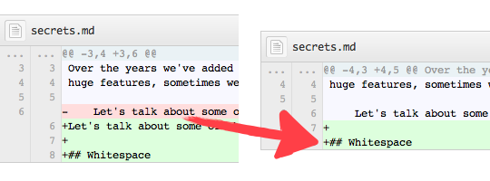

[详见 GitHub secrets](https://github.com/blog/967-github-secrets).

### 调整 Tab 字符所代表的空格数

在 diff 或者 file 页面的 URL 后面加上`?ts=4`，这样当显示 tab 字符的长度时就会是4个空格的长度，不再是默认的8个空格。`ts `后面的数字还可以根据你个人的偏好进行修改。不过，这个小诀窍在 Gists 页面和 raw file 页面不起作用。

下面是我们在 Go 语言的 source file 页面 URL 后加`?ts=4`[前](https://github.com/pengwynn/flint/blob/master/flint/flint.go)的例子：

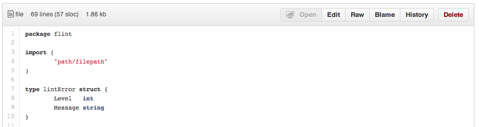

然后是我们添加`?ts=4`[后](https://github.com/pengwynn/flint/blob/master/flint/flint.go?ts=4)的例子：

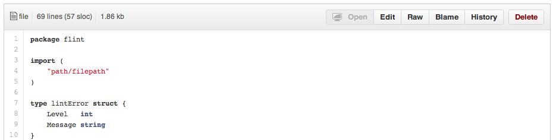

### 查看某个用户的 Commit 历史

查看某个用户的所有提交历史，只需在 commits 页面 URL 后加上`?author=username`。

```
https://github.com/rails/rails/commits/master?author=dhh
```
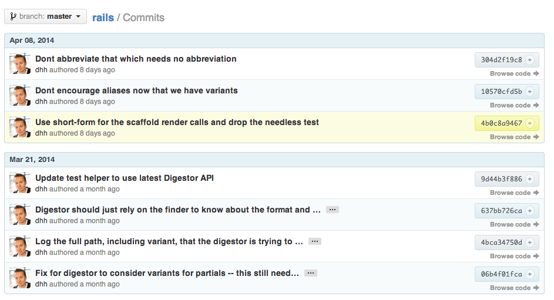

[深入了解提交视图之间的区别](https://help.github.com/articles/differences-between-commit-views)

### 克隆某个仓库

当我们克隆某一资源时，可以不要那个`.git `后缀。

```
$ git clone https://github.com/tiimgreen/github-cheat-sheet
```

[更多对 Git clone 命令的介绍.](http://git-scm.com/docs/git-clone)

### 分支

#### 将某个分支与其他所有分支进行对比

当你点击某个仓库的分支（Branches）选项卡时

```
https://github.com/{user}/{repo}/branches
```

你会看到一个包含所有未合并的分支的列表。

你可以在这里查看比较（Compare）页面或点击删除某个分支。

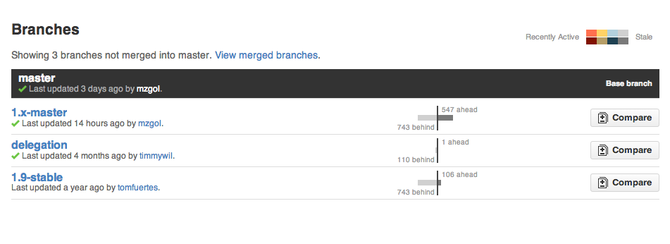

有的时候我们需要将多个分支与一个非主分支（master）进行对比，此时可以通过在 URL 后加入要比较的分支名来实现：

```
https://github.com/{user}/{repo}/branches/{branch}
```

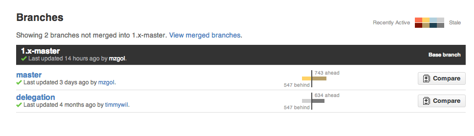

可以在 URL 后加上`?merged=1`来查看已经合并了的分支。

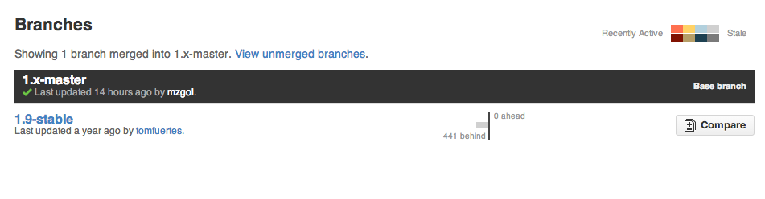

你可以使用这个界面来替代命令行直接删除分支。

#### 比较分支

如果我们想要比较两个分支，可以像下面一样修改 URL：

```
https://github.com/user/repo/compare/{range}
```

其中 `{range} = master...4-1-stable`

例如：

```
https://github.com/rails/rails/compare/master...4-1-stable
```

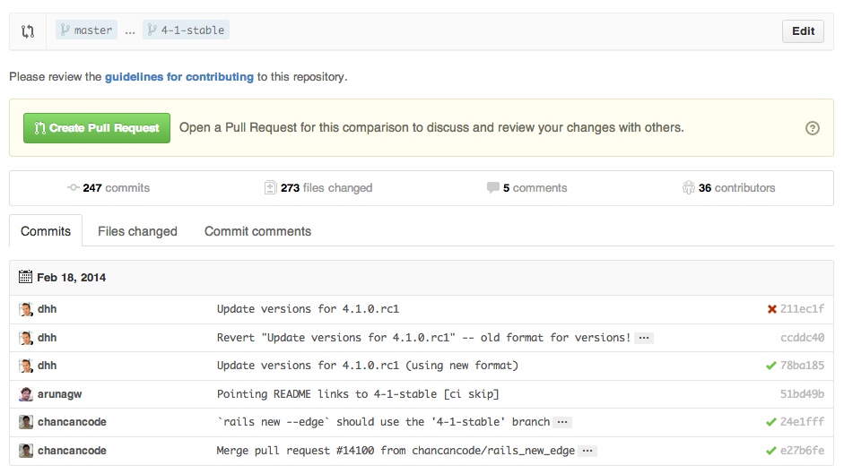

`{range}`还可以使用下面的形式:

```
https://github.com/rails/rails/compare/master@{1.day.ago}...master
https://github.com/rails/rails/compare/master@{2014-10-04}...master
```

日期格式 `YYYY-DD-MM`

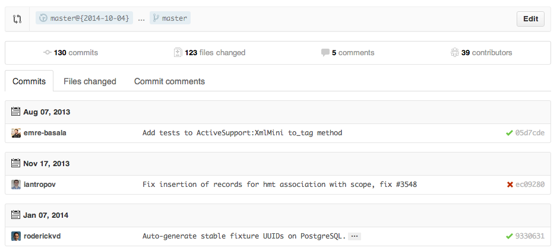

...这样你就能查看 master 分支上一段时间或者指定日期内的改动。

[了解更多关于比较跨时间段的提交记录.](https://help.github.com/articles/comparing-commits-across-time)

#### 比较不同派生库的分支

想要对派生仓库（Forked Repository）之间的分支进行比较，可以像下面这样修改 URL 实现：

```
https://github.com/user/repo/compare/{foreign-user}:{branch}...{own-branch}
```

例如：

```
https://github.com/rails/rails/compare/byroot:master...master
```

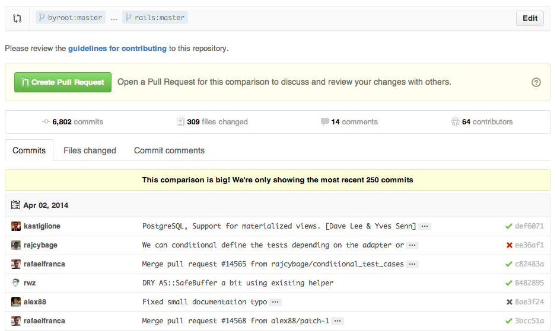

### Gists

[Gists](https://gist.github.com/) 给我们提供了一种不需要创建一个完整的仓库，使小段代码也可以工作的简单方式。

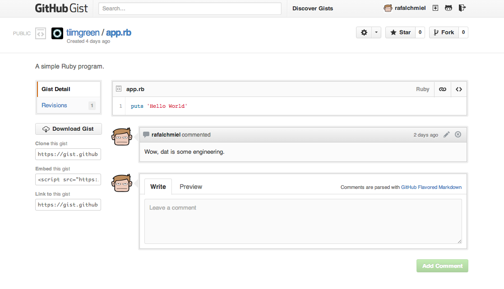

Gist 的 URL 后加上`.pibb`，可以得到更适合嵌入到其他网站的 HTML 版本。

Gists 还可以像任何标准仓库一样被克隆。

```
$ git clone https://gist.github.com/tiimgreen/10545817
```

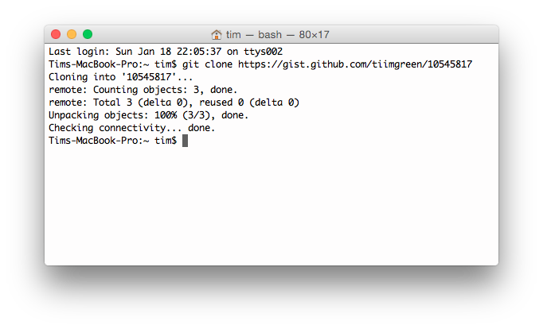

这意味着你可以像 Github 仓库一样修改和更新 Gists :

```
$ git commit
$ Username for 'https://gist.github.com': 
$ Password for 'https://tiimgreen@gist.github.com':
```

[进一步了解如何创建 gists.](https://help.github.com/articles/creating-gists)

### Git.io

Git.io 是 Github 的短网址服务。

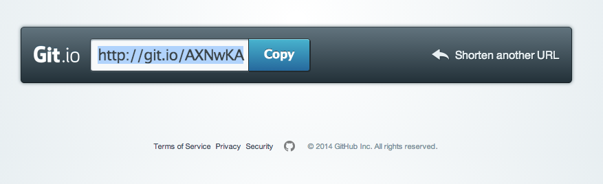

你可以通过 Curl 命令以普通 HTTP 协议使用它：

```
$ curl -i http://git.io -F "url=https://github.com/..."
HTTP/1.1 201 Created
Location: http://git.io/abc123

$ curl -i http://git.io/abc123
HTTP/1.1 302 Found
Location: https://github.com/...
```

[进一步了解 Git.io.](https://github.com/blog/985-git-io-github-url-shortener)

### 键盘快捷键

在仓库主页上提供了快捷键方便快速导航。

- 按 `t ` 键会打开一个文件浏览器。
- 按 `w ` 键会打开分支选择菜单。
- 按 `s ` 键会激活顶端的命令栏 (Command Bar)。
- 按 `l ` 键编辑 Issue 列表页的标签。
- 查看文件内容时
  （如：`https://github.com/tiimgreen/github-cheat-sheet/blob/master/README.md`），按 `y `键将会冻结这个页面，这样就算代码被修改了也不会影响你当前看到的。
按`? `查看当前页面支持的快捷键列表：

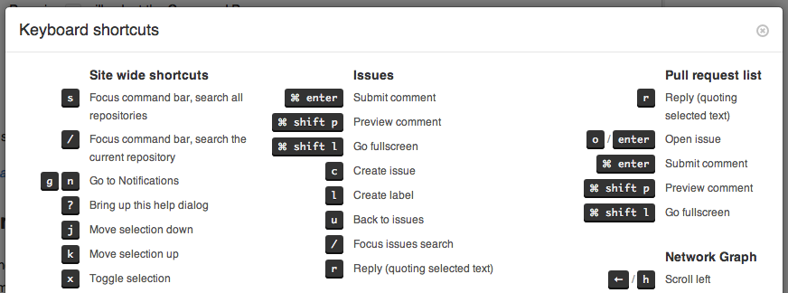

[进一步了解如何使用 Command Bar.](https://help.github.com/articles/using-the-command-bar)

### 整行高亮

在代码文件地址后加上`#L52`或者单击行号52都会将第52行代码高亮显示。

多行高亮也可以，比如用`#L53-L60`选择范围，或者按住 `shift `键，然后再点击选择的两行。

```
https://github.com/rails/rails/blob/master/activemodel/lib/act
```

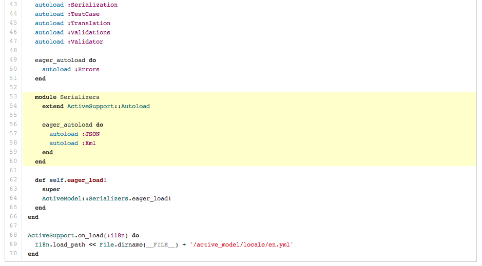

### 用 commit 信息关闭 Issue

如果某个提交修复了一个 Issue，当提交到 master 分支时，提交信息里可以使用 `fix/fixes/fixed`, `close/closes/closed` 或者 `resolve/resolves/resolved `等关键词，后面再跟上 Issue 号，这样就会关闭这个 Issue。

```
$ git commit -m "Fix screwup, fixes #12"
```

这将会关闭 Issue #12，并且在 Issue 讨论列表里关联引用这次提交。

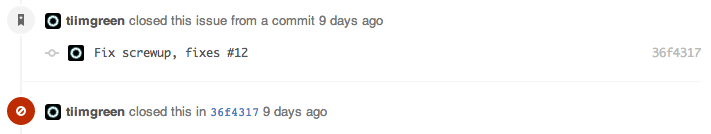

[进一步了解通过提交信息关闭 Issue.](https://help.github.com/articles/closing-issues-via-commit-messages)

### 链接其他仓库的 Issue

如果你想引用到同一个仓库中的一个 Issue，只需使用井号` # `加上 Issue 号，这样就会自动创建到此 Issue 的链接。

要链接到其他仓库的 Issue，就使用 `user_name/repo_name#ISSUE_NUMBER` 的方式，例如 `tiimgreen/toc#12`。

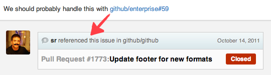

### 设置 CI 对每条 Pull Request 都进行构建

如果配置正确，[Travis CI](https://travis-ci.org/) 会为每个你收到的 Pull Request 执行构建，就像每次提交也会触发构建一样。想了解更多关于 Travis CI 的信息，请看 [Travis CI 入门](http://docs.travis-ci.com/user/getting-started/)。

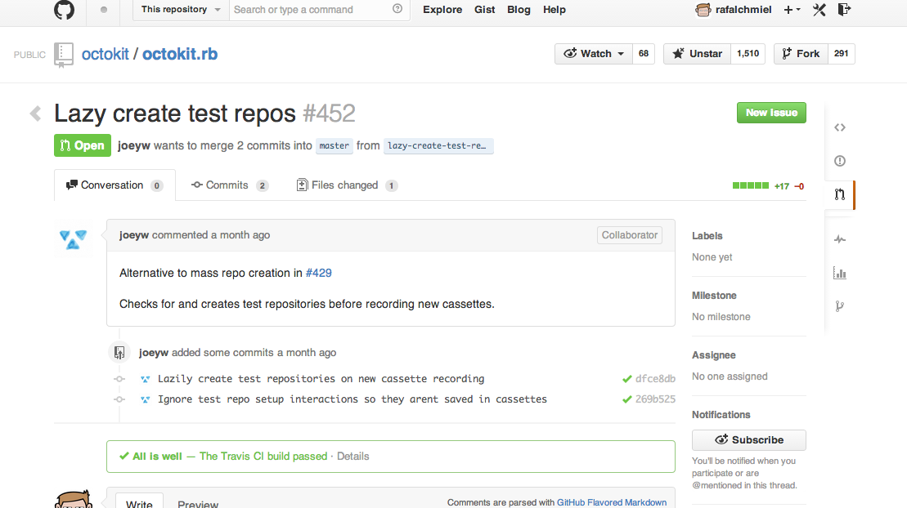

[进一步了解 Commit status API.](https://github.com/blog/1227-commit-status-api)

### Markdown 文件高亮语法

例如，可以像下面这样在你的 Markdown 文件里为 Ruby 代码添加语法高亮：


```ruby
require 'tabbit'
table = Tabbit.new('Name', 'Email')
table.add_row('Tim Green', 'tiimgreen@gmail.com')
puts table.to_s
```


效果像下面这样：

```
require 'tabbit'
table = Tabbit.new('Name', 'Email')
table.add_row('Tim Green', 'tiimgreen@gmail.com')
puts table.to_s
```

Github 使用 [Linguist](https://github.com/github/linguist) 做语言识别和语法高亮。你可以仔细阅读 [languages YAML file](https://github.com/github/linguist/blob/master/lib/linguist/languages.yml)，了解有哪些可用的关键字。

[进一步了解 GitHub Flavored Markdown.](https://help.github.com/articles/github-flavored-markdown)

### 表情符

可以在 Pull Requests, Issues, 提交消息, Markdown 文件里加入表情符。使用方法`:name_of_emoji:`

```
:smile:
```

将输出一个笑脸：

:smile:

Github 支持的完整表情符号列表详见 emoji-cheat-sheet.com 或 [scotch-io/All-Github-Emoji-Icons](https://github.com/scotch-io/All-Github-Emoji-Icons)。

Github 上使用最多的5个表情符号是：

1. :shipit: - `:shipit:`
2. :sparkles: - `:sparkles:`
3. :-1: - `:-1:`
4. :+1: - `:+1:`
5. :clap: - `:clap:`

### 静态与动态图片

注释和 README 等文件里也可以使用图片和 GIF 动画：

```

```

仓库中的原始图片可以被直接调用：

```
/(repo)/raw/master/path
```


所有图片都缓存在 Github，不用担心你的站点不能访问时就看不到图片了。

### 在 GitHub Wiki 中嵌入图片

有多种方法可以在 Wiki 页面里嵌入图片。既可以像上一条里那样使用标准的 Markdown 语法，也可以像下面这样指定图片的高度或宽度：

```
[[ http://www.sheawong.com/wp-content/uploads/2013/08/keephatin.gif | height = 100px ]]
```

结果：

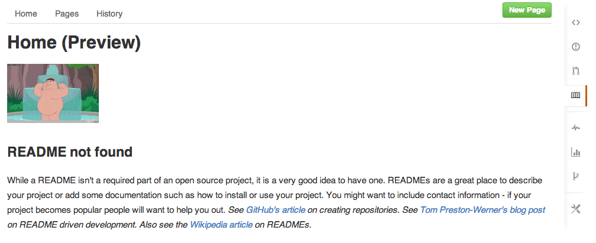

### 快速引用

在主题评论中引用之前某个人所说的，只需选中文本，然后按 `r `键，想要的就会以引用的形式复制到你的输入框里。

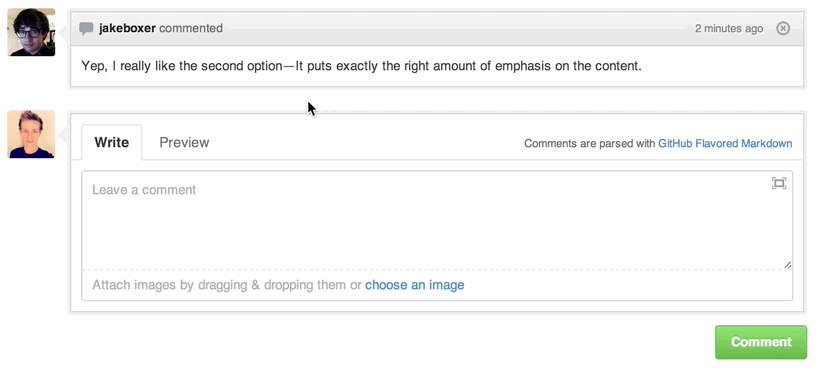

[进一步了解快速引用.](https://github.com/blog/1399-quick-quotes)

### 快速添加许可证

创建一个仓库时，Github 会为你提供一个预置的软件许可列表：

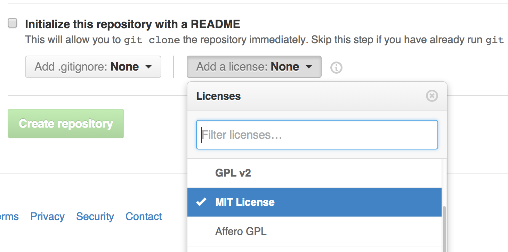

对于已有的仓库，可以通过 web 界面创建文件来添加软件许可。输入 `LICENSE `作为文件名后，同样可以从预置的列表中选择一个作为模板。

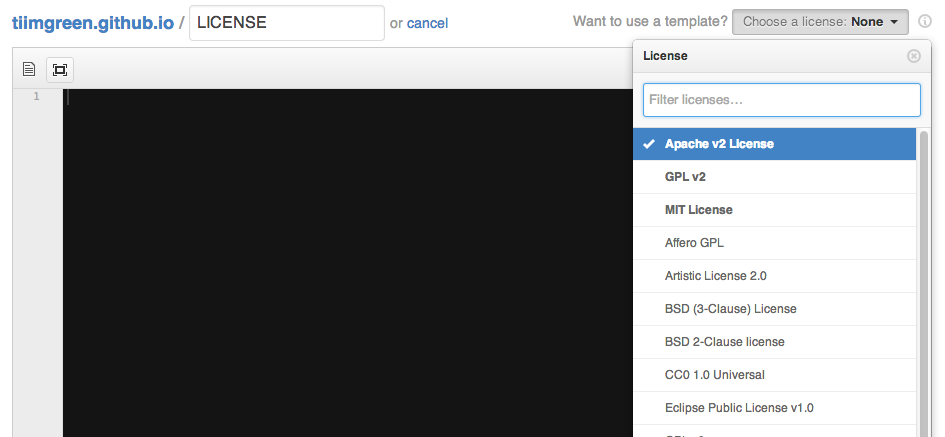

这个技巧也适用于 `.gitignore` 文件。

[进一步了解 open source licensing.](https://help.github.com/articles/open-source-licensing)

### 任务列表

Issues 和 Pull requests 里可以添加复选框，语法如下（注意空白符）：

```
- [ ] Be awesome
- [ ] Prepare dinner
  - [ ] Research recipe
  - [ ] Buy ingredients
  - [ ] Cook recipe
- [ ] Sleep
```

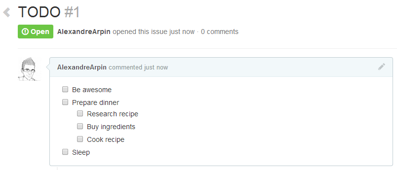

当项目被选中时，它对应的 Markdown 源码也被更新了：

```
- [x] Be awesome
- [ ] Prepare dinner
  - [x] Research recipe
  - [x] Buy ingredients
  - [ ] Cook recipe
- [ ] Sleep
```

[进一步了解任务列表.](https://help.github.com/articles/writing-on-github#task-lists)

### Markdown 文件中的任务列表

在完全适配 Markdown 语法的文件中可以使用以下语法加入一个只读的任务列表

```
- [ ] Mercury
- [x] Venus
- [x] Earth
  - [x] Moon
- [x] Mars
  - [ ] Deimos
  - [ ] Phobos
```

- [ ] Mercury
- [x] Venus
- [x] Earth
  - [x] Moon
- [x] Mars
  - [ ] Deimos
  - [ ] Phobos
[进一步了解 Markdown 文件中的任务列表](https://github.com/blog/1825-task-lists-in-all-markdown-documents)

### 相对链接

Markdown 文件里链接到内部内容时推荐使用相对链接。

```
[Link to a header](#awesome-section)
[Link to a file](docs/readme)
```

绝对链接会在 URL 改变时（例如重命名仓库、用户名改变，建立分支项目）被更新。使用相对链接能够保证你的文档不受此影响。

[进一步了解相对链接.](https://help.github.com/articles/relative-links-in-readmes)

### GitHub Pages 的元数据与插件支持

在 Jekyll 页面和文章里，仓库信息可在 `site.github` 命名空间下找到，也可以显示出来，例如，使用 `{{ site.github.project_title }}`显示项目标题。

Jemoji 和 jekyll-mentions 插件为你的 Jekyll 文章和页面增加了 [emoji](https://leohxj.gitbooks.io/a-programmer-prepares/content/software/git/github-cheat-sheet.html#emojis) 和[@mentions](https://github.com/blog/821) 功能。

[了解更多 GitHub Pages 的元数据和插件支持.](https://github.com/blog/1797-repository-metadata-and-plugin-support-for-github-pages)

### 查看 YAML 格式的元数据

许多博客站点，比如基于 [Jekyll](http://jekyllrb.com/) 的 [GitHub Pages](http://pages.github.com/)，都依赖于一些文章头部的 YAML 格式的元数据。Github 会将其渲染成一个水平表格，方便阅读。

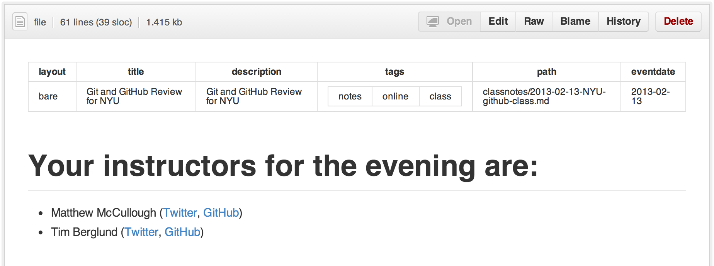

[进一步了解 在文档里查看 YAML 元数据.](https://github.com/blog/1647-viewing-yaml-metadata-in-your-documents)

### 渲染表格数据

GitHub 支持将 `.csv` (逗号分隔)和`.tsv `(制表符分隔)格式的文件渲染成表格数据。


[进一步了解渲染表格数据.](https://github.com/blog/1601-see-your-csvs)

### 撤销 Pull Request

可以通过 Pull Request 中的 Revert 按钮来撤销一个已合并的 Pull Request 中的 commit。按下按钮后会自动生成一个进行逆向操作的 Pull Request。

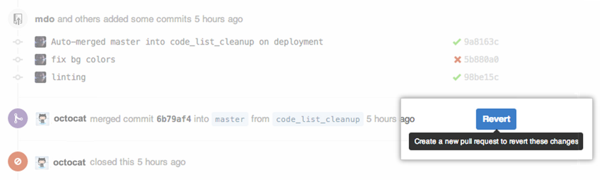

[*进一步了解“撤销”按钮](https://github.com/blog/1857-introducing-the-revert-button)

### Diffs

#### 可渲染文档的 Diffs

提交和 Pull Requests 里包含有 Github 支持的可渲染文档（比如Markdown）会提供 source 和 rendered 两个视图功能。

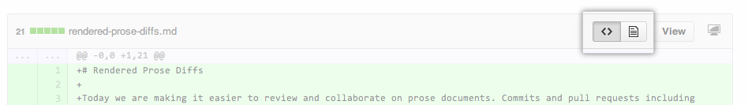

点击 "rendered" 按钮，看看改动在渲染后的显示效果。当你添加、删除或修改文本时，渲染纯文本视图非常方便。

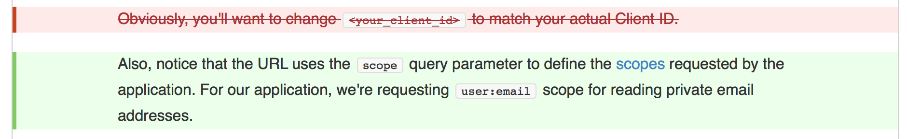

[进一步了解渲染纯文本视图 Diffs.](https://github.com/blog/1784-rendered-prose-diffs)

#### 可变化地图

当你在 GitHub 上查看一个包含地理数据的提交或 pull request 时，Github 将以可视化的方式对比版本之间的差异。


[进一步了解可比较地图.](https://github.com/blog/1772-diffable-more-customizable-maps)

#### 在 diff 中折叠与扩展代码

你可以通过点击 diff 边栏里的 unfold 按钮来多显示几行上下文。你可以一直点击 unfold 按钮直到显示了文件的全部内容。这个功能在所有 GitHub 产生的 diff 界面都可以使用。

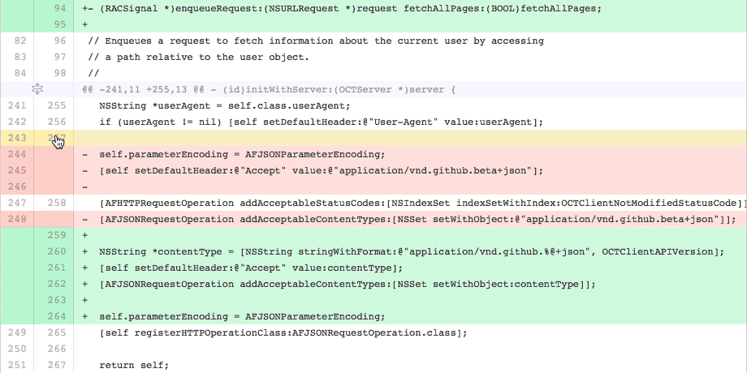

[进一步了解扩展 Diff 上下文.](https://github.com/blog/1705-expanding-context-in-diffs)

#### 查看 Pull Request 的 diff 和 patch

在 Pull Request 的 URL 后面加上 `.diff` 或 `.patch` 的扩展名就可以得到它的 diff 或 patch 文件，例如：

```
https://github.com/tiimgreen/github-cheat-sheet/pull/15
https://github.com/tiimgreen/github-cheat-sheet/pull/15.diff
https://github.com/tiimgreen/github-cheat-sheet/pull/15.patch
```

`.diff` 扩展会使用普通文本格式显示如下内容：

```
diff --git a/README.md b/README.md
index 88fcf69..8614873 100644
--- a/README.md
+++ b/README.md
@@ -28,6 +28,7 @@ All the hidden and not hidden features of Git and GitHub. This cheat sheet was i
 - [Merged Branches](#merged-branches)
 - [Quick Licensing](#quick-licensing)
 - [TODO Lists](#todo-lists)
+- [Relative Links](#relative-links)
 - [.gitconfig Recommendations](#gitconfig-recommendations)
     - [Aliases](#aliases)
     - [Auto-correct](#auto-correct)
@@ -381,6 +382,19 @@ When they are clicked, they will be updated in the pure Markdown:
 - [ ] Sleep

(...)
```

#### 渲染图像发生的变动

GitHub 可以显示包括 PNG、JPG、GIF、PSD 在内的多种图片格式并提供了几种方式来比较这些格式的图片文件版本间的不同。


[查看更多关于渲染图像变动的内容](https://help.github.com/articles/rendering-and-diffing-images)

### Hub

[Hub](https://github.com/github/hub) 是一个对 Git 进行了封装的命令行工具，可以帮助你更方便的使用 Github。

这使得你可以像下面这样进行克隆：

```
$ hub clone tiimgreen/toc
```

[查看更多 Hub 提供的超酷命令.](https://github.com/github/hub#commands)

### 贡献者指南

在你的仓库的根目录添加一个名为 `CONTRIBUTING` 的文件后，贡献者在新建 Issue 或 Pull Request 时会看到这个文件的链接。

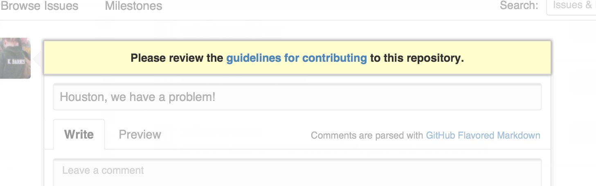

[进一步了解贡献者指南.](https://github.com/blog/1184-contributing-guidelines)

### GitHub 资源

|Title|Link|
|-----|:--:|
|GitHub Explore|https://github.com/explore/|
|GitHub Blog|https://github.com/blog|
|GitHub Help|https://help.github.com/|
|GitHub Training|http://training.github.com/|
|GitHub Developer|https://developer.github.com/|

### GitHub 讨论

|Title|	Link|
|-----|:----|
|How GitHub Uses GitHub to Build GitHub|https://www.youtube.com/watch?v=qyz3jkOBbQY|
|Introduction to Git with Scott Chacon of GitHub|https://www.youtube.com/watch?v=ZDR433b0HJY|
|How GitHub No Longer Works|https://www.youtube.com/watch?v=gXD1ITW7iZI|
|Git and GitHub Secrets|https://www.youtube.com/watch?v=Foz9yvMkvlA|
|More Git and GitHub Secrets|https://www.youtube.com/watch?v=p50xsL-iVgU|

## Git

### 前一个分支

快速检出上一个分支：

```
$ git checkout -
# Switched to branch 'master'

$ git checkout -
# Switched to branch 'next'

$ git checkout -
# Switched to branch 'master'
```

[进一步了解 Git 分支.](http://git-scm.com/book/en/Git-Branching-Basic-Branching-and-Merging)

### Stripspace 命令

Git Stripspace 命令可以:

- 去掉行尾空白符
- 多个空行压缩成一行
- 必要时在文件末尾增加一个空行

使用此命令时必须传入一个文件，像这样：

```
$ git stripspace < README.md
```

[进一步了解 Git stripspace 命令.](http://git-scm.com/docs/git-stripspace)

### 检出 Pull Requests

Pull Request 是一种 GitHub 上可以通过以下多种方式在本地被检索的特别分支：

检索某个分支并临时储存在本地的 `FETCH_HEAD `中以便快速查看更改(diff)以及合并(merge)：

```
$ git fetch origin refs/pull/[PR-Number]/head
```

通过 refspec 获取所有的 Pull Request 为本地分支：

```
$ git fetch origin '+refs/pull/*/head:refs/remotes/origin/pr/*'
```

或在仓库的`.git/config `中加入下列设置来自动获取远程仓库中的 Pull Request

```
[remote "origin"]
    fetch = +refs/heads/*:refs/remotes/origin/*
    url = git@github.com:tiimgreen/github-cheat-sheet.git
```

```
[remote "origin"]
    fetch = +refs/heads/*:refs/remotes/origin/*
    url = git@github.com:tiimgreen/github-cheat-sheet.git
    fetch = +refs/pull/*/head:refs/remotes/origin/pr/*
```

对基于派生库的 Pull Request，可以通过先 checkout 代表此 Pull Request 的远端分支再由此分支建立一个本地分支：

```
$ git checkout pr/42 pr-42
```

操作多个仓库的时候，可以在 Git 中设置获取 Pull Request 的全局选项。

```
 git config --global --add remote.origin.fetch "+refs/pull/*/head:refs/remotes/origin/pr/*"
```

此时可以在任意仓库中使用以下命令：

```
 git fetch origin
```

```
git checkout pr/42
```

[进一步了解如何检出 pull request 到本地.](https://help.github.com/articles/checking-out-pull-requests-locally)

### 提交空改动 :trollface:

可以使用`--allow-empty `选项强制创建一个没有任何改动的提交：

```
$ git commit -m "Big-ass commit" --allow-empty
```

这样做在如下几种情况下是有意义的：

- 标记新的工作或一个新功能的开始。
- 记录对项目的跟代码无关的改动。
- 跟使用你仓库的其他人交流。
- 作为仓库的第一次提交，因为第一次提交后不能被 rebase： `git commit -m "init repo" --allow-empty`.

### 更直观的 Git Status

在命令行输入如下命令:

```
$ git status
```

可以看到:

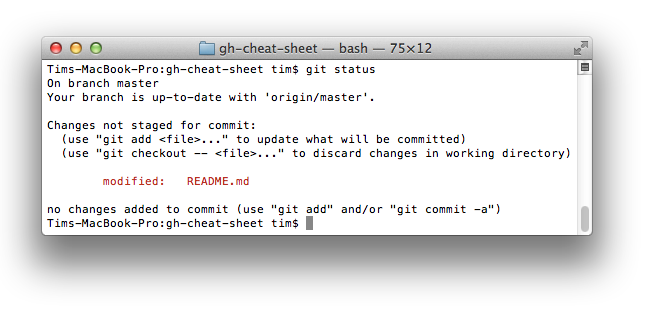

加上`-sb `选项:

```
$ git status -sb
```

这会得到:

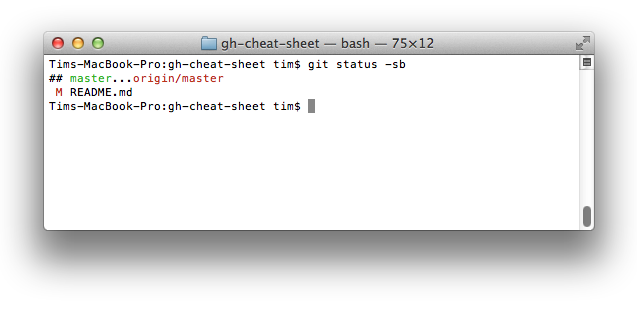

[进一步了解 Git status 命令.](http://git-scm.com/docs/git-status)

### 更直观的 Git Log

输入如下命令:

```
$ git log --all --graph --pretty=format:'%Cred%h%Creset -%C(yellow)%d%Creset %s %Cgreen(%cr) %C(bold blue)<%an>%Creset' --abbrev-commit --date=relative
```

可以看到:

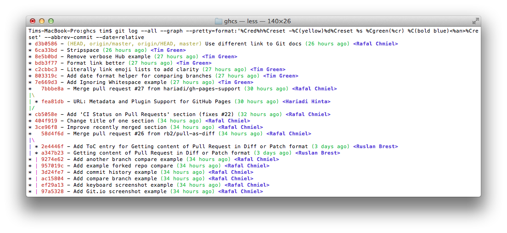

这要归功于 [Palesz](http://stackoverflow.com/users/88355/palesz) 在 stackoverflow 的回答。

这个命令可以被用作别名，详细做法见[这里](https://github.com/tiimgreen/github-cheat-sheet#aliases)。

[进一步了解 Git log 命令.](http://git-scm.com/docs/git-log)

### Git 查询

Git 查询运行你在之前的所有提交信息里进行搜索，找到其中和搜索条件相匹配的最近的一条。

```
$ git show :/query
```

这里 `query `（区别大小写）是你想要搜索的词语， 这条命令会找到包含这个词语的最后那个提交并显示变动详情。

```
$ git show :/typo
```

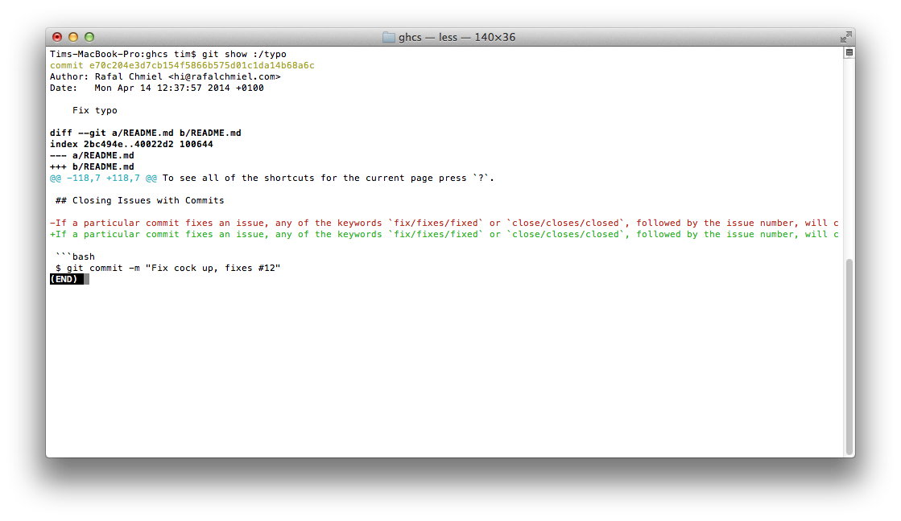

- 按 `q ` 键退出命令。*

### 合并分支

输入命令:

```
$ git branch --merged
```

这会显示所有已经合并到你当前分支的分支列表。

相反地：

```
$ git branch --no-merged
```

会显示所有还没有合并到你当前分支的分支列表。

[进一步了解 Git branch 命令.](http://git-scm.com/docs/git-branch)

### 使用网页查看本地仓库

使用 Git 的 `instaweb` 可以立即在 `gitweb `中浏览你的工作仓库。这个命令是个简单的脚本，配置了 `gitweb `和用来浏览本地仓库的Web服务器。（译者注：默认需要 lighttpd 支持）

```
$ git instaweb
```

执行后打开：

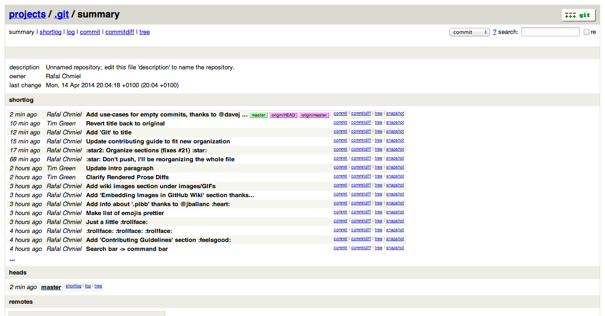

[进一步了解 Git instaweb 命令.](http://git-scm.com/docs/git-instaweb)

### Git 配置

所有 Git 配置都保存在你的`.gitconfig `文件中。

#### Git 命令自定义别名

别名用来帮助你定义自己的 git 命令。比如你可以定义 `git a` 来运行 `git add --all`。

要添加一个别名， 一种方法是打开` ~/.gitconfig` 文件并添加如下内容：

```
[alias]
  co = checkout
  cm = commit
  p = push
  # Show verbose output about tags, branches or remotes
  tags = tag -l
  branches = branch -a
  remotes = remote -v
```

...或者在命令行里键入：

```
$ git config --global alias.new_alias git_function
```

例如：

```
$ git config --global alias.cm commit
```

指向多个命令的别名可以用引号来定义：

```
$ git config --global alias.ac 'add -A . && commit'
```

下面列出了一些有用的别名：

|别名 Alias|	命令 Command	|如何设置 What to Type|
|--------|:---------|:-------|
|git cm|git commit|git config --global alias.cm commit|
|git co|git checkout|git config --global alias.co checkout|
|git ac|git add . -A git commit|git config --global alias.ac '!git add -A && git commit'|
|git st|git status -sb|git config --global alias.st 'status -sb'|
|git tags|git tag -l	|git config --global alias.tags 'tag -l'|
|git branches|git branch -a|	git config --global alias.branches 'branch -a'|
|git remotes|git remote -v|git config --global alias.remotes 'remote -v'|
|git lg|git log --color --graph --pretty=format:'%Cred%h%Creset -%C(yellow)%d%Creset %s %Cgreen(%cr) %C(bold blue)<%an>%Creset' --abbrev-commit --|git config --global alias.lg "log --color --graph --pretty=format:'%Cred%h%Creset -%C(yellow)%d%Creset %s %Cgreen(%cr) %C(bold blue)<%an>%Creset' --abbrev-commit --"|

#### 自动更正

如果键入 `git comit` 你会看到如下输出：

```
$ git comit -m "Message"
# git: 'comit' is not a git command. See 'git --help'.

# Did you mean this?
#   commit
```

为了在键入 `comit` 调用 `commit `命令，只需启用自动纠错功能：

```
$ git config --global help.autocorrect 1
```

现在你就会看到：

```
$ git comit -m "Message"
# WARNING: You called a Git command named 'comit', which does not exist.
# Continuing under the assumption that you meant 'commit'
# in 0.1 seconds automatically...
```

#### 带颜色输出

要在你的Git命令输出里加上颜色的话，可以用如下命令：

```
$ git config --global color.ui 1
```

[进一步了解 Git config 命令.](http://git-scm.com/docs/git-config)

### Git 资源

|Title|	Link|
|:----|:----|
|Official Git Site|http://git-scm.com/|
|Official Git Video Tutorials|http://git-scm.com/videos|
|Code School Try Git|http://try.github.com/|
|Introductory Reference & Tutorial for Git|http://gitref.org/|
|Official Git Tutorial|http://git-scm.com/docs/gittutorial|
|Everyday Git|http://git-scm.com/docs/everyday|
|Git Immersion|http://gitimmersion.com/|
|Ry's Git Tutorial|http://rypress.com/tutorials/git/index.html|
|Git for Designer|http://hoth.entp.com/output/git_for_designers.html|
|Git for Computer Scientists|http://eagain.net/articles/git-for-computer-scientists/|
|Git Magic|http://www-cs-students.stanford.edu/~blynn/gitmagic/|

#### Git 参考书籍

|Title|Link|
|:----|:---|
|Pragmatic Version Control Using Git|http://www.pragprog.com/titles/tsgit/pragmatic-version-control-using-git|
|Pro Git|http://git-scm.com/book|
|Git Internals Peepcode|http://peepcode.com/products/git-internals-pdf|
|Git in the Trenches|http://cbx33.github.com/gitt/|
|Version Control with Git|http://www.amazon.com/Version-Control-Git-collaborative-development/dp/1449316387|
|Pragmatic Guide to Git|http://www.pragprog.com/titles/pg_git/pragmatic-guide-to-git|
|Git: Version Control for Everyone|http://www.packtpub.com/git-version-control-for-everyone/book|

# 18.8 JetBrains

JetBrains 是一家专注开发开发工具的公司，旗下的 IEDA, WebStorm 获得了开发者的极大喜爱。

它们家的 IDE 是收费的，广大开发者最好还是支持一下正版。

# 18.8.1 IDE设置

下载安装完成后，我首先会设置一下编辑器。JetBrains 的设置在旗下的 IDE 中是通用的，所以配置是可以随时导入导出的。进入设置的方式为: `File->Settings`。

## 界面设置

- 设置行号: `show line numbers`
- 设置 softwrap: `soft Wraps`
- 设置工程和文件编码
- 设置换行模式
- 设置 index 空格数

## keymaps

- 设置 emacs 移动光标方式
- 设置基本的编辑方式
- 设置快捷打开文件方式
- 设置快捷访问功能方式
- 设置浏览器标签切换方式
- 设置格式化代码方式