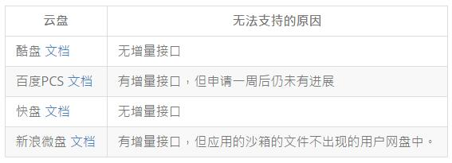

# 13. 提升效率
我是个很在意效率的人，虽然可能执行力不那么强。但是能省的绝对不会浪费精力去做。

这里的效率也包含了如何获取信息，如何与人交流，总之是对个人有益的总结。

# 13.1 学会阅读

## 参考资料

- [阅读方法：史上最全读书法](http://mp.weixin.qq.com/s?__biz=MjM5OTA3MjUwMA==&mid=205263526&idx=2&sn=21b5ca4a0699153f36131d3983a5f7d1#rd)
- [读书笔记：这样做笔记收获更大](http://mp.weixin.qq.com/s?__biz=MjM5OTA3MjUwMA==&mid=205263526&idx=1&sn=658c0943f3bd146acff9b0a00b7741e1#rd)

# 13.2 学会提问

这是我遇到的第一个提升效率的方式。

刚接触网络和论坛的时候，我常常会去问一些浪费别人时间去回答的问题，比如："如何 XXX"，其实这类问题如果再花几分钟，或者再思考下都是很容易得出答案的问题。但是互联网给人的就是浮躁，很多情况下我们只学会了伸手去索取。

一个好的答案需要一个好的问题。学会提问，你会得到更多的信息。网络上有那个一篇文章:[学会如何提问](https://leohxj.gitbooks.io/a-programmer-prepares/content/effciency/how-to-ask.html)。我是没有读过，但是我理解它的意思。当你被别人问了几次基础或者无脑的问题，你就知道你希望得到的提问是什么样的。那么你其实也学会了如何提问。

## 参考资料

- [技术问答社区中回答的艺术？](http://segmentfault.com/q/1010000002373081?utm_source=weekly&utm_medium=email&utm_campaign=email_weekly)
- [提问时最容易犯的八个错，你中了几枪？](http://mp.weixin.qq.com/s?__biz=MjM5MDgxNjc0MA==&mid=207426256&idx=1&sn=466d9c4ca77975b0be819c8fafb969ab#rd)

# 13.3 善用搜索

学会了如何提问，其实已经能把握住问题的中心，也就可以先使用搜索去尝试解决问题。

## 搜索引擎选择

通常我也会根据具体的搜索内容决定使用什么引擎，比如我要搜技术类的问题，肯定优先考虑 google。搜索下载资源，优先考虑相应的下载资源网站。做到缩小搜索范围，才能让搜索结果的质量得到提高。

其实配合上 `site `的用法，在 google 上也能很快锁定搜索结果。

常用的几个站点：

- [google](http://google.com/ncr)
- [baidu](http://baidu.com/)
- [Duck Duck Go](http://duckduckgo.com/)
- [海盗湾](http://thepiratebay.se/)
- [天天美剧](http://www.ttmeiju.com/)
- [豆瓣](http://douban.com/)

## 设置 Chrome 的搜索

Chrome 是我最常用的浏览器，大部分搜索我都是在它之中完成的，那么如何节约时间呢。首先了解一个快捷键：`command+l`,快速定位到地址栏。

其次借助 Chrome 的地址栏搜索功能，快速搜索。中文版默认的可能是百度搜索，我比较喜欢设置 google 搜索，打开 `Setting->Search->Manage search engines`，修改 defalut search 为：

```
Google google.com {google:baseURL}search?q=%s&{google:RLZ}{google:originalQueryForSuggestion}{google:assistedQueryStats}{google:searchFieldtrialParameter}{google:bookmarkBarPinned}{google:searchClient}{google:sourceId}{google:instantExtendedEnabledParameter}{google:omniboxStartMarginParameter}{google:contextualSearchVersion}ie={inputEncoding}
```

如果设置了代理的，可以先访问 google.com/ncr 选择为通用版本。确保访问到页面是通用版本，在地址栏里搜索试试。如果还会自动转向到代理的国家，Chrome 也会提示你继续使用还是切换为 google.com。同时需要设置 `Setting->Currently showing search results in `为 English, 中文 (简体)。

如果只选择结果为 English,那么挂上日本的代理，出现的结果优先会是日文。

### 其他搜索设置

在 Chrome 的地址栏中，也可以设置快捷键触发其他搜索, 在 `Setting->Search->Manage search engines`，添加：

```
DDK duckduckgo.com https://duckduckgo.com/?q=%s
```

类似的规则，在地址栏中输入 duckduckgo 然后按一下 tab，就可以选择自定义的引擎进行搜索。

## 搜索技巧

直接给一张图解释: 


## 参考资料

- [Google 语法详解](http://www.docin.com/p-201879681.html)
- [搜索引擎有哪些常用技巧？](http://www.zhihu.com/question/19847393)
- [如何用好 Google 等搜索引擎](http://www.zhihu.com/question/20161362)

# 13.4 如何写作
关于写作，我们为什么要写作，这是一个前提。

## 为什么写作

无论是否是技术人员，我觉得都应该坚持写作。写作带给你的是思维的总结，因为有些事情你只是去想，貌似是很简单。当你去深入思考，其实又是另一个境界。我觉得写作能帮助到我最大的一点是，理清思路。

关于其他，我也比较推荐刘未鹏的两篇博客：

- [为什么你应该（从现在开始就）写博客](http://mindhacks.cn/2009/02/15/why-you-should-start-blogging-now/)
- [书写是为了更好的思考](http://mindhacks.cn/2009/02/09/writing-is-better-thinking/)

程序员是理科出生，写文章是文科的特征。但是程序员养成写作的习惯，对编程也是很用用处的，比如:

- 写文章和写代码最核心的共同之处在于它们都需要清晰思考的能力。好代码与好文章一样都需要言简意赅，不然就会浪费 CPU 资源或人的精力。
- 软件工程师应该写作因为现在开发协作变得越来越重要。不论是 GitHub 评论、代码注释，还是技术文档都需要清晰准确的文字。良好的写作能力方便了人们之间的交流，使得项目更好地运行下去。
- 即使没人读你的文章，写作的过程也是有益无害。它帮助你理清思路，明确对于某个问题的看法，加强或削弱你的某种观点。把凌乱的想法汇聚成精简的文字非常有价值。

## 用什么写作

[Markdown](http://zh.wikipedia.org/wiki/Markdown) 是我极力推崇的一种通用格式。

但是目前存在多种解释器，导致语法有些混乱，但是熟悉标准的语法，依然能够写好文章。

说几点常用的：

- 删除线: 需要删除的内容前后添加`~~`。
- 强制断行： 正常，回车后形成的断行，不会被 Markdown 解析为断行，需要在断行前面段落后加两个空格或者写入`<br/>`标签。
- 水平分割线: 三个以上的星号，减号，或者下划线，除了空格，不允许出现其它符号。`-----`。

## 在哪里写作

小时候我们常常使用的是笔和纸，形式多为日记。其实日记并没有什么不好，但是大多数人应该和我应该，会把日记写成流水账，没有太大的意义。

现在是互联网的时代，手机和电脑可以替代我们完成输入，并且记录的形式也多样化，除了文字还可以记录声音，图片和视频。

如果是个人的记录，我比较喜欢使用云笔记，比如印象笔记或者为知笔记。设置一个访问密码，以防无意被他人阅读。

技术性的文章，我更喜欢以博客的形式去发布，一方面会有知识积累的成就感，另一方面也可以与他人交流。博客可以自己搭建，比如 github+jekyll,或者使用简书这样的 web 服务。

## 参考文档

- [Markdown 标准格式](http://jgm.github.io/stmd/spec.html)
- [为什么软件工程师应该养成写作的习惯？](http://www.36kr.com/p/218600.html)
- [You Should Write Blogs](https://sites.google.com/site/steveyegge2/you-should-write-blogs)
- [技术文章的写作技巧](http://www.philo.top/2015/02/19/%E6%8A%80%E6%9C%AF%E6%96%87%E7%AB%A0%E7%9A%84%E5%86%99%E4%BD%9C%E6%8A%80%E5%B7%A7/)

# 13.5 如何翻墙

既然想学点东西，就不能被网络束缚住。国内的网络环境，并不利于我们成长。

## 什么是墙

[great firewall](http://baike.baidu.com/link?url=Ko6D0GzKfQ2gXQ3oXLr-6_Racoa5uo8UApoNRRV5Jc8LyCYv1fGBGDxMxOV7ULARGidRgcoM6DVh3m06PMD_y823plq8PCCs51xmz6aJoY_), 中国特有的。就是国家对网络的封锁。想要看看外面的世界，就得翻墙。

## 如何翻墙

翻墙的服务一般都是收费的，免费的除了 goAgent，其他都不要尝试了，不然只是在浪费生命。我比较提倡用钱能解决的问题，尽量还是花些钱吧。

目前来说，我了解的方式主要有两种：VPN 和 Shadowsocks。

## VPN

在公用网络上建立专用网络，进行加密通讯。原理是在一个国外网络无阻的机器上与本地机器通信。

优点是方便设置，网络速度稳定。

缺点是稳定的服务价格不便宜，且本地流量全部走的是代理。

### 配合 VPN 实现国内外分流访问

“分流”，这个词不知道说的准不准确，意思就是实现对不需要翻墙的网站直接连接，需要翻墙的网站走 VPN 代理。这样国内的网站访问不受影响，又能正常访问国外站点。

实现方式就是修改系统的路由表，网络上有这样的开源项目，专门收集国内被“墙”的网站。利用这些数据，让 vpn 客户端在进行连接的时候自动执行.

通过这些路由脚本, 可以让用户在使用 vpn 作为默认网络网关的时候, 不使用 vpn 进行对中国国内 ip 的访问, 从而减轻 vpn 的负担, 和增加访问国内网站的速度.

### Mac 设置：

1. 下载附件 mac.zip, 并将其中的 ip-up, ip-down 两个文件放入到 /etc/ppp 目录中。
2. 开终端，执行命令 cd /private/etc/ppp，进入/etc/ppp 目录下。
3. 在该目录下执行 sudo chmod a+x ip-up ip-down
4. 好了，可以连接 VPN 试试了。

### Windows 设置：

1. 下载附件 windows.zip, 并将其中的 vpnup.bat, ivpndown.bat 两个文件解压到任意目录。
2. 右击 vpnup.bat，选择以管理员权限运行，然后会弹出 cmd 窗口，等待运行完毕，窗口会自动关闭。（Windows 需要每次开机时执行一次）
3. 好了，可以连接 VPN 试试了。

测试方式:连接 VPN 后，可以访问 ip.cn 查看当前的 ip,如果显示南京就对了，然后再打开 youtube.com 看看能否访问。

一点说明: ip-down 和 vpndown.bat 是恢复路由表的脚本。

## goagent

[goagent](https://github.com/goagent/goagent), 项目主页里有详细的安装使用指南。需要你注册 google 的 GAE 服务。

当然，你可以用来当做教育网加速，或者穿透公司内网。我目前放在 SAE 上用来穿透公司 http 代理。

使用的过程之后，可能会遇到证书错误而不受信任的情况，解决方式就是导入证书。详情可见: [解决 GoAgent 打开 https 网站 SSL 证书错误 (安全证书不受信任)](http://blog.netsh.org/posts/goagent-https-ssl-error_1013.netsh.html)

## Shadowsocks

shadowsocks 的出现，我觉得真是一大利好。它解决了网络流量分配的问题，借助代理插件，可以方便的实现只针对需要翻墙的网站都代理访问。且价格便宜。

一般情况下，我使用 Chrome 的插件: [Proxy SwitchySharp](https://chrome.google.com/webstore/detail/dpplabbmogkhghncfbfdeeokoefdjegm)。

shadowsocks 的服务，如果自己有 vps 的话，就自己搭建一个，分分钟的事情，自己搜搜教程。如果没有的话，也可以去买这样的服务，我用东哥的 ss，包年100，速度很好。

## chnroutes

[chnroutes](https://github.com/fivesheep/chnroutes)，此项目通过修改路由表，解决通过 VPN 链接网络时的流量转向问题。达到不需要翻墙的访问走正常网络，需要翻墙的请求走 VPN。

## ChinaDNS

[ChinaDNS](https://github.com/clowwindy/ChinaDNS), 此项目解决的是 DNS 污染问题，我还没搞明白。。。

## 参考资料

- [Chnorutes 生成的脚本下载地址](http://chnroutes-dl.appspot.com/): 需要翻墙。

# 13.6 突破内网

有的公司网络环境是受限的，上外网是需要通过代理的，并且对一些娱乐性质的网站进行了屏蔽。我们的目标就是要消除这个现象！

## 准备条件

- 电脑一台
- 一个可以上外网的公司代理
- goagent/shadowsocks，并且有账号
- proxifier: 控制网络请求
- SwitchOmega: chrome 的插件

## 实现原理

普通的科学上网上一节已经介绍过了，一般能直连外网的情况下都适用，但是在需要代理上网的环境下，就需要借助其他软件了。

普通环境下上网的过程是: 请求->goagent/shadowsocks->访问。

但是内网代理环境下，所有需要访问外网的请求必须先经过代理。由于 shadowsocks/goagent 没有设置代理的选项(其实 goagent 有，但是不稳定)，那么我们就需要借助 proxifier 类似的工具，先设置 goagent/shadowsocks 走代理访问外部，再将其他网络请求走 goagent/shadowsocks 创建的本地代理。这样我们就实现了穿越 http 代理。

关于这个穿越 http 代理，我说一下我的理解： 就是我们通过代理和外界进行了沟通，形成了一个隧道。我们将真实的请求通过这个隧道传递/接受,而代理只看到隧道有流量，却不知道里面具体是什么。

## 科学上网

科学上网目前首选的工具是 shadowsocks，它可以创建一个本地的1080端口的 socks5 的代理，如果设置了允许局域网访问，还会在本地创建一个8123端口的 http 代理。

下面我们就要使用 Proxifier 这个软件，控制代理规则。具体的操作如下:

- Profile -> Advance -> Http Proxy Servers -> 开启
- Profile -> Proxifier -> 添加可以访问外网的代理
- Profile -> Proxification Rules -> Add
   1. 命名随意，比如 ss
   2. 应用软件添加 shadowsocks.exe
   3. action 选择第二步添加的可以访问外网的代理
   4. 如果 http 的代理不可用，可在第二步时，添加或追加一个相同地址的 https 代理
   5. 记得把新添加的放在最上面，规则是从上往下执行的，并且保留最后一个 defalut,不然其他情况上不了网了。。
- Save

接着开启 shadowsocks，启用系统代理（关于这个系统代理，我是将 ie 下面的 Lan 代理选择了自动模式）。

最后，安装 chrome 的插件 SwitchOmega（其实就是 proxySwitchy 的新版本）。添加新规则，选择 socket5 代理，地址填写127.0.0.1, 端口1080。使用新的规则模式上网，比如 twitter.com 进行一下测试，或者查看一下 ip 地址。

关于 SwitchOmega 这个插件，我推荐大家再建立一个规则，设置为公司提供的代理。并且在自动切换模式下，将公司代理设置为默认访问方式。这样下来，通过 chrome 上网就不存在障碍了。

## 内网加速

进行了一番科学上网的设置后，基本所有的网络都是可以上了。缺点也有，就是公司封锁了的地址需要借助代理，这些大多的是国内的网站，走代理速度肯定不太好。那么我们还有什么办法可以让被公司封锁了的国内应用访问更加自如呢？这个想法我想在国外的留学生朋友一定也有需求，国外看国内的视频网站也是被封锁的，所以需要借助国内的服务器，进行一下代理，这里我推荐一下 goagent+SAE 的方法。其实还是推荐自己在国内的 vps 上搭建一下 shadowsocks，使用确实速度快，稳定。这两点我个人感觉比 goagent 好得多。

说了这么一大推，下面实践一下(原理还是和上面一样的)。

### goagent+SAE

必备条件：

- SAE 账号，便于创建应用
- goagent
- proxifier

步骤:

- 在 SAE 上创建一个应用，记住生成的地址(其实就是 your_app_name.sinaapp.com 这样的)
- 将 goagent/serve/php 下目录文件打包上传 SAE(SAE 应用有上传代码的菜单)
- 编辑 goagent/local/proxy.ini
 - [gae] -> enable 属性 -> 由1修改为0,关闭 gae 模块
 - [pac] -> 如果不需要切换的话，也是由1修改为0
 - [php] -> enable -> 设置为1， 表示开启
 - [php] -> fetchserver -> 设置为应用地址，就是类似 `http://xxx.sinaapp.com/`
- 开启 goagent.exe， 如果有警告你需要使用管理员权限运行，而普通权限暂时也没问题的情况下，忽略那个警告吧。

开启之后，本地就会有一个8088端口的 http 代理，这样就可以通过 proxifier 或者 switchOmega 设置代理规则了。

### shadowsocks+阿里云

必备条件:

- 国内的 vps
- shadowsocks 客户端: [shadowsocks-qt5](https://github.com/librehat/shadowsocks-qt5/releases)
- proxifier

我的国内代理搭建在阿里云上（ps:国内 vps 确实贵，带宽还小）。搭建的方式使用的是 `docker`，具体操作可以查阅: [搭建 shadowsocks](https://leohxj.gitbooks.io/a-programmer-prepares/content/effciency/software/develop-tool/shadowsocks.html)。

shadowsocks 的客户端可以选择 qt5,这样本地就可以开多个 shadowsocks 客户端了。

步骤:

- 服务器上搭建好 shadowsocks
- 开启一个 shadowsocks 客户端,输入账号，指定本地端口
- proxifier rules 添加一个规则，针对这个 shadowsocks 客户端，使其走公司提供的外网代理
- 浏览器或者 proxifier 可以使用本地端口的 socks5 代理

这样的话，国内访问速度就会比较流畅了，唯一的缺点就是国内 vps 价格比较贵。

## 参考资料

- [goagent](https://github.com/goagent/goagent)
- [shadowsocks](https://github.com/shadowsocks/shadowsocks)
- [proxifier](https://www.proxifier.com/)
- [利用 Proxifier 把 shadowsocks 转为全局代理](http://dangger.net/2014/07/24/17.html)
- [利用 BAE 搭建 Goagent 代理服务突破内网封锁](http://goodbai.com/secure/UseGoagentCrossLan.html)
- [利用 Sina App Engine 翻墙回国内看优酷土豆等网络视频]()
- [使用 Proxifier 解决 Dropbox 无法实时更新问题](http://hazelzhu.com/archives/1294)

# 13.7 时间管理

时间就是金钱，如果能把握时间，你就掌握了自己的命运吧。

## 感受时间

大学的浑浑噩噩，上班之后的混水摸鱼。我们只觉得到了时间过的好快，但我们真的感受过时间吗？所以在谈管理时间之前，我想先感受下时间。

你可以停掉手中的工作，远离电子设备，远离浮躁的互联网，静静的待上三分钟。我喜欢用打坐的方式去感受时间，放空自己，让自己清醒。我觉得只有大脑清晰，你才能高效，你才能把握时间。

有人说互联网的信息垃圾很多，没有营养，我们就是为了吃饱，才会去吃更多的垃圾。所以何不换个方式，试着去体会呼吸的节奏，让自己多吸收些营养。

## GTD

GTD 是英文"Getting Things Done"的缩写。是一种高效的管理时间的方式。个人感受就是划分任务，把重要的先去完成，专注一定的时间去处理一些事情。然后再休息，再继续专注，周而复始。

通常每一天，最好的方式是在早晨花上一定的时间规划一天的安排。

专注时间的方式，比较有效的是[番茄工作法](http://zh.wikipedia.org/wiki/%E7%95%AA%E8%8C%84%E5%B7%A5%E4%BD%9C%E6%B3%95)。

## 音乐

这里提到音乐，是因为有时候我喜欢带上耳机，隔绝外界的环境。

音乐类型我比较推荐白噪音，大自然的声音或者雨声。会很容易让人安静，专注起来。如果你喜欢音乐，我觉得也可以单曲循环一首歌曲。记住，听歌不是为了分神，而是为了更加专注！

# 13.8 知识管理

当你有时间，有计划，有效率的去工作生活的时候。你会涉及和吸取很多的知识。我不觉得有人能记住所有的信息，所以对知识也应该做一些管理。

对于知识，我也比较推荐"IPO"的形式，就是 input->process->output。摄入的知识并不是你的收获，而只有 output 出来的内容才是自己的。

## Input

在网络时代，我对知识的吸收主要通过 web。所以我会通过微博，博客，新闻的形式收集信息。

### 微博

可以建立不同的分组，里面关注对于的账号。这样每天差翻阅翻阅，就能了解大致的内容。

### RSS

我喜欢这个已经被 google 淘汰的技术，可以方便我去订阅自己感兴趣的网站，以及个人博客。目前我使用的客户端是 feedly。

### 网络书签

在网络上看到好的内容，我们需要去收藏。一般情况下只是对书签进行保存。

保存的方式可以放在 Chrome 的书签中，使用 google 账号同步。我个人喜欢第三方工具，比如 pinboard，它可以对书签打上标签和描述，方便搜索。

### process

### output

# 13.9 文件管理

需要管理的文件，通常包含了一些用来同步的配置，有用的软件和照片等。

## 工具

### BitTorrent Sync

[BitTorrent Sync](http://www.appinn.com/bittorrent-sync/)，是一个可以自己搭建 p2p 服务的同步软件。主要的意思就是可以自定义网盘，且文件大小不受限制。目前我发现的一个缺点是无法设置忽略文件。这导致很多隐藏文件也会备份。。。

### 百度网盘

这个主要是网盘大，速度还不错。

### 金山快盘

同步盘，主要同步一些配置文件。

### Dropbox

最好的网盘肯定是 dropbox,之前看到有人这么评价过:

试了一圈国内的网盘，发自内心感叹 Dropbox 的牛 X。Dropbox 不仅可以在服务器上通过客户端> 同步，同时也可以选择创建应用同步，Dropbox 在创建应用时就可以为自己生成 access > token。



## 照片

### 文件命名

之前在一个 padcast 中听到的方式，文件先按照设备去划分，二级目录使用日期去划分。这样的好处是保留原片。如果需要 share 的东西，可以拷贝原片再按照类别划分。

### 文件保存

通常 instagram 的照片我通过 IFTTT 保存到了 dropbox 中。
手机的照片我尽量定期拷贝到电脑中。
单反的照片，每次使用完都拷贝到电脑中，然后格式化相机的存储卡，因为相机的存储空间还是不太大的，不适合长期保留文件。

原片存储好之后，一般我会进行一次筛选，删除一些废片。这其实是一项巨大的工作，至今我2014上半年的照片还没有整理完。。。

# 13.10 密码管理

# 13.11 制作视频

既然我这么喜欢分享，图文是一种方式，视频不更直观嘛。周末抽个时间学习一下如何制作视频，特别是能吸引人的视频。

## 与众不同

授人以鱼不如授人以渔，如果要教育好别人，是替他人开发心智，让他人学会自我学习，不断提升。前几天我也看到@iBuick 说到，"我对 OS X 图书的看法，早年间，特别热衷各种技巧介绍，各种 defaults write 觉得了不起。后来觉得重要的在应用层面，各种 App 走起。现在觉得，写操作系统本身的书最重要，你把这东西弄明白了，给读者讲明白了，他们看完书以后会自己动手解决问题了，才是最重要的。"

我个人也很看好在线教育的发展，在线教育要的是研究，优化，抽离，信息化教学习惯和流程。

保持课程的与时俱进，让你的课程与众不同。

## 课程大纲

确定了录制的方向，就要确定内容大纲。关于大纲，我觉得是做任何事都需要的一个思维习惯，很有效率的一件事。

### 大纲的要素

- 谁适合学
- 学什么内容
- 学完了可以做什么
- 老师是谁
- 如何学
- 学习周期与频率
- 具体课程与章节

课程以一个向导系列的课程，可以将很多内容拆分为小课程，每个章节对应的课程时间应该也把握在 25 min 以内。利用好零碎的时间，现在的人都比较浮躁。

麦子网的备课录课的比例，大约是3:1。所以录制出一小时的视频，其实是需要花费3-5小时的。

## 视频录制的规范

### 视频分类

视频可分为三大类：

- 软件操作的课程，主要是电脑的界面录制
- 硬件操作的课程，主要录制的是操作台
- 非技术类的课程，主要是录制人，以及后期的剪辑

### 操作系统的分类

- windows
- MacOS
- Linux

### 视频分辨率

早起为1024x768,现在主流为1280x720, 1280x800。

### 录制环境

- 电脑的选择
- 麦克风： 主要测试一下噪音等问题
- 分贝增强的设置：最好不要设置，防止出现电流声
- 录制的背景音：最好在按键的环境下，避免嘈杂的背景音。
- 准备手写板：电子白板。
- 录屏软件：不同的操作系统软件不同。

### 录制的时长

互联网的时代是碎片时间，最好是 5-25 min，方便他人利用零碎时间观看。

## 视频之间的起承转合

- 视频开始的时候要说一下 subject
- 视频结束要布置 homework
- 课程资料以及 demo 等需要和视频一一对应

## 备课工具和形式

- PPT 是一种方式，但是需要和演示的内容经常切换。
- 云笔记之类的随时敲打也是一种方式。
- 思维导图: 这是一种很好的方式，能够清晰的梳理好我们的知识点和思路。包括够花一些草图也很方便。Mindjet 是一款很好的思维导图软件，各平台在都有。操作确实很漂亮，但是收费也很高。
- 绘画笔或者电子白板：直接在屏幕上进行一些标注。Mac 的电子白板不是很多，选择的时候需要注意。

## 录屏软件的使用

### Windows 下

### Mac OS 下

推荐使用 ScreenFlow。这个软件的使用过程，需要注意的是音量的设置，以及背景环境音。录制完成即可预览。

这个软件录制完成，会自动将音频和视频分开。

压缩软件的话，推荐使用 HandBrake。记得勾选 web optimized 选项。

### Linux 下

## 后期的处理

- 如何删除内容，将录制出错的地方删掉。
- 裁剪区域： 选择合适的播放内容范围。比如可以截取除去顶部菜单，或者底部内容的区域。
- 音频的控制，调制音频的大小，使得清晰。
- 导出的格式：适合 web 的，比如 H.264 的 MP4 格式。
- 视频压缩: 投放到网页或者与人分享的时候，文件较小一些便于传输。

## 录课的技巧

- 需要注意的是，录课和现实的讲课是有区别的。现实的课堂是有学员的，录制课程可以假象有一堆学员，保持积极的态度。
- 形成自己的风格，养成自己的习惯。有清晰的思路，有合适的 Homework，方便考察。
- 线上的标注，使用电子笔进行标注可以更清晰。
- 养成课程的竞争优势，讲解出与众不同，有特点，更专业的内容。
- 音频的深入，可以使用专业的录制设备。
- 可以使用专业的剪辑和后期。

## 参考资料

- [麦子学院：如何录制好在线视频](http://www.maiziedu.com/node/3195)

# 13.12 制作 PPT

# 13.13 论音乐对效率的影响

我相信很多人都有在学习或者工作的时候听音乐的习惯。那么音乐对我们有帮助吗？应该是有的，起码我知道胎教的时候应该多听听古典音乐。

## 白噪音

最初的时候，我是杂食，很喜欢在学习的时候听流行音乐。不自觉的就会被曲子，或者歌词带入到另外一个世界里。工作之后，有时候办公环境很嘈杂，也会把你的思绪打乱。所以我又必要找一种能让你迅速进入状态的音乐，其实也就是培养一种习惯，条件反射而已。

应该是今年（2014）上半年的时候，我看到了一些国外的应用，有一些专门利用环境音乐的 app，比如雨声，雷声，鸟鸣声。后来搜索了下，原来这叫做白噪音。

## 巴洛克超级学习音乐和罗扎夫记忆音乐

内心里我觉得这一类肯定是假的，寄托于音乐帮助你学习是不可能的。但是能让你专注的音乐，我觉得是可以尝试的。

## 参考资料

- [白噪音](http://zh.wikipedia.org/wiki/%E7%99%BD%E9%9B%9C%E8%A8%8A)
- [阿尔法脑电波](http://baike.baidu.com/link?url=R8msZvDz-lkLiUL4SV-uQKvFvUHD6o5mNT9G3u_eh4WgQBxcPRVe5yZD_aBNQ2sRct5QqPWadGkGsZVQBMXOE_)
- [巴洛克音乐](http://zh.wikipedia.org/wiki/%E5%B7%B4%E6%B4%9B%E5%85%8B%E9%9F%B3%E4%B9%90)
- [巴洛克超级学习音乐和罗扎夫记忆音乐是一种安慰剂效应](http://www.zhihu.com/question/19967504)

# 13.14 程序员效率指南

几条建议

## 尽量不要用 windows 进行开发

除非你只用 dotnet 开发软件，不然 osx/ubuntu 会是更好的开发平台。太多太多优秀的工具在 osx/ubuntu 下可以一键安装，在 windows 下却不得不花费超过一个甚至几个数量级的时间去安装，更别提有的工具 windows 压根没有替代品。

如果不认可 Rule 1，那么直接可以跳过下面的文字走人。

## 尽量使用 mbp

我在「能花钱的，就不要花时间」文中已经强调，有条件买15"高配的就不要买15"低配，有条件买15"低配的就不要买13"（Retina/ssd 版本是必备）。作为一个开发者，你实在应该在开发工具上对自己好些 —— 毕竟你跟她相处的时间比跟女盆友/老婆多多了！

如果实在觉得 mbp 太贵 [1]，可以考虑一个15"轻薄的本子装 ubuntu。

mbp 的好处不在于逼格 [2]，而在于优秀的硬件 + 优秀的 Unix 兼容的软件。retina 屏，超长的电池续航（相比 PC)，舒服的 trackpad 让工作的舒适度提高不是一星半点，而软件上强大的 spotlight 等系统功能让效率提升很多。这个我就不详述，自己看『mactalk·人生元编程』去。

## 使用大屏幕

工作中使用 mbp 是为了便携性 —— 在各种场合都可以进行开发任务，应对会议和各种各样的演示需求。可一旦坐在工位上好几个小时，全神贯注地写代码时，就最好有个大屏幕。

屏幕多大才好？在机器带的起来的情况下越大越好，能27"就不要24"，能24"就不要21"，能21"就不要直接使用笔记本的屏幕。大屏幕可以让一个屏幕同时显示好几个窗口而无需来回切换。我现在自己的工作配置是15" mbp + 27" apple display，用上了就回不去了，一天呆在公司12小时都不嫌多。

我自己一般把屏幕劈成两半，左边 chrome，右边 iterm，这样，在 vim 里写代码时，随时可以查文档。配合 vim 的热键，我可以用 xx 在 chrome 里打开某个开发语言的文档，鼠标都不用动一下。

## 使用 dotfiles

一个程序员一天可能80%的时间都在跟 shell 打交道，有个好的 shell(bash or zsh)，加上合理的 shell 配置绝对让效率提升一大截。我以前都是直接使用 mathiasbynens/dotfiles 的设置，后来自己改得多了，就干脆 fork 了一个版本 tyrchen/dotfiles 出来，把自己的改动放上去。

dotfiles 这样的东西不必自己从头来，在 github 上找个 star 最高的 clone 或者 fork 之即可，这便是所谓的站在巨人的肩膀上。武学中要打通任督二脉，靠勤奋往往是不够的，还要有际遇，好比虚竹遇上了无涯子或者张无忌遇到了白猿。程序世界里的无涯子和白猿们都在 github 上，只是需要你的发掘。

我自己的 dotfiles 就在 Mathias 的基础上发展而来，基本上，我做了两个主要的改动：

- 把 prompt 换成帅呆了的 liquidprompt
- vim 使用 vundle，并且使能了一堆我喜爱的插件（这个随后讲）

## 挑一款趁手的 editor 和 ide

作为一个开发者，你需要精挑细选一款趁手的用来编辑代码的 editor。我使用了几年的 vim，又换用过大半年的 emacs，为了强制自己习惯 emacs，我甚至在 bash 中把 vim alias 成 emacs。但最终，没能打开 emacs 下的任督二脉的我实在无法抗拒 vim 下的那些好用的插件，又回到了 vim 的阵营。所以在 editor 这里，我只能先讲讲更为熟悉的 vim。

vim 下最基本的 vundle 不提，至少这些插件你值得拥有：

- SirVer/ultisnips: 撰写和使用 snippet 神器，用过 textmate/sublime 的人应该都知道。一个程序员的效率很大程度上跟他的 snippet 库有关。如果你的 python class，html 的标签，erlang/elixir 的 otp 代码还是一个字符一个字符手敲，那么你该好好看看这个插件了。配合着 honza/vim-snippets，大部分代码的 snippet 都有了；遇到结构类似的代码块（bolerplate），又没有已经定义好的 snippet 时，调用 :UltiSnipsEdit 立刻定义之，你基本上就走在无敌的路上了。
- scrooloose/nerdtree：让你的 vim 支持文件树。这个插件加上 tpope/vim-eunuch，文件系统的各种操作和显示全在 vim 里搞定了。
- sheerun/vim-polyglot：几乎所有程序语言的源文件 syntax/tab 等的支持。有此一个插件，就不再需要 vim-ruby，vim-go 等一票单独的语言插件了。
- Valloric/YouCompleteMe：让 vim 支持自动补齐。这个几乎是 IDE 的标配，效率提升的另一大神器。有了它，IDE 的需求就减弱很多。

其它的插件就不一一介绍了，感兴趣的可以在我的 dotfiles 里面一一翻阅。

大部分编程的工作，轻量级的 editor 就足够胜任，但有些开发语言和框架，bolerplate 代码实在太多，整个开发目录太繁杂，这时候不得不使用 IDE，比如说 java 下的很多项目。当你不得不使用 IDE 的时候，intelliJ 系列的 IDE 是比 eclipse 系列好很多的选择。

当然，这条 rule 的核心是尽量使用 editor，能不用 IDE 就不用 IDE。

## 把常用的任务命令化/快捷键化

国外的开发高手也都是使用快捷键的高手，我以前不习惯使用快捷键，但看了很多高手的 screencast 后，发现他们都是当一个任务重复几次后，顺手就定义快捷键或者命令。这里我讲讲 vim 怎么做，emacs 的用户自行脑补。

在进行 elixir 做 TDD 开发的时候，我经常需要运行 mix test 来确保我新写的代码或者重构的代码能够跑过已有的 test case。这事做多了也就烦了，因为在 vim 里总需要输入 !mix test，这个时候，我就会为此定义个快捷键。如果快捷键只跟当前项目有关，那么就在当前项目根目录下生成一个 .vimrc，定义快捷键，否则在系统的 .vimrc 中定义：

```
noremap <leader>et :!mix test<CR>
```

这样，以后需要运行这个命令的时候，直接敲 key + ed 就好。对于 elixir，我有这些定义：

```
noremap <leader>ed :!mix deps.get<CR>
noremap <leader>et :!mix test<CR>
noremap <leader>ec :!mix compile<CR>
```

因为每个语言都有类似的 dependency，test，compile 等任务，如果要定义在全局的 .vimrc 文件里，可以为每种语言附不同的前缀（elixir 为 e）区隔。如果你喜欢按项目定义，那可以把 t 统一定义为 UT 的命令，这样可以省去敲一个字符的时间。

## 培养自己好的重构习惯

这里讲的重构和代码里的重构大体意思一样，就是不断优化自己的工作环境。Rule 6 其实就是一种重构。

经常问问自己这些问题：

- 常用的命令是不是做了 alias？比如：总敲 ls -l，是不是应该 alias 出一个 ll 来？
- 常用的服务器信息是否写在了 .ssh/config 里？服务器登录是否使用了pub/private key（毋须输入密码）？
- 对于某些操作，可不可以定义一些快捷键（比如说 google search）？
- 项目里重复的工作是不是写成了 makefile（或是其他任务脚本，如 rake，jake）？
- 常写的代码结构是否定义了 snippet？

讲讲 snippet。我特别喜欢 vim 的 ultisnips，它能让我按语言很方便地定义 snippet。比如在 elixir 里总要写的 GenServer 代码，大体结构是 Public API + GenServer API，我可以定义一个 snippet，在敲入 defgen 的时候，可以展开成为下面的代码（并且我可以在代码中跳至需要我修改的地方）：

```
defmodule name do
  @moduledoc """

  """
  use GenServer

  ### Public API

  def start_link do
    {:ok, server} = :gen_server.start_link __MODULE__, [], []
  end

  ### GenServer API
  def init(state) do
    {:ok, state}
  end

  def handle_call(, _from, state) do

  end

  def handle_cast(, state) do

  end
end
```

这将省去我多少 bolerplate 的时间 —— 更关键的时，我的思绪不会被撰写这些无趣，但又不得不写的 bolerplate 打断。

## 使用 git 管理个人文件

大部分开发者对于自己的代码项目都有很好的习惯：使用 git（或者其他 scm）管理。但代码之外的文档，管理起来就有些随意，即没有历史记录，单纯存储在本地也容易丢失。建议大家对 $HOME 下的文件，只要是自己生成的文档（太大的二进制除外），一律用 git 管理（在目录下 git init）。你们看到的这个公众号的所有文章就是用 github 存储（private repo）。然而 github 上存储 private repo 毕竟要花钱 —— 不想花钱，又想很多私人的文档想管理怎么办？可以在 dropbox（或者其他类似的网盘）上生成一个 git 的 bare project，然后把本地的文档 push 上去。

## 多看高手的 screencast

很多时候我们没有机会近距离看高手是怎么工作的，但观看他们的 screencast 不失是一种提高自己的好办法。在这个方面，其他语言的爱好者估计都要妒忌 ruby 的拥趸 —— ruby 社区的各种 screencast 多得令人发指！通过订阅这些 screencast，你不仅能快速学到语言相关的知识和实用的技巧，更重要的是，你知道高手都在用什么工具，如何写代码。11年的时候我看过一个 php 的 screencast，一个法国人介绍如何用 symfony 撰写项目。那是我第一次领略什么是指尖如飞，也给我播下了 snippet 的种子（他用的是 textmate）。从那以后，我会时不时地看一些各种各样的 screencast（以 rails 的居多），学习点新东西的同时，还能学习高手的习惯。

## 参考资料

- [程序员效率指南](http://mp.weixin.qq.com/s?__biz=MzA3NDM0ODQwMw==&mid=206041450&idx=1&sn=3982c8cc45d7c47f0fbc19fe8371490f#rd)