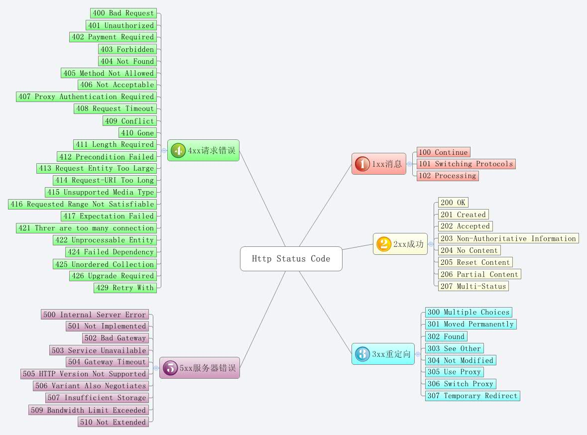

# 6. 网络知识

## 参考资料

- [EMC: 网络基本功系列](https://community.emc.com/thread/197851)

# 6.1 HTTPS, SPDY 和 HTTP/2 性能的简单对比

Firefox 35 这周发布了，成为第一个默认开启支持 HTTP/2 协议的浏览器。Chrome 也支持了，只是以 SPDY 4 的名义，并且要自己在 about://flags 里面手动开启。

不过 HTTP/2 规范还没有最终完成，所以 Firefox 实际上支持的是 HTTP/2 第14版草案，这个版本的草案离最终发布可能不会有大改动了。Google 现在在其服务器上同时支持了 HTTP/2 的第14草案和 SPDY 协议，这就给我们了一个基于同一个网页来对比 HTTPS, SPDY和 HTTP/2 的性能的机会。

HttpWatch 也更新了，从而可以在 Firefox 里面监控 HTTP/2 了，它现在有一列专门显示每个请求所使用的协议了：

## 性能对比

这组性能测试是使用 Firefox 和 HttpWatch，测试页面为 Google 英国首页，使用了三种协议:

- 原始的 HTTPS
- SPDY/3.1
- HTTP/2
每次测试都是基于空缓存的。所以即便这个测试很简单并且只基于一个网站，但其结果还是具有代表性的。

## 测试#1：请求和响应报头的大小

大部分网站在下载文本内容的时候已经启用了压缩(Gzip)，因为它可以提供很明显的性能优势。但是很不幸，HTTP/1.1 不支持压缩每个请求和相应的 HTTP 报头。SPDY 和后来的 HTTP/2 旨在使用不同的压缩类型来弥补这个短板。

SPDY 使用普通的 DEFLATE 算法而 HTTP/2 使用专门为压缩报头而设计的 HPACK 算法。它使用预定义的 token、动态表以及哈夫曼压缩。

从一个空请求也可以看到生成的报头大小的不同。在 Google 英国首页有返回空内容的信标请求(204返回码)。下面是 HttpWatch 的截图，‘Sent’列显示请求报头的大小，‘Received’列显示响应报头的大小：

胜出: HTTP/2 的报头大小还是很明显的，看来 HPACK 确实不错。

## 测试#2：响应信息大小

响应信息包括响应报头和编码过的响应内容。HTTP/2 提供了最小的报头，那么它会否给到最小的响应信息？

原因在于可被添加到 HTTP/2 数据帧的可选填充字节。HttpWatch 现在并不能显示填充，但是在 debug log 里面可以看到 Google 服务器向文本内容的数据帧中添加了填充。HTTP/2 规范给到的使用填充的理由是： 填充可以用来混淆帧内容的实际大小，而且减少 HTTP 中的特殊攻击。例如，压缩的内容包含攻击者控制的明文和秘密数据的攻击(见 [BREACH]).

填充不会用于图片文件，因为它已经是压缩过的格式了，并不包含攻击者控制的纯文本。

胜出: SPDY

在 Google 服务器上看到的较大的响应体是因为在数据帧中使用了填充。尽管，HTTP/2 产生了比 SPDY 大的响应信息，它的加密连接可能会更安全。这可能会是安全和性能权衡折衷的一个地方。

## TCP 连接数和 SSL 握手请求时间

通过将每个域名的最大并发连接数从2个提升到6个甚至更多，浏览器在 HTTP/1.1 实现了明显的性能提升。增加并发使得网络带宽可以更有效的利用，因为它减少了请求块。

SPDY 和 HTTP/2 通过复用单个连接来允许多个请求一次发送和接收数据来支持在一个 TCP 和 SSL 连接中的并发。

增加了‘Connect’和‘SSL Handshake’时间后，SPDY：

胜出: 共同胜出: SPDY & HTTP/2.

在 SPDY 和 HTTP/2 中增加的复用支持减少了下载页面时不得不设置的网络连接的数量。作为附加好处，当 HTTP/2 使用的更加广泛时，网络服务器不用再不得不维护太多的活动 TCP 连接了。

## 测试#4：页面加载时间

HttpWatch 中的‘Page Load’时间显示页面被完全下载并可用的时间。大部分情况下，这是合理的网页速度的衡量数据。

胜出：HTTP/2

原生的 HTTPS 的加载时间最长的原因可能是缺乏报头压缩和额外的 TCP 连接和 SSL 握手请求。对于更复杂的页面来说，SPDY 和 HTTP/2 的优势可能会更加明显。

我们也发现 HTTP/2 通常比 SPDY 要快，尽管它的响应信息通常更大。这个优势可能是因为 HPACK 压缩减少的更小的 GET 请求信息。我们的网络连接，和许多人一样，是非对称的——网络上传速度比下载速度小很多。这意味着任何节省的上传数据比节省的等量的下载数据更有价值。

## 结论

HTTP/2 看起来能提供明显的性能优势，。然而，响应信息中填充的使用会是一个潜在的关于性能和安全的权衡点。

参考资料

- [A Simple Performance Comparison of HTTPS, SPDY and HTTP/2](http://blog.httpwatch.com/2015/01/16/a-simple-performance-comparison-of-https-spdy-and-http2/)
- [如何防止网站被电信运营劫持弹广告](http://dbanotes.net/security/iframekiller_anti_iframe_clicjacking.html)
- [Hypertext Transfer Protocol version 2](https://http2.github.io/http2-spec/)
- [SPDY](http://en.wikipedia.org/wiki/SPDY)
- [HttpWatch](http://www.httpwatch.com/download/)

# 6.2 HTTP 状态码

